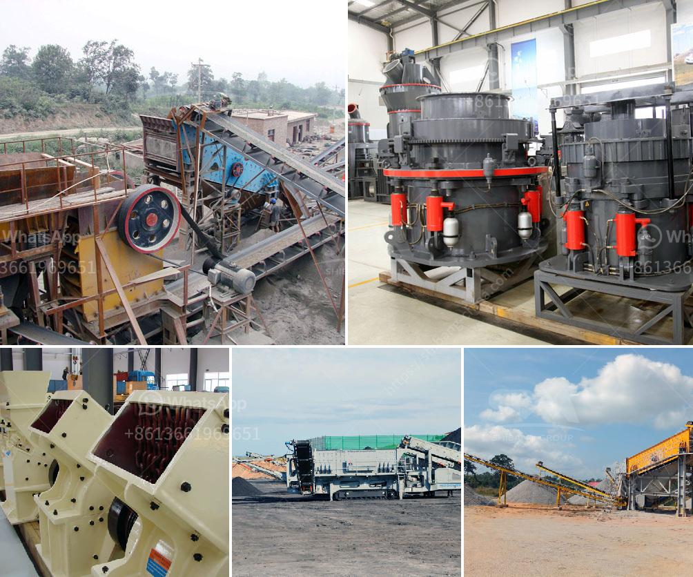

<h3>conveyor belt distributor in nigeria</h3>
In today’s fast-paced and industrialized world, conveyor belts have become an integral part of numerous industries that rely heavily on efficient material handling. The need for reliable and high-quality conveyor belts is particularly evident in a dynamic country like Nigeria, which is witnessing rapid development across various sectors. This has given rise to the emergence of reputable conveyor belt distributors that cater to the growing demands of the nation's diverse industries.

One prominent conveyor belt distributor in Nigeria is renowned for partnering with both local and international manufacturers to provide an extensive range of conveyor belts suitable for various applications. These belts are designed to withstand heavy-duty usage and are produced using durable materials like rubber, nylon, and PVC to ensure long-lasting performance. They also offer customization options, tailored to the specific needs of different industries.

The mining sector is one of the industries that heavily relies on conveyor belts for its operations. Conveyor belts enable safe and efficient transportation of minerals, rocks, and other heavy materials across different mining sites. With the right conveyor belt distributor, mining companies in Nigeria can benefit from having access to top-notch products that facilitate smooth and uninterrupted mineral extraction processes.

The manufacturing industry is another sector that significantly benefits from conveyor belts. They play a crucial role in automating production lines, ensuring efficient movement of raw materials, and enhancing overall productivity. Conveyor belt distributors in Nigeria provide a wide variety of belts that are compatible with different manufacturing needs, such as food processing, automotive production, and pharmaceutical industries.

Moreover, conveyor belts are indispensable in logistics and distribution centers. They facilitate the smooth movement of goods, packages, and parcels within warehouses, reducing manual labor and enhancing efficiency. As e-commerce continues to boom in Nigeria, conveyor belts are becoming increasingly vital to meet the growing demands of online shopping fulfillment.

In conclusion, the presence of conveyor belt distributors in Nigeria is essential to fulfill the evolving needs of different industries. These distributors ensure the availability of high-quality conveyor belts that enhance productivity, efficiency, and safety across various sectors, including mining, manufacturing, and logistics. With their extensive range of products and commitment to excellence, they play a vital role in supporting Nigeria's industrial growth.
<h3>Contact us</h3><ul><li><strong>Whatsapp:&nbsp;<a href="https://wa.me/8613661969651">+8613661969651</a></strong></li><li><a href="https://swt.shibang-china.com/?git&amp;zhl&amp;conveyor belt distributor in nigeria"><strong>Online Service(chat now)</strong></a></li></ul><h3>Related</h3><ul><li><a href='mobile coal washing plant investment.md'>mobile coal washing plant investment</a></li><li><a href='mobile concrete crusher.md'>mobile concrete crusher</a></li><li><a href='small scale tantalum milling machine supplier.md'>small scale tantalum milling machine supplier</a></li><li><a href='grinding media for ball mill.md'>grinding media for ball mill</a></li><li><a href='silica sand washing plant.md'>silica sand washing plant</a></li></ul>