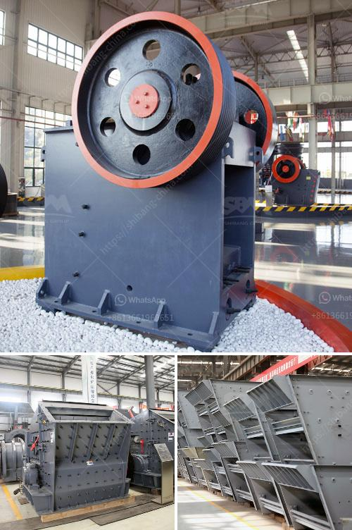

<h3>conveyor belt manufacturers in pakistan</h3>
Conveyor belts are used in various industries, such as food processing, automotive, mining, packaging, and pharmaceutical, to transport materials or products from one point to another. They play a crucial role in improving productivity and reducing labor costs. In Pakistan, numerous conveyor belt manufacturers offer a wide range of belts for different applications, ensuring efficient and safe material handling operations.

One notable conveyor belt manufacturer in Pakistan is Ali Engineering Works. With over two decades of experience, the company specializes in producing conveyor belts for various industrial sectors. Their belts are known for their exceptional quality, durability, and excellent performance. They offer a wide range of conveyor belts, including steel cord belts, sidewall belts, chevron belts, heat-resistant belts, and many more.

Ali Engineering Works' conveyor belts are manufactured using high-quality materials and advanced technology. They are designed to withstand heavy loads and harsh working conditions, ensuring uninterrupted operations. These belts are also resistant to oil, grease, chemicals, and extreme temperatures, making them suitable for diverse industries.

Another prominent player in the conveyor belt manufacturing industry is Reko Automation, which is dedicated to providing innovative solutions for material handling. The company offers a comprehensive range of conveyor belts, including modular belts, plastic belts, timing belts, and high-temperature belts. Their belts are designed to meet the specific requirements of different applications, from simple conveying to complex production processes.

Reko Automation's conveyor belts are known for their exceptional reliability, efficiency, and low maintenance. They are made from high-quality materials, such as polypropylene, polyethylene, and stainless steel, ensuring durability and longevity. These belts are designed to efficiently handle various types of products, including small parts, bulk materials, and delicate items.

Apart from Ali Engineering Works and Reko Automation, there are several other conveyor belt manufacturers operating in Pakistan. Each of them offers unique products, catering to different industries and applications. Some notable manufacturers include Ebrahim Textile Mills, Habasit Pakistan, and Bubber Machine Tools.

Ebrahim Textile Mills specializes in producing textile-oriented conveyor belts, catering to the textile industry's specific requirements. Their belts are designed to handle various textile items, such as yarns, fabrics, and garments, with ease and precision.

Habasit Pakistan, a subsidiary of the Swiss-based Habasit Group, is a leading conveyor belt manufacturer in Pakistan. They offer a wide range of conveyor belts, including fabric belts, plastic modular belts, and power transmission belts. Habasit Pakistan's belts are widely used in industries such as textile, automotive, packaging, and printing.

Bubber Machine Tools is another well-known name in the conveyor belt manufacturing industry in Pakistan. They offer a comprehensive range of conveyor belts, including PVC belts, rubber belts, and conveyor accessories. Bubber Machine Tools' belts are known for their quality, versatility, and cost-effectiveness.

In conclusion, conveyor belt manufacturers in Pakistan play a vital role in providing efficient and reliable material handling solutions for various industries. With their range of high-quality belts and innovative designs, they contribute to improving productivity, reducing labor costs, and ensuring safe operations. Whether it is for the textile, automotive, packaging, or mining industry, these manufacturers offer a wide variety of conveyor belts to meet diverse customer needs.
<h3>Contact us</h3><ul><li><strong>Whatsapp:&nbsp;<a href="https://wa.me/8613661969651">+8613661969651</a></strong></li><li><a href="https://swt.shibang-china.com/?git&amp;zhl&amp;conveyor belt manufacturers in pakistan"><strong>Online Service(chat now)</strong></a></li></ul><h3>Related</h3><ul><li><a href='gold processing plant equipment price.md'>gold processing plant equipment price</a></li><li><a href='crusher price in malaysia stones.md'>crusher price in malaysia stones</a></li><li><a href='calcium carbonate ball mill.md'>calcium carbonate ball mill</a></li><li><a href='indonesia raymond mill import agent.md'>indonesia raymond mill import agent</a></li><li><a href='grinding mill machine cost price south africa.md'>grinding mill machine cost price south africa</a></li></ul>