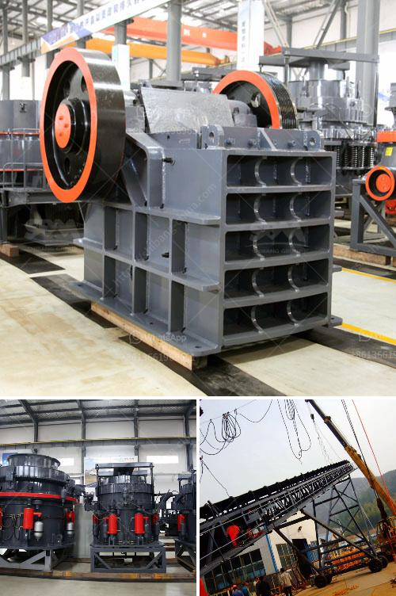

<h3>conveyor belts for shelves</h3>
In today's fast-paced world, the need for efficient warehousing and distribution systems is more crucial than ever. Conveyor belts have long been an invaluable tool in industries such as manufacturing and logistics, but their application has now extended to shelves in warehouses. These conveyor belts for shelves are revolutionizing the way businesses operate, streamlining processes, and maximizing efficiency.

One of the primary advantages of employing conveyor belts for shelves is the elimination of manual labor. Traditionally, warehouse employees would have to walk aisle after aisle, picking items from the shelves and manually transferring them to packing or shipping areas. This process is not only labor-intensive but also time-consuming. With conveyor belts installed on each shelf, items are effortlessly transported to the desired location, significantly reducing the need for physical labor.

Warehouse managers can attest to the fact that every second counts in meeting tight deadlines. Conveyor belts for shelves offer enhanced speed and accuracy in order fulfillment, resulting in quicker turnaround times. As items move automatically from one point to another, there is a significant reduction in processing time, allowing businesses to cater to a higher volume of customer orders. Additionally, these conveyor belts can be integrated with barcode scanners or RFID technology, ensuring accurate tracking and minimizing errors.

Modularity is another key feature of conveyor belts for shelves. Warehouse layouts can vary greatly, and it is essential to have a flexible system that can adapt to different requirements. These conveyor belts can be fitted on a variety of shelving configurations, such as fixed or adjustable, ensuring compatibility with the existing setup. The modular design also enables easy installation and scalability. Businesses can choose to start with a few shelves and gradually expand as their needs grow, resulting in a cost-effective solution.

Another significant advantage of conveyor belts for shelves is their ability to maximize storage space. In traditional setups, warehouse aisles can take up a significant portion of the overall area, limiting the number of shelves that can be installed. By utilizing conveyor belts, these aisle spaces are eliminated, allowing for more shelves to be accommodated within the same footprint. This directly translates into increased storage capacity and better inventory management.

Furthermore, conveyor belts for shelves contribute to a safer working environment. By reducing manual handling of items, the risk of physical strain and injuries associated with heavy lifting is significantly reduced. Employees can focus on supervising the movement of goods rather than engaging in strenuous labor, promoting overall workplace safety and well-being.

In conclusion, conveyor belts for shelves are transforming the warehouse industry by streamlining operations, maximizing efficiency, and optimizing space utilization. They offer a range of benefits including labor reduction, enhanced speed and accuracy, modularity, increased storage capacity, and improved workplace safety. With constant advancements in technology, these conveyor belts are expected to continue evolving and further revolutionize warehousing and distribution systems. Businesses that adopt this modern approach will undoubtedly gain a competitive edge in the fast-paced world of logistics.
<h3>Contact us</h3><ul><li><strong>Whatsapp:&nbsp;<a href="https://wa.me/8613661969651">+8613661969651</a></strong></li><li><a href="https://swt.shibang-china.com/?git&amp;zhl&amp;conveyor belts for shelves"><strong>Online Service(chat now)</strong></a></li></ul><h3>Related</h3><ul><li><a href='mining crusher costs.md'>mining crusher costs</a></li><li><a href='bauxite manufacture equipment in india.md'>bauxite manufacture equipment in india</a></li><li><a href='mobile coal jaw crusher for hire.md'>mobile coal jaw crusher for hire</a></li><li><a href='hammer pulverizer machine price.md'>hammer pulverizer machine price</a></li><li><a href='washing plant suppliers in mozambique.md'>washing plant suppliers in mozambique</a></li></ul>