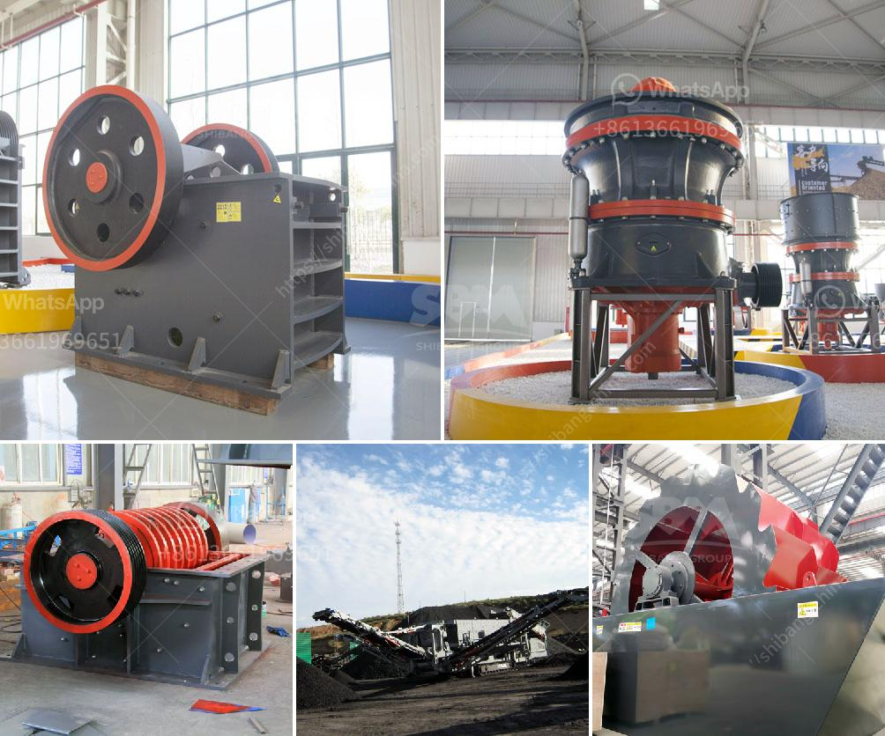

<h3>conveyor belts in malaysia</h3>
Conveyor belts are utilized in various industries for efficient transportation of goods and products. From food production to heavy machinery, conveyor belts help streamline operations and increase productivity. In Malaysia, conveyor belts play a significant role in the industrial sector, particularly, mining, manufacturing, and distribution.

When it comes to mining, conveyor belts are essential for transporting minerals from the mining site to processing plants or storage areas. In Malaysia, mining activities involve extraction of various minerals such as tin, gold, bauxite, iron ore, limestone, and coal. The use of conveyor belts is crucial to ensure the transportation of these minerals is done efficiently and safely.

Malaysia is also known for its manufacturing sector, which encompasses a wide range of industries. Conveyor belts are a common sight in factories, where they are used to transport goods, materials, and components within the production line. By automating the process of moving items, conveyor belts simplify assembly processes, reduce labor costs, and enhance overall efficiency. Industries such as electronics, automobile, pharmaceuticals, and textiles heavily rely on conveyor belts to streamline their manufacturing operations.

Another sector where conveyor belts are widely used in Malaysia is the distribution and logistics industry. With the rise of e-commerce, there has been a surge in demand for efficient and reliable transportation of goods. Conveyor belts play a critical role in sorting, packaging, and shipping processes. They enable continuous movement of the packages, reducing the time and effort required to handle them manually. Furthermore, conveyor belts help optimize storage space and expedite the loading and unloading of trucks and containers.

In recent years, conveyor belt technology in Malaysia has advanced significantly, keeping up with global standards. Conveyor belts are now equipped with advanced features such as sensors, automated sorting systems, and smart monitoring. These technologies help improve the overall efficiency of conveyor belt systems and reduce operational costs. For example, sensors can detect products on the belt and trigger specific actions such as diverting them to different lanes based on their destination or size.

Conveyor belts are subject to wear and tear due to constant use and exposure to harsh environments. Regular maintenance and proper handling are crucial to ensure their longevity and optimal performance. In Malaysia, there are several reputable companies that specialize in conveyor belt maintenance and repair services. These companies provide timely inspections, repairs, and replacements of conveyor belts to minimize downtime and maximize productivity.

In conclusion, conveyor belts play a vital role in Malaysia's industrial sector, facilitating the smooth transportation of goods and materials. From mining to manufacturing and distribution, conveyor belts help enhance efficiency, reduce labor costs, and streamline operations. With advancements in technology, conveyor belts in Malaysia have become more sophisticated, offering features that increase productivity and improve overall performance. It is important for industries to prioritize regular maintenance and engage professional services to ensure the longevity of conveyor belts and the uninterrupted flow of production.
<h3>Contact us</h3><ul><li><strong>Whatsapp:&nbsp;<a href="https://wa.me/8613661969651">+8613661969651</a></strong></li><li><a href="https://swt.shibang-china.com/?git&amp;zhl&amp;conveyor belts in malaysia"><strong>Online Service(chat now)</strong></a></li></ul><h3>Related</h3><ul><li><a href='rock crushing machine for concrete use.md'>rock crushing machine for concrete use</a></li><li><a href='bentonite mill project report.md'>bentonite mill project report</a></li><li><a href='ball mill for sand and gravel.md'>ball mill for sand and gravel</a></li><li><a href='used ultra fine wet grinding mill gold ore.md'>used ultra fine wet grinding mill gold ore</a></li><li><a href='working hours of a crusher plant.md'>working hours of a crusher plant</a></li></ul>