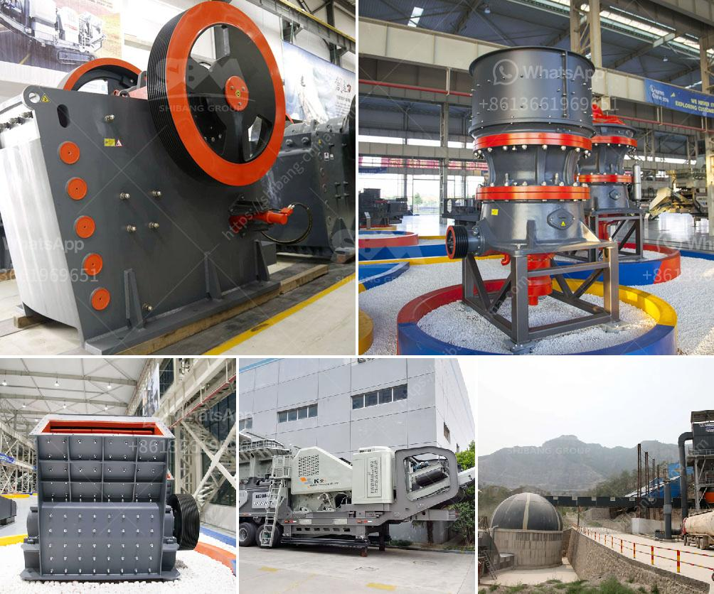

<h3>conveyor belts in mexico</h3>
Conveyor belts have become an integral part of various industries around the world, including Mexico. These automated systems are revolutionizing the way goods are transported, boosting productivity, reducing labor costs, and improving overall efficiency. With Mexico being a major player in manufacturing and industrial production, conveyor belts play a crucial role in several sectors, such as automotive, food processing, mining, packaging, and logistics.

Mexico's automotive industry is one of the largest in the world, accounting for a significant portion of the country's GDP. Conveyor belts have contributed to the success of this sector by streamlining the production process. Car manufacturers in Mexico rely on conveyor belts to move components, parts, and vehicles throughout the assembly line, ensuring a smooth and efficient production process. By automating the transportation of parts, conveyor belts save time and reduce the risk of human error.

In the food processing industry, conveyor belts are essential for handling and transporting various food products. Whether it is fruits, vegetables, meat, or bakery items, these belts facilitate the movement of goods from one process to another. In Mexico, where agriculture is a significant sector, conveyor belts play a crucial role in ensuring efficient production and distribution of food items. Furthermore, they also contribute to maintaining the hygiene and food safety standards required by regulatory bodies.

The mining industry is another sector that heavily relies on conveyor belts in Mexico. Mexico is rich in mineral resources, and the extraction and transportation of these valuable resources are essential for the country's economy. Conveyor belts are used to transport minerals, ores, and materials, reducing the need for manual labor and boosting productivity. These belts can cover long distances, traverse rough terrains, and transport heavy loads, making them a reliable solution for the mining industry.

Packaging and logistics are other sectors benefiting from the use of conveyor belts in Mexico. With a robust manufacturing industry and a growing export market, efficient packaging and distribution are essential. Conveyor belts enable the automated movement of goods from one packaging station to another, reducing the need for manual handling and speeding up the process. Additionally, conveyor belts contribute to the overall logistics chain, helping to streamline the movement of products within warehouses, distribution centers, and shipping terminals.

As the demand for conveyor belts continues to grow in Mexico, so does the need for reliable suppliers and manufacturers. Several companies have established their presence in the market, offering a wide range of conveyor belt solutions tailored to specific industry requirements. This not only ensures a steady supply of these systems but also promotes healthy competition, leading to better products and services.

In conclusion, conveyor belts have become an indispensable part of various industries in Mexico, enabling efficient and automated transportation of goods. Whether it is in automotive, food processing, mining, or logistics, these belts play a pivotal role in enhancing productivity, reducing labor costs, and improving overall operational efficiency. As Mexico continues to grow and diversify its industrial landscape, the demand for conveyor belt solutions will only increase, fostering further innovation and development in this sector.
<h3>Contact us</h3><ul><li><strong>Whatsapp:&nbsp;<a href="https://wa.me/8613661969651">+8613661969651</a></strong></li><li><a href="https://swt.shibang-china.com/?git&amp;zhl&amp;conveyor belts in mexico"><strong>Online Service(chat now)</strong></a></li></ul><h3>Related</h3><ul><li><a href='crushing machine manufacturer in maharashtra.md'>crushing machine manufacturer in maharashtra</a></li><li><a href='high capacity stone hammer crusher manufacturer.md'>high capacity stone hammer crusher manufacturer</a></li><li><a href='quartz stone crushing unit in india.md'>quartz stone crushing unit in india</a></li><li><a href='bauxite manufacture equipment in india.md'>bauxite manufacture equipment in india</a></li><li><a href='gypsum plant equipment catalogue.md'>gypsum plant equipment catalogue</a></li></ul>