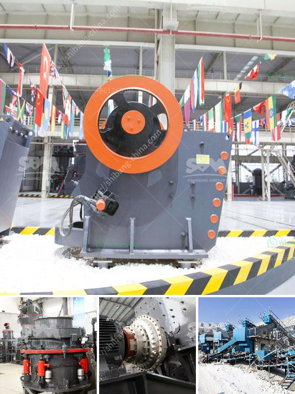

<h3>conveyor belts supplier malaysia</h3>
Conveyor belts are an essential component in various industries, allowing for the efficient transportation of goods and materials. In Malaysia, there is a wide range of conveyor belt suppliers to choose from, each offering unique advantages. The choice of conveyor belt supplier plays a crucial role in ensuring the smooth operation of your business and maximizing productivity.

One reputable conveyor belt supplier in Malaysia is Belt-Tech Engineering Supplies Sdn Bhd. With more than 20 years of experience, the company promises advanced technology and high-quality products to meet the demands of various industries. Their conveyor belts come in different types, including PVC belts, PU belts, sidewall belts, and modular belts, to suit different applications.

Another reliable conveyor belt supplier in Malaysia is Nishi Enterprise. Established in 1990, the company offers a wide range of conveyor belt solutions. It specializes in providing advanced technologies and innovative solutions to cater to various industries' unique requirements. Nishi Enterprise provides conveyor belts for industries such as food processing, automotive, packaging, and manufacturing.

Conveyor belts from these suppliers are designed and manufactured to withstand harsh environments, heavy loads, and high temperatures, ensuring durability and longevity. They are also customizable to meet specific needs and requirements, making them a great investment for businesses.

Apart from supplying conveyor belts, these companies also offer excellent customer service, timely delivery, and competitive pricing. They prioritize customer satisfaction and provide professional advice on the selection and maintenance of conveyor belts.

When choosing a conveyor belt supplier in Malaysia, it is essential to consider factors such as reliability, product quality, customization options, and customer support. The aforementioned suppliers have proven their commitment to meeting these criteria, making them highly recommended choices for businesses seeking conveyor belt solutions.

In conclusion, conveyor belts are crucial for the smooth operation of various industries in Malaysia. Choosing the right conveyor belt supplier is essential to ensure efficiency, productivity, and ultimately, the success of your business. Belt-Tech Engineering Supplies Sdn Bhd and Nishi Enterprise stand out as reliable suppliers with their high-quality products, advanced technologies, and exceptional customer service.
<h3>Contact us</h3><ul><li><strong>Whatsapp:&nbsp;<a href="https://wa.me/8613661969651">+8613661969651</a></strong></li><li><a href="https://swt.shibang-china.com/?git&amp;zhl&amp;conveyor belts supplier malaysia"><strong>Online Service(chat now)</strong></a></li></ul><h3>Related</h3><ul><li><a href='fine grinding ball mills.md'>fine grinding ball mills</a></li><li><a href='high energy ball mill price.md'>high energy ball mill price</a></li><li><a href='stone crusher in goa.md'>stone crusher in goa</a></li><li><a href='crushing machine manufacturer in maharashtra.md'>crushing machine manufacturer in maharashtra</a></li><li><a href='sand mining equipment manufacturers in south africa.md'>sand mining equipment manufacturers in south africa</a></li></ul>