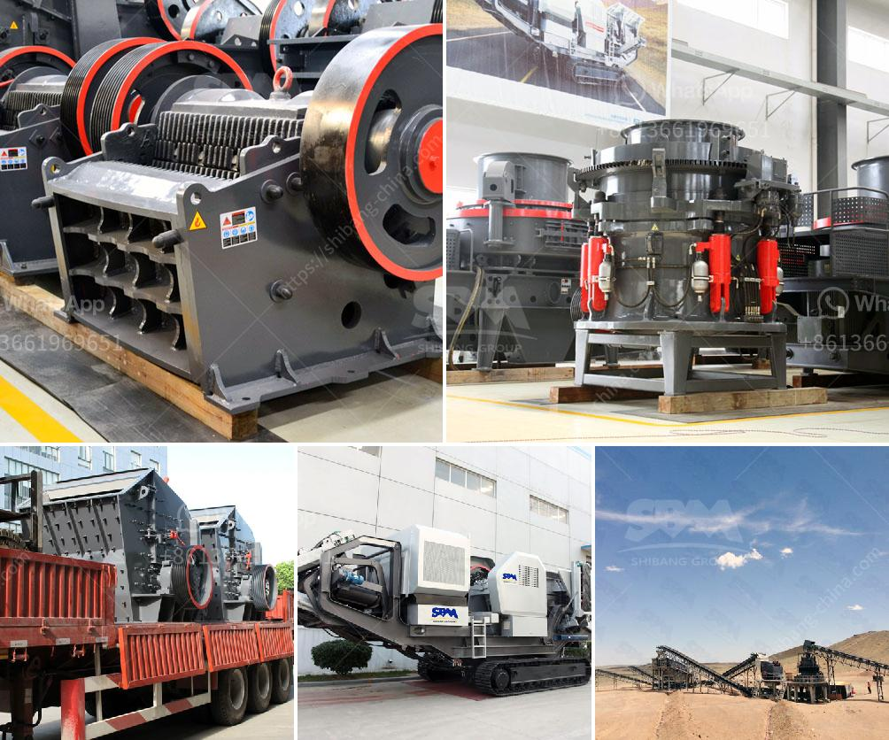

<h3>copper concentrate ball mill for sale</h3>
Copper concentrate mills are widely used in metallurgy, building materials, chemical industry, mining, and other fields. Copper concentrate is a kind of mineral processing method, which can extract copper from copper ore. Copper concentrate refers to the copper ore processed by a beneficiation process that can be used for smelting copper. In order to produce high-quality copper concentrate, different types of mills can be used for grinding. Among them, the copper concentrate ball mill has a relatively high cost. Customers often consult the price when choosing a copper concentrate ball mill supplier.

For many reasons, copper concentrate is widely used. After the copper concentrate is processed, it turns into copper sulfide concentrate or copper oxide concentrate. Mainly copper sulfide concentrates are used for smelting. The copper concentrate ball mill grinds the copper into copper concentrate to increase its use in smelting. By one smelting method, it can get copper ingot. Copper concentrate can be also treated with chemical methods, then it will have copper chloride, copper sulfate, copper acetate. Copper chloride, copper sulfate and copper acetate are widely used in the chemical industry.

There are many types of copper concentrate ball mills on the market. Commonly used ones are overflow ball mills and lattice ball mills. In addition to copper concentrate, the ball mill can also be used for grinding coal, limestone, ceramics, etc. The ball mill is a commonly used grinding equipment in the dressing production line. Its grinding efficiency can be summarized in three ways: the grinding operation of the new type mill is more rational and energy-saving; the grinding operation of the machine is efficient, and the water and electricity consumption is reduced; the equipment has fewer failures and maintenance costs.

The price of copper concentrate ball mills is cost-effective, which makes it cheaper for customers to purchase. Compared with other mills, the overall cost of copper concentrate ball mills is low. Because the equipment is less, the factory covers a small area, and the price paid for one mill is lower than for other equipment, so it is cost-effective for customers to purchase. Of course, the specific price is also related to factors such as production capacity, model, and supplier of the copper concentrate ball mill equipment.

In conclusion, copper concentrate ball mills are widely used in metallurgy, building materials, chemical industry, mining, and other fields, providing customers with high-quality and cost-effective equipment. As a professional copper concentrate ball mill supplier, Fote Machinery has made a complete set of copper concentrate processing equipment, including the copper concentrate ball mill, classifier, magnetic separator, flotation machine, spiral chute, shaking table, rotary kiln, dryer, etc. Welcome to visit and consult!
<h3>Contact us</h3><ul><li><strong>Whatsapp:&nbsp;<a href="https://wa.me/8613661969651">+8613661969651</a></strong></li><li><a href="https://swt.shibang-china.com/?git&amp;zhl&amp;copper concentrate ball mill for sale"><strong>Online Service(chat now)</strong></a></li></ul><h3>Related</h3><ul><li><a href='harga stone crusher 250 ton jam indonesia.md'>harga stone crusher 250 ton jam indonesia</a></li><li><a href='hp series cone crusher.md'>hp series cone crusher</a></li><li><a href='price of a mobile crusher.md'>price of a mobile crusher</a></li><li><a href='stone crusher machine in kenya.md'>stone crusher machine in kenya</a></li><li><a href='ball mill grinder.md'>ball mill grinder</a></li></ul>