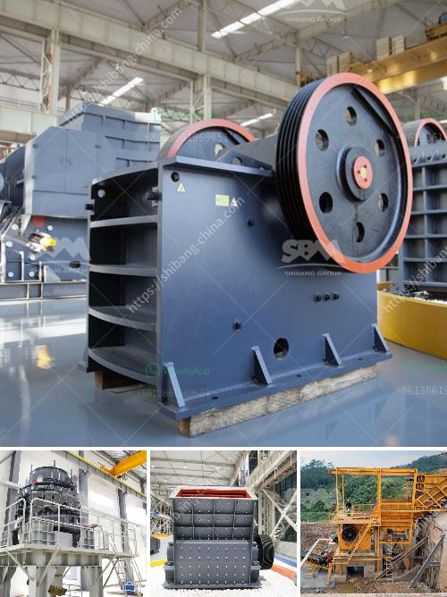

<h3>copper manufacturing process</h3>
Copper, one of the oldest metals known to mankind, has been used for various purposes since ancient times. From coins to electrical wiring, copper remains a vital element in our daily lives. But have you ever wondered how this versatile metal is manufactured? Let's delve into the copper manufacturing process and discover the fascinating journey from copper ore to finished product.

The copper manufacturing process begins with the extraction of copper ore, which is typically found in large deposits underground. This ore is obtained through either open-pit or underground mining. In open-pit mining, huge earth-moving equipment is used to remove the top layer of soil and expose the ore bed. Underground mining involves tunnels and shafts to reach deeper deposits.

Once the copper ore is excavated, it undergoes various processes to extract the pure copper metal. The first step is crushing the ore into smaller pieces using crushers. This reduces the size of the ore and makes it more manageable for further processing. The crushed ore is then ground into a fine powder in ball mills. This process, known as pulverization, increases the surface area of the ore and enhances the efficiency of subsequent extraction.

After pulverization, the copper ore undergoes a process called flotation. This involves mixing the powdered ore with water and chemicals such as collectors and frothers. Air is blown through the mixture, causing the copper minerals to stick to the bubbles that rise to the surface. These mineral-laden bubbles are then skimmed off, leaving behind the unwanted rock particles.

The collected copper minerals, now in the form of a concentrate, are further processed through smelting. Smelting involves heating the copper concentrate at high temperatures in a furnace. This melts the concentrate, separating it into two layers - molten copper at the bottom and slag, a waste material, on top. The molten copper is then tapped from the furnace and cast into ingots or billets, which are cooled and solidified.

The next step in the copper manufacturing process is refining. This is necessary to remove impurities and achieve the desired purity suitable for various applications. There are two main refining methods - electrolytic refining and fire refining. Electrolytic refining involves immersing the copper anodes (made from the cast molten copper) into an electrolyte bath and passing an electric current through it. This causes the impurities to accumulate as sludge on the anode, while pure copper is deposited on the cathode.

On the other hand, fire refining involves the melting of the copper anodes in a furnace. During this process, impurities such as sulfur, iron, and other metals are oxidized and form a gas or slag that is separated from the molten copper. The resulting copper is then cast into bars or rods, ready to be transformed into various products.

The final stage in the copper manufacturing process involves shaping and forming the copper into its intended product. The copper can be rolled into sheets or plates, drawn into wires, or extruded into various shapes. This versatility allows copper to be used in a wide range of applications, from electrical wiring and plumbing to construction materials and automotive parts.

In conclusion, the copper manufacturing process begins with the extraction of copper ore and goes through several stages to obtain the pure copper metal. From crushing and pulverization to flotation, smelting, and refining, each step plays a crucial role in transforming the raw material into the final product. The versatility of copper and its numerous applications demonstrate the importance of this metal in our modern world.
<h3>Contact us</h3><ul><li><strong>Whatsapp:&nbsp;<a href="https://wa.me/8613661969651">+8613661969651</a></strong></li><li><a href="https://swt.shibang-china.com/?git&amp;zhl&amp;copper manufacturing process"><strong>Online Service(chat now)</strong></a></li></ul><h3>Related</h3><ul><li><a href='new ready mix crusher setup plan.md'>new ready mix crusher setup plan</a></li><li><a href='gypsum powder grinding mill price in pakistan.md'>gypsum powder grinding mill price in pakistan</a></li><li><a href='pf impact crusher.md'>pf impact crusher</a></li><li><a href='gravel washing plant.md'>gravel washing plant</a></li><li><a href='crusher stone crusher 4 ton.md'>crusher stone crusher 4 ton</a></li></ul>