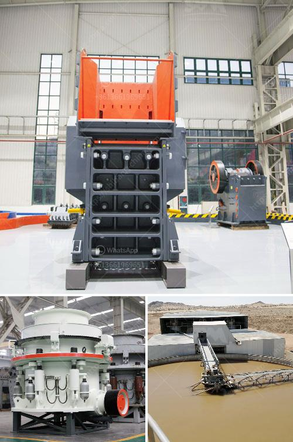

<h3>copper mining companies in congo</h3>
Congo, one of the largest countries in Africa, is home to vast mineral resources, including copper. With an estimated 50% of the world’s cobalt reserves, alongside significant copper deposits, the country holds tremendous potential for mining companies seeking to tap into these riches. However, the copper mining industry in Congo also poses various challenges and concerns. This article aims to shed light on the opportunities and obstacles faced by copper mining companies in Congo.

Firstly, let us explore the immense potential of copper mining in Congo. The country is known for having some of the largest copper deposits in the world, making it an attractive destination for mining corporations. With vast reserves spread throughout the Katanga and Lualaba provinces, Congo offers a rich opportunity for mining companies to capitalize on the growing demand for copper, driven by infrastructure development and the transition to renewable energy sources.

Several international mining companies have already invested in the Congolese copper industry. Companies such as Glencore, China Molybdenum, and Ivanhoe Mines have been significant players in the region, contributing to the country's economic growth and providing employment opportunities for local communities. The mining activities not only generate revenue for the companies but also contribute to the country's export earnings, enhancing its overall economic stability.

However, amid the wealth of resources, copper mining in Congo faces various challenges. One significant obstacle is the presence of armed groups and illegal mining operations. These groups often exploit the mining sector to fund their illicit activities, leading to conflicts and human rights violations. Local communities bear the brunt of these challenges, as they face displacement and social disruption.

Moreover, environmental concerns and sustainability issues are equally paramount. The extraction and processing of copper leave a significant ecological footprint. Mining activities can lead to deforestation, soil erosion, and contamination of water sources, affecting local ecosystems and biodiversity. Sustainable mining practices are crucial to mitigate these environmental impacts and ensure the long-term preservation of Congo's natural resources.

Additionally, the lack of infrastructure and reliable power supply poses hurdles for mining companies operating in Congo. Insufficient transportation systems and inadequate energy infrastructure increase operational costs and limit the efficient extraction and transportation of copper. Addressing these infrastructure gaps is vital to fully unlock the potential of the copper mining industry and attract more investment to the region.

To overcome these challenges, it is crucial for mining companies to collaborate with the Congolese government, local communities, and international organizations. Initiatives focused on responsible mining, community development, and sustainable practices must be implemented to ensure a fair and equitable distribution of wealth and benefits. Investments in infrastructure development, particularly in transportation and energy, should be prioritized to enhance the efficiency and competitiveness of the mining sector.

In conclusion, Congo's copper mining industry presents substantial opportunities for both local and international companies. With its vast reserves and growing demand for copper, the country has the potential to become a major player in the global copper market. However, challenges such as armed conflicts, environmental concerns, and inadequate infrastructure must be addressed to unlock the full potential of the industry. Collaborative efforts between mining companies, the government, and local communities are essential to foster sustainable and responsible copper mining practices in Congo.
<h3>Contact us</h3><ul><li><strong>Whatsapp:&nbsp;<a href="https://wa.me/8613661969651">+8613661969651</a></strong></li><li><a href="https://swt.shibang-china.com/?git&amp;zhl&amp;copper mining companies in congo"><strong>Online Service(chat now)</strong></a></li></ul><h3>Related</h3><ul><li><a href='gravel production line.md'>gravel production line</a></li><li><a href='small ore crusher.md'>small ore crusher</a></li><li><a href='puzzolana 100tph cone crusher plant price.md'>puzzolana 100tph cone crusher plant price</a></li><li><a href='sand making crusher plant india.md'>sand making crusher plant india</a></li><li><a href='zinc crusher machine zimbabwe.md'>zinc crusher machine zimbabwe</a></li></ul>