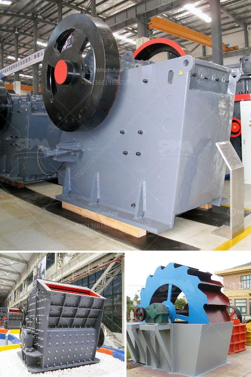

<h3>copper ore ball mill torky</h3>
Copper ore ball mill is a critical pulverizing equipment for copper ore processing. It is mainly used to grind the copper ore into fine powder and then prepare for beneficiation process. The main component of copper ore ball mill is a cylinder with smaller diameter and larger length which can be revolved via the transmitting machinery. Materials are put in cylinder through the feed opening and then thoroughly grinded because the falling course of iron balls and ores can produce huge falling impact and autogenous grinding. The continuous feeding of ores can create considerable pressure to make ores move from feed opening toward discharge opening. Finally, acceptable particles are discharged from the discharge opening. Acceptable ore particles are carried away by water in wet mill, or by air in dry mill.

In recent years, with the economic development, more and more copper resources are exploited from mining operations. Copper ore ball mill has low operation and maintenance cost. It has wide applications and can be applied in mineral industry, metallurgy, chemical industry, construction industry and so on. Copper ore ball mill has a strong adaptability to raw materials and is capable of continuous production.

The specifications, performance and price of copper ore ball mill are all important factors in the purchase. With the increasing demand for the copper ore ball mill, Mexico is a widely recognized exporter of copper ore and its products. Copper mining is first heard of in Connecticut, the Simsbury mines being worked as early as 1709, but they were abandoned as unprofitable about the middle of that century. The Schuyler Mine, near Belleville, New Jersey, was discovered in 1719, and is historic as the scene of the building of the first steam-engine in America in 1793-94. Lake Superior copper was mined beginning in 1844. In 1846, copper-bearing rock was discovered in a German silver mine in Copper Harbor, Michigan. It became evident that vast quantities of copper could be found in the western part of the Upper Peninsula of Michigan.
<h3>Contact us</h3><ul><li><strong>Whatsapp:&nbsp;<a href="https://wa.me/8613661969651">+8613661969651</a></strong></li><li><a href="https://swt.shibang-china.com/?git&amp;zhl&amp;copper ore ball mill torky"><strong>Online Service(chat now)</strong></a></li></ul><h3>Related</h3><ul><li><a href='linear vibrating screener nigeria.md'>linear vibrating screener nigeria</a></li><li><a href='50tph stone crusher in germany.md'>50tph stone crusher in germany</a></li><li><a href='clay production plant.md'>clay production plant</a></li><li><a href='silica sand grinding.md'>silica sand grinding</a></li><li><a href='stone crushers price in south.md'>stone crushers price in south</a></li></ul>