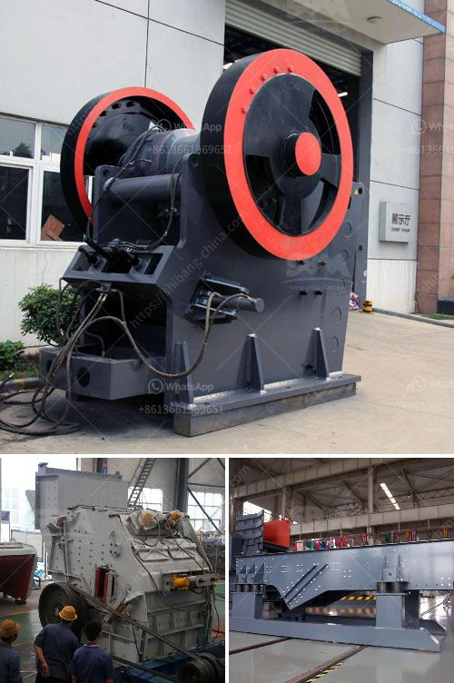

<h3>copper ore ball mill</h3>
Copper ore ball mill, also known as ball grinding mill, is one of the most commonly used mining equipment, which is widely used in mineral processing, construction materials, silicate and chemical industries. In the production of copper ore, the ball mill is an indispensable equipment.

Nowadays, the ball mill has become the preferred equipment for copper ore beneficiation industry. Its small investment, easy operation, low maintenance rate and low energy consumption make it the ideal equipment for copper ore processing. The ball mill has a wide range of applications and can grind various ores and other materials with dry or wet grinding methods.

One of the key factors influencing the grinding efficiency of a ball mill is the size and proportion of the grinding media. The smaller the grinding media, the finer the grinding particles. However, the size and proportion of grinding media is influenced by many factors such as the type of mill, the size of the feed ore, the size and hardness of the grinding ore, and the type, shape and proportion of the grinding body.

Another important factor is the speed of the ball mill. In order to obtain optimal grinding efficiency, the speed of the ball mill should be set at a suitable level. Too high or too low speed will reduce the grinding efficiency. Generally, the speed of the ball mill is between 65% and 85% of the critical speed.

The lining plate of the ball mill also affects the grinding efficiency. The lining plate is an important part of the ball mill and it is often used to protect the cylinder from the direct impact of grinding media and materials. Different types of lining plates can adjust the motion state of grinding media, thus enhancing the grinding effect of copper ore particles.

In addition, the moisture content of the grinding material also has an important influence on the grinding efficiency of the ball mill. When the moisture content of the grinding material is too large, the liquid film formed on the surface of the grinding body will hinder the movement of the grinding body, resulting in a decrease in grinding efficiency. Therefore, it is necessary to control the moisture content of the grinding material within a reasonable range.

In summary, the copper ore ball mill has been continuously developed and improved during the utilization process. It has high production capacity, low energy consumption, stable operation, easy maintenance and other advantageous characteristics. Therefore, it is widely used in the grinding of copper ore in the beneficiation industry. With the continuous improvement of technology, the copper ore ball mill will also develop towards large-scale, high-efficiency and green environmental protection.
<h3>Contact us</h3><ul><li><strong>Whatsapp:&nbsp;<a href="https://wa.me/8613661969651">+8613661969651</a></strong></li><li><a href="https://swt.shibang-china.com/?git&amp;zhl&amp;copper ore ball mill"><strong>Online Service(chat now)</strong></a></li></ul><h3>Related</h3><ul><li><a href='processing of cement crusher.md'>processing of cement crusher</a></li><li><a href='cost of barite processing plant.md'>cost of barite processing plant</a></li><li><a href='jaw crusher for sale in ethiopia.md'>jaw crusher for sale in ethiopia</a></li><li><a href='crusher plant in pakistan.md'>crusher plant in pakistan</a></li><li><a href='quarry stone plant.md'>quarry stone plant</a></li></ul>