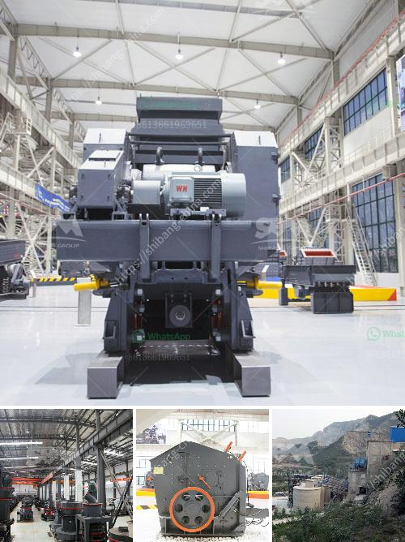

<h3>copper ore crusher</h3>
Copper ore is commonly used in metallurgical, manufacturing, electrical, and construction industries. It's considered one of the vital minerals in the world due to its widespread use and versatility. To extract copper from copper ore, a copper ore crusher is necessary. Here we will introduce you to the copper ore crushing process and its pivotal role in the production of copper concentrate.

Copper ore mining is a complex process, which involves several stages of extraction. The first step in the production of copper concentrate is crushing. Crushing is performed in two or three stages, depending on the desired size of the material. Primary and secondary crushing are used for this purpose. Afterwards, the crushed ore is grinded into fine particles.

The primary copper ore crusher is jaw crusher. In the production line, it can be used as the primary crushing equipment to crush raw copper ore, which eliminates the need for secondary crushing equipment. Large pieces of copper ore are evenly sent to the jaw crusher or coarse crushing mobile station by the vibrating feeder for coarse crushing. After coarsely crushed copper ore is screened through the vibrating screen, it is sent by the belt conveyor to Zhongxin hydraulic cone crusher for copper ore fine crushing. The secondary crushing machine will crush them again until they meet the requirements.

Cone crusher is the ideal equipment for intermediate and fine crushing. With the continuous development of technology, the performance and efficiency of cone crushers have been improved significantly. It has high crushing efficiency and uniform product size. It is the best choice for copper ore beneficiation.

The secondary copper ore crusher usually has a longer service life than the primary one. The particle size of copper ore after primary crushing is 65-300mm. The copper ore hydraulic cone crusher can help you to finish the secondary crushing and the particle size is 120-199mm. As to the tertiary crushing, you can use the copper ore fine crusher. Copper ore crusher plant in Turkey Raw material: copper ore Output: 200t/h Equipment: Jaw crusher, Hydraulic cone crusher, Circular vibrating screen, Belt conveyor, Feeder, etc.

Copper ore plant whole process is composed of first stage crushing and second stage grinding process. In the grinding process, copper ore ball mill is usually used for Copper ore beneficiation plant. Copper ore crusher is the indispensable equipment in the process of copper ore dressing. Its purpose is crushed copper ore to an appropriate size to suitable for the Raymond mill, grinding mill processing, ultra-fine grinding mill processing, the grinder for further processing.

As we all know, copper ore crushing machine in the process of the ore processing, copper ore crusher is used for crushing mine ore into small particle size for copper concentrate process. In the copper ore mining plant, when the copper ore is mined from the ground, it is loaded into a 300 ton truck for transport to the crusher. The complete copper crushing plant includes jaw crusher as copper primary crusher, impact crusher and cone crusher.

Copper ore machine supplier in Chile, Zambia, Russia, the United States, Canada, and Congo. Copper ore machine supplier in Zambia, as for the abundant mineral resources, copper ore mining plant plays an important role in the economic development around the world. Copper ore mining plant working process: This production line can be used to crush iron ore, copper ore, limestone, granite, basalt, river stone, etc.

In the copper ore mining plant, when the copper ore is mined from the ground, it is loaded into a 300 ton truck for transport to the crusher. The complete copper crushing plant includes jaw crusher as copper primary crusher, impact crusher and cone crusher. After crushed, the copper ore must be screened out according to size by screening machine and distribute the classified ore to a series of conveyors, for transportation to the mill for further processing.

In summary, copper ore crusher is necessary to process copper ore into smaller particles to meet the production requirements of copper concentrate. The main types of copper ore crushers includejaw crusher, cone crusher, impact crusher, and hydraulic cone crusher. However, there are many factors that will affect the output of the copper ore crusher. Therefore, in the process of purchasing the copper ore crusher, customers should carefully consider the factors such as the type of equipment, quality, cost, and other aspects to ensure the high efficiency and stable operation of the copper ore crusher.
<h3>Contact us</h3><ul><li><strong>Whatsapp:&nbsp;<a href="https://wa.me/8613661969651">+8613661969651</a></strong></li><li><a href="https://swt.shibang-china.com/?git&amp;zhl&amp;copper ore crusher"><strong>Online Service(chat now)</strong></a></li></ul><h3>Related</h3><ul><li><a href='ball mill drive system.md'>ball mill drive system</a></li><li><a href='picture of silica sand process plant.md'>picture of silica sand process plant</a></li><li><a href='apline ball mill pakistan.md'>apline ball mill pakistan</a></li><li><a href='bentonite production process.md'>bentonite production process</a></li><li><a href='coal crushing and screening plant.md'>coal crushing and screening plant</a></li></ul>