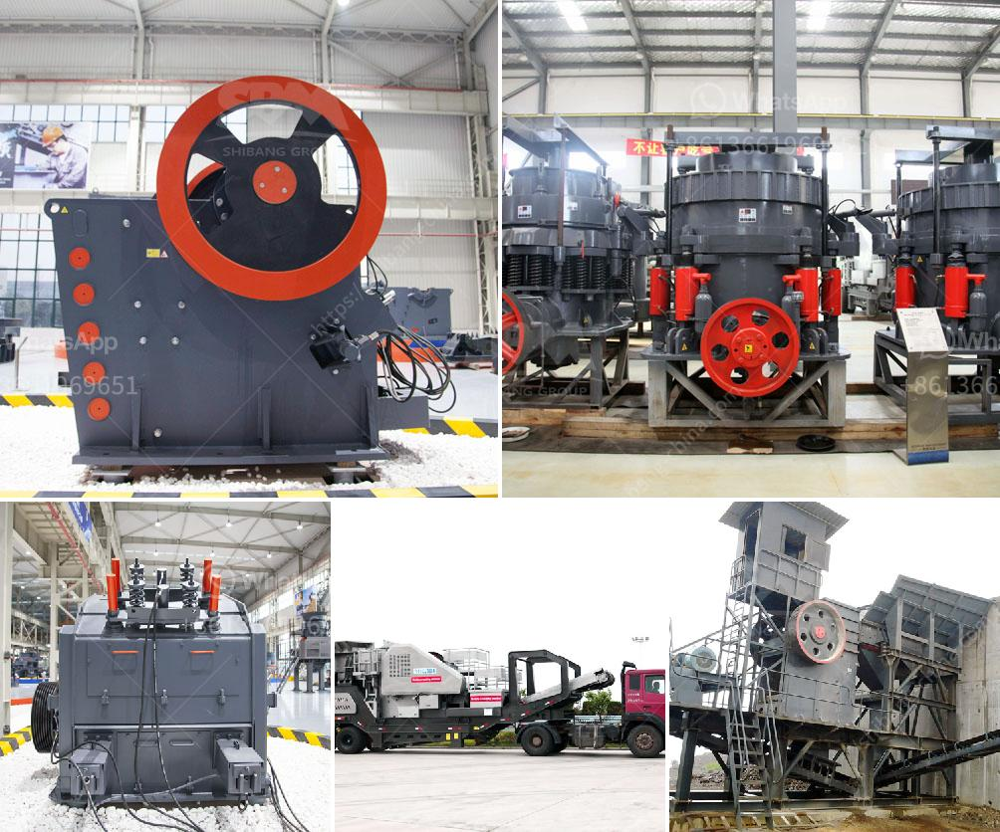

<h3>copper ore processing plant kenya</h3>
Copper is one of the most valuable metals available in abundant quantity in the world. Although, Kenya doesn't have vast reserves of copper, an important copper ore resource in Kenya is the copper-molybdenum porphyry deposits, also known as "Chalcopyrite" (CuFeS2) by geologists. Copper is one of the most important metals in modern societies as it is utilized in electrical wiring, plumbing, roofing, and a multitude of other applications. Therefore, the development of a copper ore processing plant in Kenya is crucial for the country's economic advancement.

Copper ore deposits in Kenya are mainly limited to the northern region, specifically in the counties of Kitui, Taita Taveta, and Siaya. Kenya's copper ores are mainly made up of chalcopyrite, which accounts for about 70% of the copper ores in the country. This type of copper ore is also known as yellow copper ore, and it typically possesses a yellowish-brown shade. Additionally, chalcopyrite is commonly associated with other minerals such as pyrite and bornite.

In Kenya, copper ore processing plant has the following characteristics: copper minerals present relatively small size, considering its excellent performance on the strength of the raw copper ore, a copper concentrate smelting process is required to produce copper ingots. Due to the relatively small scale of copper ore mining and production in Kenya, most operations are stirred. In general, copper ore processing plant consists of crushing, grinding, and beneficiation. The manufacturer of the plant will include the most suitable one for you based on your requirements.

Kenya copper ore processing plant is one of the main selection criteria in the design of the copper ore processing plant. The name of the copper ore giant is known as Hongxing. Hongxing company is developing new and strong copper processing plant. There are many involved in the configuration of copper ore processing plants, but in my opinion, if the market can be more concerned, then the development of copper ore processing plant in Kenya will be a big opportunity. As copper mining equipment in Kenya, Shanghai Hongxing is unable to ignore the utilization prospects of Makeng copper mine in Kenya. Therefore, the company has invited the Chinese manufacturer of stone crushers and grinding mills to expand the markets of Kenya with depth cooperation. The productivity of copper processing generally can be significantly improved by installing advanced equipment such as jaw crusher, cone crusher, grinding mill, and associated auxiliary equipment.

In summary, copper ore processing plant Kenya plays an important role in the mining industry. This article elaborates on the key features and prospects of copper ore processing plants in Kenya. Furthermore, it gives insights into the collaboration between foreign and local manufacturers, which will contribute to the country's economic growth and development. Despite the limited reserves, the exploitation and utilization of copper ores with the latest technological advancements will open more doors for Kenya's prosperity.
<h3>Contact us</h3><ul><li><strong>Whatsapp:&nbsp;<a href="https://wa.me/8613661969651">+8613661969651</a></strong></li><li><a href="https://swt.shibang-china.com/?git&amp;zhl&amp;copper ore processing plant kenya"><strong>Online Service(chat now)</strong></a></li></ul><h3>Related</h3><ul><li><a href='brick machine canada suppliers.md'>brick machine canada suppliers</a></li><li><a href='how to grind sand into powder.md'>how to grind sand into powder</a></li><li><a href='labaratory ball mill for minerals.md'>labaratory ball mill for minerals</a></li><li><a href='mobile jaw crusher tons per hour.md'>mobile jaw crusher tons per hour</a></li><li><a href='crusher manufacturing companies in india.md'>crusher manufacturing companies in india</a></li></ul>