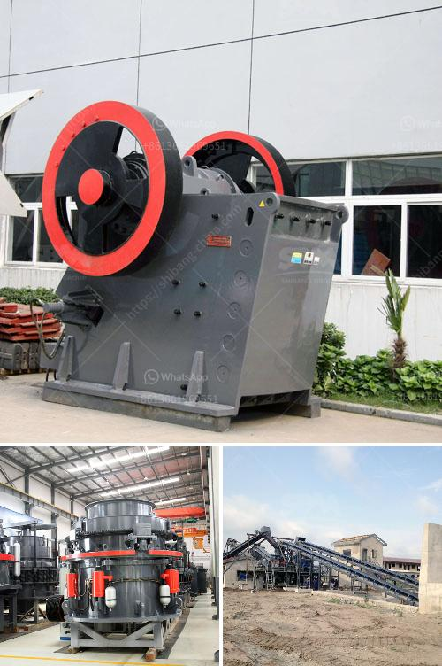

<h3>copper ore vertical ball mill</h3>
Copper ore is one of the most versatile materials used in the modern industry for a wide range of applications, from electronics to construction. As the demand for copper continues to grow, an increasing number of mining and smelting companies are turning towards the vertical ball mill as a cost-effective way to process copper ore. This innovative machine combines the advantages of traditional ball mills with the efficiency and convenience of vertical mills, making it a powerful tool for enhancing copper smelting operations.

A vertical ball mill is a type of grinder used to grind and blend materials for use in mineral dressing processes, paints, pyrotechnics, ceramics, and selective laser sintering. It works on the principle of impact and attrition: size reduction is done by impact as the balls drop from near the top of the shell. A ball mill consists of a hollow cylindrical shell rotating about its axis. The axis of the shell may be either horizontal or at a small angle to the horizontal. It is partially filled with balls. The grinding media are the balls, which may be made of steel (chrome steel), stainless steel, ceramic, or rubber.

1. The equipment is compact and occupies only a small area. It can be installed in a workshop or outdoors, which greatly saves space and reduces cost.

2. Vertical ball mills have a higher grinding efficiency compared to traditional ball mills. This efficiency translates to a lower energy consumption during the grinding process, resulting in significant savings in operating costs.

3. The vertical design of the mill ensures that the materials are fed into the grinding chamber evenly and continuously. This promotes a better grinding effect and prevents clumping or uneven particle size distribution.

4. The vertical ball mill is equipped with a classifier, which separates the ground particles from the oversized ones. This classifier ensures that only the desired particle size passes through, improving the overall efficiency and quality of the final product.

5. The vertical ball mill can also be used in conjunction with other auxiliary equipment such as a pre-grinding mill or pre-screening machine for improved grinding efficiency and higher processing capacity.

In conclusion, the copper ore vertical ball mill provides a new and efficient way to process copper ore, eliminating the need for conventional ball mills and improving the overall smelting process. This mill offers a significant reduction in energy consumption, leading to cost savings for the mining and smelting industry. With its compact size and high grinding efficiency, the vertical ball mill is set to revolutionize the copper smelting industry and pave the way for a sustainable and profitable future.

- Gao, Y., Ju, W., Wu, X., Liu, Y., & Zhang, J. (2019). Experimental study on the grinding rate constant of solid materials in a vertical ball mill. Powder Technology, 356, 623-628.

- Hsieh, C. H., Wu, P. C., Chen, C. C., & Lin, G. K. (2010). The effect of grinding media performance on milling and operational behavior of a horizontal stirred mill. Minerals Engineering, 23(7), 544-551.
<h3>Contact us</h3><ul><li><strong>Whatsapp:&nbsp;<a href="https://wa.me/8613661969651">+8613661969651</a></strong></li><li><a href="https://swt.shibang-china.com/?git&amp;zhl&amp;copper ore vertical ball mill"><strong>Online Service(chat now)</strong></a></li></ul><h3>Related</h3><ul><li><a href='ball mills vietnam.md'>ball mills vietnam</a></li><li><a href='gravel crusher prices philippines.md'>gravel crusher prices philippines</a></li><li><a href='crusher dust washing machines.md'>crusher dust washing machines</a></li><li><a href='crusher mandrel crusher price.md'>crusher mandrel crusher price</a></li><li><a href='mill for grinding quartz.md'>mill for grinding quartz</a></li></ul>