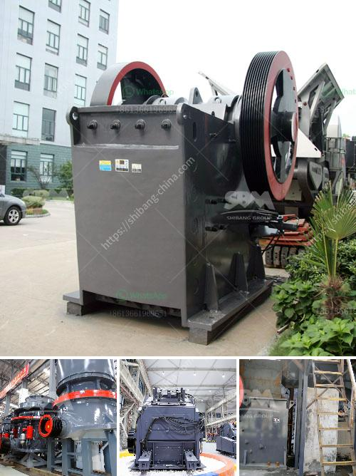

<h3>cost 100tpd cement plant india</h3>
India is one of the fastest-growing economies in the world, and its construction industry plays a crucial role in the country's development. To meet the growing demand for cement, many entrepreneurs and investors are considering setting up cement plants in India. One popular option is the 100 TPD cement plant.

A 100 TPD cement plant is a small-scale cement manufacturing unit with a capacity of 100 tons per day. This type of plant requires relatively less capital investment and offers great flexibility in terms of production and expansion possibilities. It is a suitable option for start-ups, small-scale entrepreneurs, and even established players looking to set up smaller cement plants in India.

The cost of setting up a 100 TPD cement plant in India depends on various factors, including the location of the plant, the availability of raw materials, the market demand for cement, and the labor and machinery costs. Generally, the cost ranges between $3 million to $7 million.

The major cost components of setting up a 100 TPD cement plant include the land, machinery, and equipment, raw materials, labor, and miscellaneous expenses such as transportation and marketing. On average, the land cost constitutes around 30% of the total investment, while the machinery and equipment costs account for approximately 40-50%.

India offers significant advantages for cement plant investors, with an abundant availability of limestone, the primary raw material for cement production. Additionally, the government has implemented various policies and incentives to promote the cement industry, such as tax benefits, subsidies, and simplified regulatory procedures.

One of the key considerations for setting up a 100 TPD cement plant is the demand for cement in the local market. Entrepreneurs must conduct a detailed market analysis to assess the demand-supply dynamics, competition, pricing, and future growth potential. It is also crucial to develop a comprehensive business plan and investment strategy to ensure profitability and success.

In conclusion, setting up a 100 TPD cement plant in India can be a lucrative investment opportunity, given the country's growing construction industry and favorable government policies. However, thorough research, planning, and cost estimation are essential to ensure a successful venture. With the right strategy and execution, entrepreneurs can tap into India's booming cement market and contribute to the nation's infrastructure development.
<h3>Contact us</h3><ul><li><strong>Whatsapp:&nbsp;<a href="https://wa.me/8613661969651">+8613661969651</a></strong></li><li><a href="https://swt.shibang-china.com/?git&amp;zhl&amp;cost 100tpd cement plant india"><strong>Online Service(chat now)</strong></a></li></ul><h3>Related</h3><ul><li><a href='crusher machine manufacturer in coimbatore.md'>crusher machine manufacturer in coimbatore</a></li><li><a href='used industrial stone crushers for sale.md'>used industrial stone crushers for sale</a></li><li><a href='roller mill suppliers in mexico.md'>roller mill suppliers in mexico</a></li><li><a href='hand portable rock crusher.md'>hand portable rock crusher</a></li><li><a href='dolomite powder mill manufacturing process.md'>dolomite powder mill manufacturing process</a></li></ul>