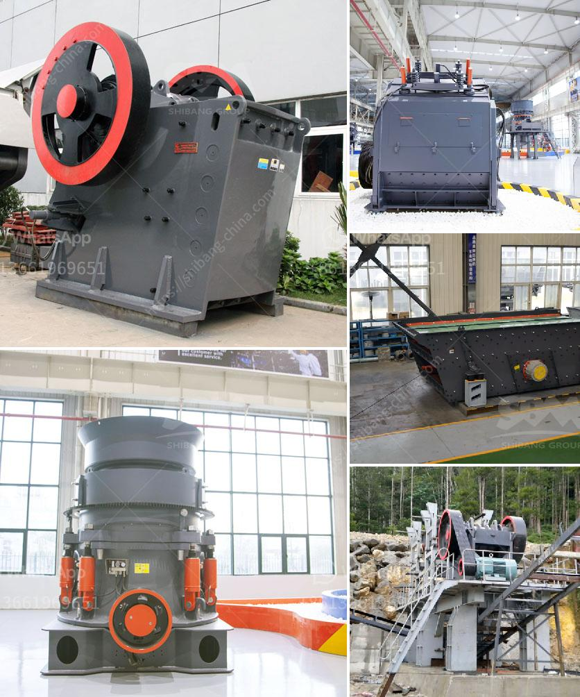

<h3>cost analysis of stone quarry in india</h3>
India is known for its immense resources of stones, and there are several suppliers and exporters of natural stone in the country. But witnessing the increasing demand for these stones, there is also a need to understand the cost analysis of the stone quarry process. Quarrying stones in India can be a major expenditure since the extraction involves a series of costly procedures. In this article, we will discuss the factors that affect the cost analysis of a stone quarry in India.

One of the major factors impacting the cost of quarrying stones is the transportation cost. Stones need to be transported from the quarry site to the processing plant, and this can be a costly affair. The quarrying sites are often located in remote areas, far away from the urban centers where the processing plants are situated. The transportation cost can be high due to the long distances and sometimes poor road conditions. This expense needs to be factored in when calculating the overall cost of the stone quarry.

Another significant factor in the cost analysis of a stone quarry is the cost of labor. Quarrying stones is a labor-intensive process that requires skilled workers. These workers are responsible for extracting the stones from the earth, processing them, and ensuring they are ready for sale. The cost of employing skilled labor can be quite high, especially if the quarry is situated in areas where labor wages are high.

Equipment and machinery are also essential for stone quarrying, and their cost needs to be factored in the cost analysis. The equipment and machinery used in quarrying vary depending on the type of stone being extracted and the method of extraction. For example, in the case of dimensional stones like granite or marble, diamond wire saws and drills are commonly used, which can be expensive to acquire and maintain. The cost of purchasing and maintaining the machinery adds to the overall cost of stone quarrying.

In addition to labor and machinery costs, an important aspect to consider is the cost of environmental compliance. Nowadays, there are strict regulations in place to ensure sustainable mining practices and minimize environmental impact. Quarrying stones can have adverse effects on the environment, such as soil erosion, water pollution, and habitat destruction. To comply with these regulations, stone quarries need to invest in measures like erosion control, water treatment facilities, and land rehabilitation. All these activities incur additional costs, which need to be considered in the cost analysis.

Lastly, the final factor to consider is the market demand and price of the stones extracted from the quarry. The market demand for stones can fluctuate, affecting the profitability of the quarry. If there is a high demand for certain types of stones, the quarry can fetch a higher price for its products. On the other hand, if there is low demand or oversupply in the market, the quarry may need to reduce its prices or face a decrease in revenues.

In conclusion, the cost analysis of a stone quarry in India involves various factors such as transportation costs, labor expenses, equipment and machinery costs, environmental compliance costs, and market demand. All these factors impact the overall cost of quarrying stones. It is essential for quarry owners to carefully assess these costs and determine the viability and profitability of their operations.
<h3>Contact us</h3><ul><li><strong>Whatsapp:&nbsp;<a href="https://wa.me/8613661969651">+8613661969651</a></strong></li><li><a href="https://swt.shibang-china.com/?git&amp;zhl&amp;cost analysis of stone quarry in india"><strong>Online Service(chat now)</strong></a></li></ul><h3>Related</h3><ul><li><a href='ball mill pulverizer.md'>ball mill pulverizer</a></li><li><a href='calcium silicone crushers.md'>calcium silicone crushers</a></li><li><a href='marble crushing machinery.md'>marble crushing machinery</a></li><li><a href='how to grind sand into powder.md'>how to grind sand into powder</a></li><li><a href='induatrial mill crusher supplier.md'>induatrial mill crusher supplier</a></li></ul>