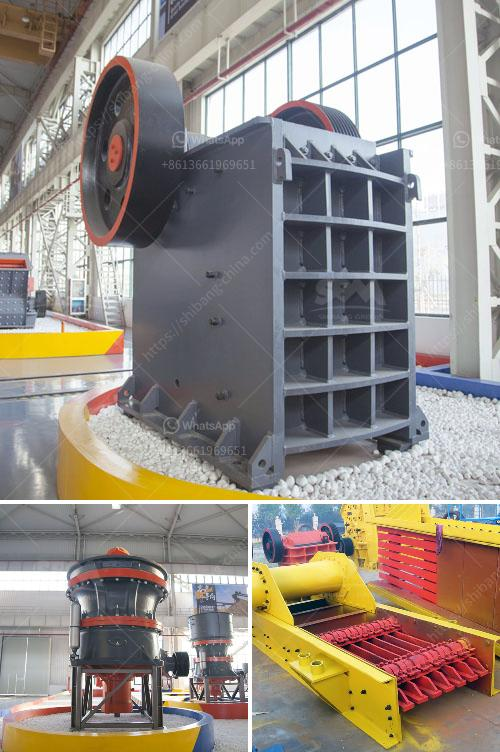

<h3>cost of 1000 tpd cement plant</h3>
The cement industry is known for its high capital investment, with cost estimates for a new cement plant exceeding $1 billion dollars. However, it's not uncommon for companies to spend just as much, if not more, on yearly maintenance and regular upgrades to their existing facilities.

For a 1000 TPD (tonnes per day) cement plant, a conservative estimate would be around $1 billion dollars. This includes the cost of land, building materials, and equipment, as well as labor and construction costs. Additionally, there are also expenses for permits and licenses, engineering and design services, and various other fees.

The largest portion of the cost goes towards equipment, which includes crushers, mills, kilns, and conveyor belts. These machines require regular maintenance, which adds to the overall cost of running the plant. Moreover, energy costs are a significant consideration, as cement production is an energy-intensive process. Fuel, electricity, and other utilities can quickly add up to significant expenses.

The production capacity of a cement plant is measured in tonnes per day (TPD). In this case, a 1000 TPD cement plant means that the plant can produce 1000 tonnes of cement per day. This is a substantial amount, requiring a sizable facility and workforce to operate.

It's important to note that the cost of a cement plant can vary significantly depending on factors such as location, local regulations, and market conditions. For instance, constructing a plant in an urban area may increase the cost due to higher land prices and stricter environmental regulations.

Despite the high initial cost, investing in a cement plant can be financially rewarding in the long run. Cement is a fundamental building material, with demand that is expected to grow steadily in the coming years. As a result, cement manufacturers can benefit from a stable market and generate substantial profits.

In conclusion, the cost of a 1000 TPD cement plant can easily exceed $1 billion dollars when considering various factors, such as equipment, labor, utilities, and permits. While the upfront investment is substantial, the long-term rewards and profitability of the cement industry make it an attractive venture for many companies.
<h3>Contact us</h3><ul><li><strong>Whatsapp:&nbsp;<a href="https://wa.me/8613661969651">+8613661969651</a></strong></li><li><a href="https://swt.shibang-china.com/?git&amp;zhl&amp;cost of 1000 tpd cement plant"><strong>Online Service(chat now)</strong></a></li></ul><h3>Related</h3><ul><li><a href='crushing machine company.md'>crushing machine company</a></li><li><a href='zimbabwe crusher rental.md'>zimbabwe crusher rental</a></li><li><a href='crushers for recycling machine uae.md'>crushers for recycling machine uae</a></li><li><a href='quarry crusher plant in ethiopia.md'>quarry crusher plant in ethiopia</a></li><li><a href='price of portable stonecrusher.md'>price of portable stonecrusher</a></li></ul>