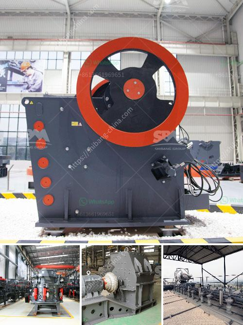

<h3>cost of a cement grinding plant in india</h3>
The cost of setting up a cement grinding plant in India is significantly higher compared to other regions of the world. Firstly, the location of the plant and the availability of raw materials in that particular region affect the project's cost.

Transporting cement over long distances can be expensive, so opting for a location near a limestone deposit minimizes transportation costs. Additionally, the availability of other materials such as gypsum and fly ash, which are essential in the cement production process, should also be considered.

The size of the plant also plays a crucial role in determining the cost. A small-scale plant with a production capacity of 100 tons per day will incur lower expenses compared to a larger plant with a capacity of 300 tons per day. The cost of machinery and equipment varies accordingly.

Labor costs are another significant factor to consider. India has a large and competitive labor market, but the expertise required for operating and maintaining a cement grinding plant may require skilled workers who demand higher wages. Thus, labor costs need to be factored into the overall project budget.

Furthermore, environmental regulations and compliance costs can also impact the total cost of setting up a cement grinding plant in India. The government imposes stringent regulations on emissions, waste management, and other environmental aspects, which may require substantial investments in pollution control systems.

Apart from the above factors, the cost of land, utilities, permits, and licenses must also be considered. Depending on the region, the cost of acquiring land for industrial purposes can vary significantly.

In conclusion, setting up a cement grinding plant in India can be an expensive proposition due to various factors. These include the location, availability of raw materials, the size of the plant, labor costs, and environmental compliance. Determining the project's feasibility and estimating the overall investment required is essential before commencing such a venture.
<h3>Contact us</h3><ul><li><strong>Whatsapp:&nbsp;<a href="https://wa.me/8613661969651">+8613661969651</a></strong></li><li><a href="https://swt.shibang-china.com/?git&amp;zhl&amp;cost of a cement grinding plant in india"><strong>Online Service(chat now)</strong></a></li></ul><h3>Related</h3><ul><li><a href='mobile used crushing and screening plant for sale.md'>mobile used crushing and screening plant for sale</a></li><li><a href='used stone crusher sale in ethiopia.md'>used stone crusher sale in ethiopia</a></li><li><a href='gypsum plant equipment catalogue.md'>gypsum plant equipment catalogue</a></li><li><a href='granite edge cutting machine in sweden.md'>granite edge cutting machine in sweden</a></li><li><a href='lime morter grinding machine price list.md'>lime morter grinding machine price list</a></li></ul>