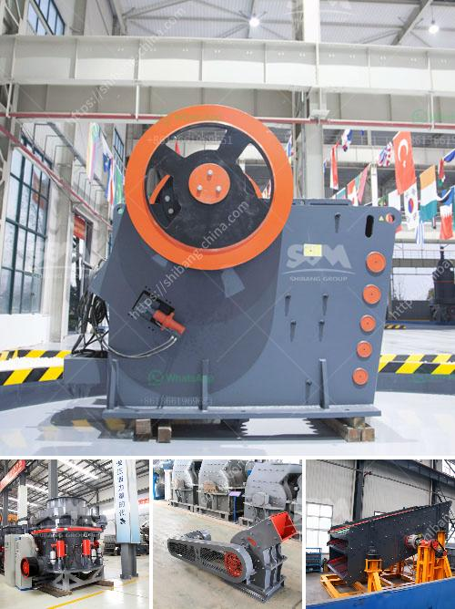

<h3>cost of a conveyor belt in india</h3>
Conveyor belts play a vital role in various industries, from transporting heavy materials to facilitating faster and efficient production processes. In India, the cost of a conveyor belt can vary depending on its size, material, and design specifications. Let's take a closer look at the factors influencing the cost and potential price ranges.

One of the significant determinants of a conveyor belt's cost is its size. Conveyor belts are available in a wide range of sizes to suit different applications. Smaller belts used for light-duty tasks come at a comparatively lower cost than larger belts designed to handle heavy loads. Therefore, clients must consider their specific requirements and choose an appropriate size accordingly.

The material used in the construction of a conveyor belt also affects its cost. Common materials include rubber, PVC, nylon, and steel. Rubber belts are popular due to their versatility and durability; however, they might be more expensive compared to PVC belts. Nylon and steel belts are the costliest options due to their exceptional strength and ability to handle heavy objects. Buyers should assess the material requirements based on their operations and budget accordingly.

Moreover, the design specifications of a conveyor belt impact its cost. Belts with additional features like heat resistance, oil resistance, or anti-static properties may cost more than standard belts. Different designs such as flat, V-shaped, or troughed belts are available, each with its own price range. Clients must evaluate whether the specific design features are necessary for their application or if a standard belt would suffice.

Considering these factors, the cost of a conveyor belt in India can range from INR 500 to INR 10,000 per meter. It is crucial for businesses to thoroughly analyze their requirements and consult with reputable manufacturers or suppliers to ensure they are getting the most cost-effective solution for their needs.

In conclusion, the cost of a conveyor belt in India varies according to factors such as size, material, and design specifications. Businesses should carefully consider their requirements, balancing their budget and operational needs, to make an informed decision. By doing so, they can acquire a high-quality conveyor belt that enhances productivity while ensuring a satisfactory return on investment.
<h3>Contact us</h3><ul><li><strong>Whatsapp:&nbsp;<a href="https://wa.me/8613661969651">+8613661969651</a></strong></li><li><a href="https://swt.shibang-china.com/?git&amp;zhl&amp;cost of a conveyor belt in india"><strong>Online Service(chat now)</strong></a></li></ul><h3>Related</h3><ul><li><a href='sand mining equipment manufacturers in south africa.md'>sand mining equipment manufacturers in south africa</a></li><li><a href='used stone crusher in europe for sale.md'>used stone crusher in europe for sale</a></li><li><a href='dealers of hammer mill in nigeria.md'>dealers of hammer mill in nigeria</a></li><li><a href='marble crusher germany.md'>marble crusher germany</a></li><li><a href='types of cone crusher.md'>types of cone crusher</a></li></ul>