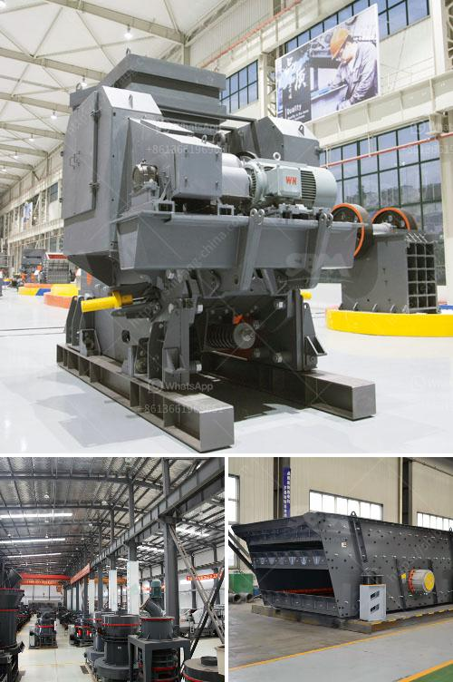

<h3>cost of a silica crusher</h3>
Silica, also known as silicon dioxide, is a mineral found abundantly in nature. It is widely used in various industries, including construction, glass manufacturing, ceramics, and electronics, due to its hardness and heat resistance. To extract silica from its natural form and prepare it for industrial use, a crusher specifically designed for silica crushing is required. In this article, we will discuss the cost of a silica crusher and factors influencing it.

The primary cost associated with a silica crusher is the initial purchase. The price range for a silica crusher can vary significantly depending on the brand, model, capacity, and features it offers. Typically, a basic model with a lower capacity will have a lower price, while a higher capacity model with advanced features will be more expensive. On average, the cost of a silica crusher can range from $10,000 to $100,000 or more.

However, the initial purchase cost is just the tip of the iceberg. Several other factors contribute to the overall cost of owning a silica crusher. One of the significant costs incurred is the cost of operation and maintenance. This includes the cost of electricity required to power the crusher, regular inspection and servicing, and replacement of worn-out parts. The cost of operation and maintenance can vary depending on the usage intensity and the quality of maintenance practices followed.

Another factor that influences the cost of a silica crusher is its efficiency and productivity. A highly efficient crusher will require less energy and produce more output per unit of time compared to a less efficient one. This can result in cost savings in terms of reduced electricity consumption and increased production, which can justify a higher initial investment. It is essential to carefully evaluate the efficiency and productivity of different models before making a purchasing decision.

The type of silica crusher also affects the cost. There are several types of crushers available, including jaw crushers, cone crushers, impact crushers, and gyratory crushers. Each type has its own advantages and disadvantages in terms of cost, performance, and maintenance requirements. Jaw crushers are cost-effective and widely used for primary crushing, but they may have limitations in terms of size reduction. Cone crushers are versatile and offer better control over the final product, but they are more expensive to purchase and maintain. Impact crushers are efficient in producing cubic-shaped materials, but they may require frequent maintenance due to wear and tear. Gyratory crushers are costly but offer high capacity and low maintenance requirements.

Along with the cost of the crusher itself, the cost of transportation, installation, and commissioning should also be considered. These costs can vary depending on the location of the site and the complexity of the installation process. It is crucial to factor in these costs to get an accurate estimation of the total investment required for a silica crusher.

In conclusion, the cost of a silica crusher can vary depending on various factors, including the brand, model, capacity, efficiency, and type. While the initial purchase cost is important, the cost of operation and maintenance, efficiency, and productivity should also be considered. Careful evaluation of different models and consideration of all associated costs are essential to make an informed decision and ensure the long-term success and profitability of using a silica crusher.
<h3>Contact us</h3><ul><li><strong>Whatsapp:&nbsp;<a href="https://wa.me/8613661969651">+8613661969651</a></strong></li><li><a href="https://swt.shibang-china.com/?git&amp;zhl&amp;cost of a silica crusher"><strong>Online Service(chat now)</strong></a></li></ul><h3>Related</h3><ul><li><a href='mobile crusher for rent in uae.md'>mobile crusher for rent in uae</a></li><li><a href='crushers made in south korea.md'>crushers made in south korea</a></li><li><a href='list of quarry operators in uae.md'>list of quarry operators in uae</a></li><li><a href='equipments in gypsum powder production line.md'>equipments in gypsum powder production line</a></li><li><a href='lister grinding mill in kenya.md'>lister grinding mill in kenya</a></li></ul>