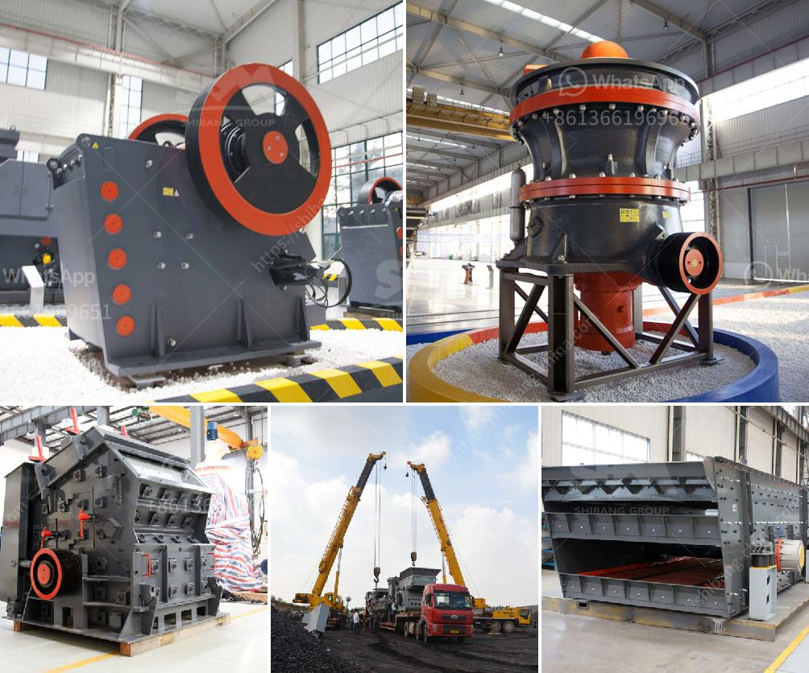

<h3>cost of an copper ore crusher</h3>
Copper ore refers to natural minerals containing copper and other compounds. It can be used to extract useful copper, which is widely used in various industries. However, crushing copper ore can be a challenge due to its hardness and size. The cost of a copper ore crusher stands as a significant factor in the overall project investment.

One of the primary factors influencing the cost of a copper ore crusher is the level of production. The more pellets the crusher can process per hour, the higher its cost. Crushers capable of processing a large volume of copper ore are often expensive to purchase and maintain. On the other hand, crushers with a lower processing capacity are generally more affordable.

Another major factor affecting the cost is the size and hardness of the copper ore. If the ore is not properly crushed, the efficiency of subsequent extraction processes may suffer. Therefore, it is crucial to invest in a crusher capable of handling copper ore of varying hardness. Equipment that can crush ore efficiently while minimizing wear and tear will be more expensive than less efficient options.

The cost of a copper ore crusher can vary widely depending on factors such as the supplier and the specifications of the crusher. Additionally, additional costs may be incurred for transportation and installation. Therefore, it is essential to consider all these factors in order to make an informed decision regarding the purchase of a crusher.

Ultimately, while cost is undoubtedly an essential element in any investment, it should not be the sole consideration when choosing a copper ore crusher. The quality, performance, and durability of the crusher are equally important. In the long run, an efficient and reliable crusher will prove to be a wise investment, helping to enhance the overall productivity and profitability of the copper mining operation.

In conclusion, the cost of a copper ore crusher can vary depending on production needs, processing capacity, size, and hardness of the ore, supplier, and additional expenses involved. It is crucial to weigh all these factors carefully when making a purchase decision. By doing so, it is possible to find a crusher that offers the best balance between cost and performance while meeting the specific requirements of the copper ore crushing process.
<h3>Contact us</h3><ul><li><strong>Whatsapp:&nbsp;<a href="https://wa.me/8613661969651">+8613661969651</a></strong></li><li><a href="https://swt.shibang-china.com/?git&amp;zhl&amp;cost of an copper ore crusher"><strong>Online Service(chat now)</strong></a></li></ul><h3>Related</h3><ul><li><a href='crusher manufacturers in peru.md'>crusher manufacturers in peru</a></li><li><a href='capacity of cone crusher.md'>capacity of cone crusher</a></li><li><a href='company of stone crusher.md'>company of stone crusher</a></li><li><a href='germany calcium carbonate grinding mill suppliers.md'>germany calcium carbonate grinding mill suppliers</a></li><li><a href='quarry equipment china.md'>quarry equipment china</a></li></ul>