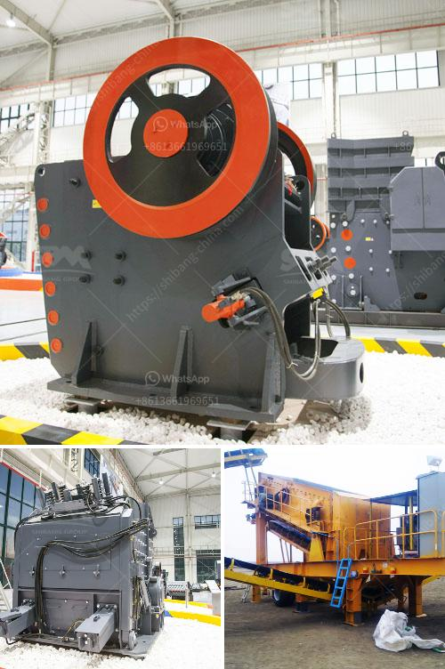

<h3>cost of barite processing plant</h3>
The cost of barite processing plant is an important factor that affects the decision-making process of a barite producer as well as the economic success of their operations. Barite processing plants are used to produce various grades of barite for a wide range of industry applications, such as oil drilling, painting, and medical uses.

The upfront cost of establishing a barite processing plant can be quite significant. However, this cost is usually justified in the long run, as barite processing plants have the potential to generate substantial profits. The cost of establishing a barite processing plant can vary greatly depending on the specific location, scale, and processing requirements. It is essential for potential plant owners to carefully analyze these factors to estimate an accurate cost.

The location of a barite processing plant can have a significant impact on the cost. The cost of land, infrastructure, and utilities can vary greatly depending on the location. Additionally, the availability of skilled labor can also affect the cost. For instance, establishing a processing plant in developed countries where labor costs are high can result in higher upfront expenses. In contrast, setting up a plant in developing countries with lower labor costs can reduce the initial investment.

The scale of the barite processing plant is another critical factor that influences the cost. A larger plant with higher production capacity would require more investment in terms of equipment, machinery, and infrastructure. However, a larger plant often benefits from economies of scale, as the cost per unit of production decreases with higher output levels. Proper market analysis should be conducted to determine the optimal scale of the plant.

Furthermore, the processing requirements of the barite also affect the cost of the plant. Different grades of barite require different processing techniques and equipment. For example, higher quality barite may require additional steps such as grinding or chemical purification, which can increase the cost of the plant. Therefore, the desired purity and grades of barite products should be determined in advance to estimate the cost accurately.

In conclusion, the cost of establishing a barite processing plant depends on numerous factors, including the location, scale, and processing requirements. A thorough analysis of these factors is necessary to estimate the upfront investment accurately. While the initial cost may be significant, a well-planned and efficiently operated barite processing plant has the potential to yield substantial profits in the long run.
<h3>Contact us</h3><ul><li><strong>Whatsapp:&nbsp;<a href="https://wa.me/8613661969651">+8613661969651</a></strong></li><li><a href="https://swt.shibang-china.com/?git&amp;zhl&amp;cost of barite processing plant"><strong>Online Service(chat now)</strong></a></li></ul><h3>Related</h3><ul><li><a href='mineral powder machine.md'>mineral powder machine</a></li><li><a href='proposal pabrik stone crusher.md'>proposal pabrik stone crusher</a></li><li><a href='potential of mica wet grinding plant.md'>potential of mica wet grinding plant</a></li><li><a href='production process of cement.md'>production process of cement</a></li><li><a href='calcium carbonate powder machine.md'>calcium carbonate powder machine</a></li></ul>