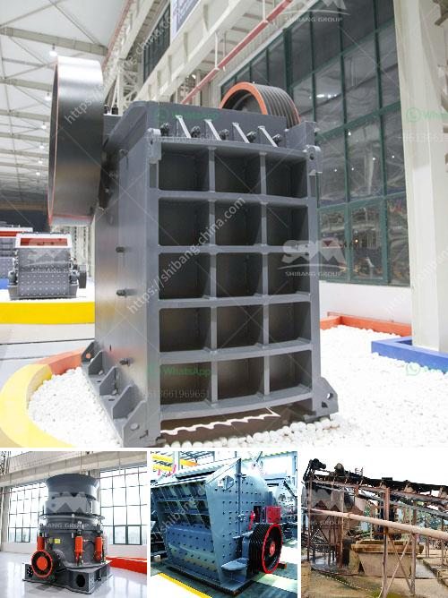

<h3>cost of building calcium carbonate factory</h3>
Calcium carbonate is a widely used mineral compound, renowned for its various industrial applications. Its importance in various sectors has made establishing a calcium carbonate factory a lucrative business opportunity. However, before venturing into the industry, it is vital to assess the cost of setting up and running such a factory to ensure profitability and success.

The initial cost of building a calcium carbonate factory primarily depends on several factors. Firstly, the scale of the factory plays a significant role. Building a small-scale factory with a production capacity of 5,000-10,000 tons per annum would require a smaller investment compared to a large-scale factory with a capacity of 50,000-100,000 tons per annum. The machinery and equipment required for larger output volumes ultimately increase the cost of building the factory.

Secondly, the location of the factory is an essential aspect to consider. Proximity to high-quality limestone deposits, transportation infrastructure, and the availability of skilled labor should be taken into account. Locating the factory close to limestone mines reduces transportation costs, making it more economically feasible. Additionally, availability of labor at competitive wages will help in curbing operational costs.

Moreover, incorporating environmental and safety requirements into the factory's design and construction raises the initial investment. Waste management systems, air pollution control, and soundproofing equipment necessitate additional expenses. However, this expenditure ensures compliance with environmental regulations and guarantees the factory's sustainability and acceptance by local authorities.

Equipment and machinery for a calcium carbonate factory include crushing machines, conveyors, grinding mills, classifiers, dust collectors, and packaging machines. The selection of machinery depends on the desired end product specifications and production capacity. While it is important to invest in high-quality machinery, this decision should be balanced with budget constraints. Collaborating with reputable equipment suppliers can help in proper selection, ensuring a good return on investment.

Installation and commissioning costs, followed by training for the factory's workforce adds to the initial expenditure. Hiring experienced technicians and engineers for these processes ensures a smooth start of operations and optimization of production efficiency. It is crucial to allocate sufficient funds for these activities to avoid cost overruns and project delays.

In addition to the initial cost, operational expenses are equally significant. Raw material procurement costs, power consumption, maintenance, and labor costs contribute to the overall operational expenditure. Establishing partnerships with reliable suppliers for raw materials and using energy-efficient machinery can bring down operational costs.

To justify the investment, conducting a thorough market analysis is crucial. Identifying potential customers, their demands, and competition in the market helps in estimating the factory's revenue and profitability. Adequate marketing and sales strategies should be devised to attract clients and secure long-term contracts.

In conclusion, setting up a calcium carbonate factory requires careful consideration of both the initial and operational costs. Assessing the scale of the factory, location, machinery selection, environmental compliance, and market feasibility are key factors influencing the overall investment. A well-planned approach and efficient resource utilization can secure profitability in this promising industry.
<h3>Contact us</h3><ul><li><strong>Whatsapp:&nbsp;<a href="https://wa.me/8613661969651">+8613661969651</a></strong></li><li><a href="https://swt.shibang-china.com/?git&amp;zhl&amp;cost of building calcium carbonate factory"><strong>Online Service(chat now)</strong></a></li></ul><h3>Related</h3><ul><li><a href='crushing machine company.md'>crushing machine company</a></li><li><a href='vibrating screen for mesh 14 vibrating screen.md'>vibrating screen for mesh 14 vibrating screen</a></li><li><a href='benefit analysis for granite mining.md'>benefit analysis for granite mining</a></li><li><a href='limestone crusher for sale.md'>limestone crusher for sale</a></li><li><a href='equipments in gypsum powder production line.md'>equipments in gypsum powder production line</a></li></ul>