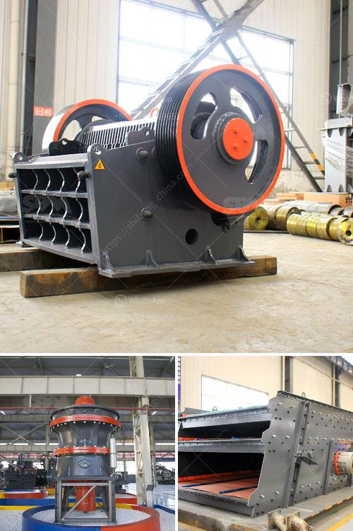

<h3>cost of cement manufacturing machine china</h3>
China has a long history of cement production, and the industry plays a crucial role in the country's economic development. As the largest cement producer in the world, China has been continually investing in new technology and equipment to improve efficiency and reduce environmental impact.

One of the essential machines in cement manufacturing is the cement kiln. The kiln is where raw materials are heated at a high temperature to produce clinker, which is then ground into cement. The cost of cement manufacturing machines in China varies widely depending on the size and type of kiln.

For small-scale cement plants or projects with a limited budget, small cement kilns are the preferred choice. These mini kilns have a capacity of around 100-300 tons per day and cost between $500,000 to $1 million. Despite their smaller size, these kilns can still achieve high energy efficiency and low emissions.

Medium-sized cement kilns, often used by medium-sized cement plants, have a daily capacity of 300-600 tons and are priced at approximately $1-3 million. These kilns can produce a significant amount of clinker while maintaining operational stability and reliability.

Large cement kilns, capable of producing more than 1,000 tons of clinker per day, are typically used in large-scale cement plants. These kilns require substantial investment and can cost anywhere from $3-10 million. However, these high-capacity kilns can achieve economies of scale, minimizing the cost per ton of clinker produced.

In addition to the cement kiln, other machines are necessary for the cement manufacturing process. These include crushers, raw material mills, cement mills, and packing machines. The cost of these auxiliary machines can range from a few hundred thousand dollars to several million dollars, depending on their scale and sophistication.

The cost of cement manufacturing machines in China is influenced by various factors. One major factor is the level of automation and technological advancement of the equipment. More advanced machines with higher automation capabilities tend to be more expensive but offer better efficiency and productivity.

Another factor impacting the cost is the quality and durability of the machines. While cheaper options may seem attractive at first, they may not withstand the harsh conditions and heavy workload of cement production, resulting in frequent breakdowns and higher maintenance costs. Investing in high-quality machines might have a higher initial cost but can save money in the long run.

Furthermore, government regulations and environmental considerations significantly impact the cost of cement manufacturing machines in China. In recent years, as China strives to reduce carbon emissions and improve air quality, stricter regulations have been imposed on the cement industry. This has led to the introduction of more environmentally friendly and energy-efficient equipment, which, although costly, aligns with China's sustainability goals.

In conclusion, the cost of cement manufacturing machines in China can vary greatly depending on the size, type, quality, and technological advancement of the equipment. While initial investment may be significant, investing in high-quality, efficient machines is crucial for long-term success and sustainability in the cement industry. China's continuous efforts to reduce emissions and improve environmental performance also play a significant role in shaping the cost of cement manufacturing machines.
<h3>Contact us</h3><ul><li><strong>Whatsapp:&nbsp;<a href="https://wa.me/8613661969651">+8613661969651</a></strong></li><li><a href="https://swt.shibang-china.com/?git&amp;zhl&amp;cost of cement manufacturing machine china"><strong>Online Service(chat now)</strong></a></li></ul><h3>Related</h3><ul><li><a href='ball mill capacity.md'>ball mill capacity</a></li><li><a href='clay making process nigeria.md'>clay making process nigeria</a></li><li><a href='silica sand crusher machine.md'>silica sand crusher machine</a></li><li><a href='lister grinding mill in kenya.md'>lister grinding mill in kenya</a></li><li><a href='jaw impact crusher poland.md'>jaw impact crusher poland</a></li></ul>