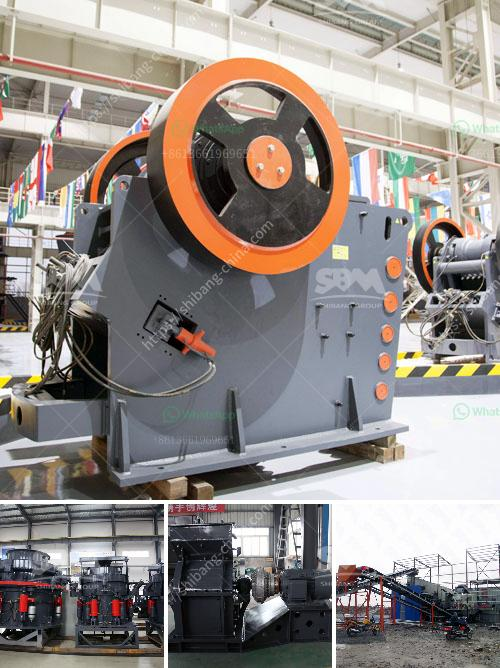

<h3>cost of coal washing plant</h3>
Coal washing plant, also known as coal preparation plant, is a facility that washes coal to remove soil, rock, and other impurities from it. The resulting clean coal is used for various purposes – such as power generation, heating fuel, and coal exports.

Coal washing is an integral part of the coal production process. It is estimated that over 1 billion metric tons of coal are used annually worldwide, and the demand is increasing. With this increasing demand, the need for efficient coal washing plants becomes crucial in maintaining the quality of the final product.

The cost of setting up a coal washing plant varies depending on the specific requirements and the size of the plant. However, a typical coal washing plant can range from $3 million to $15 million USD.

The cost of coal washing plants is generally determined by the design, equipment, and construction factors. The specific factors that contribute to the overall cost include:

1. Size and capacity: The size and capacity of the plant play a significant role in determining the overall cost. Larger plants require more physical area, raw materials, and costlier equipment, resulting in a higher price tag.

2. Equipment selection: The choice of equipment used in a coal washing plant greatly impacts the cost. High-quality, efficient equipment can be more expensive initially but can save on operational costs in the long run.

3. Infrastructure and construction: The site selection, civil works, and plant construction expenses contribute significantly to the overall cost. Factors such as site accessibility, land acquisition costs, and any necessary environmental mitigation measures can influence the final price.

4. Water and energy supply: Coal washing plants require significant amounts of water and energy for their operation. The availability and cost of these resources can influence the overall cost of the plant.

5. Maintenance and operational costs: Apart from the initial capital investment, ongoing maintenance, labor, and operational costs need to be considered. Routine maintenance, repairs, and labor costs for plant operation impact the long-term cost of running a coal washing plant.

It is important to note that the cost of coal washing plants should be viewed as an investment rather than an expense. These plants play a vital role in reducing environmental pollution by removing impurities from coal and improving its combustion efficiency. The high-quality clean coal produced can be sold at a premium, further offsetting the initial investment.

Additionally, coal washing plants have a positive impact on the health and safety of workers involved in coal mining. By removing harmful substances such as silica and sulfur, the risks associated with coal dust and air pollution can be significantly reduced.

In conclusion, the cost of a coal washing plant can vary depending on numerous factors, such as size, capacity, equipment selection, infrastructure, and ongoing operational costs. However, the investment in a coal washing plant not only ensures high-quality, clean coal but also promotes environmental sustainability and worker safety.
<h3>Contact us</h3><ul><li><strong>Whatsapp:&nbsp;<a href="https://wa.me/8613661969651">+8613661969651</a></strong></li><li><a href="https://swt.shibang-china.com/?git&amp;zhl&amp;cost of coal washing plant"><strong>Online Service(chat now)</strong></a></li></ul><h3>Related</h3><ul><li><a href='flow diagram for limestone process.md'>flow diagram for limestone process</a></li><li><a href='ball mill machine in china.md'>ball mill machine in china</a></li><li><a href='induatrial mill crusher supplier.md'>induatrial mill crusher supplier</a></li><li><a href='crusher conica crusher ethiopia.md'>crusher conica crusher ethiopia</a></li><li><a href='crusher stone crusher 4 ton.md'>crusher stone crusher 4 ton</a></li></ul>