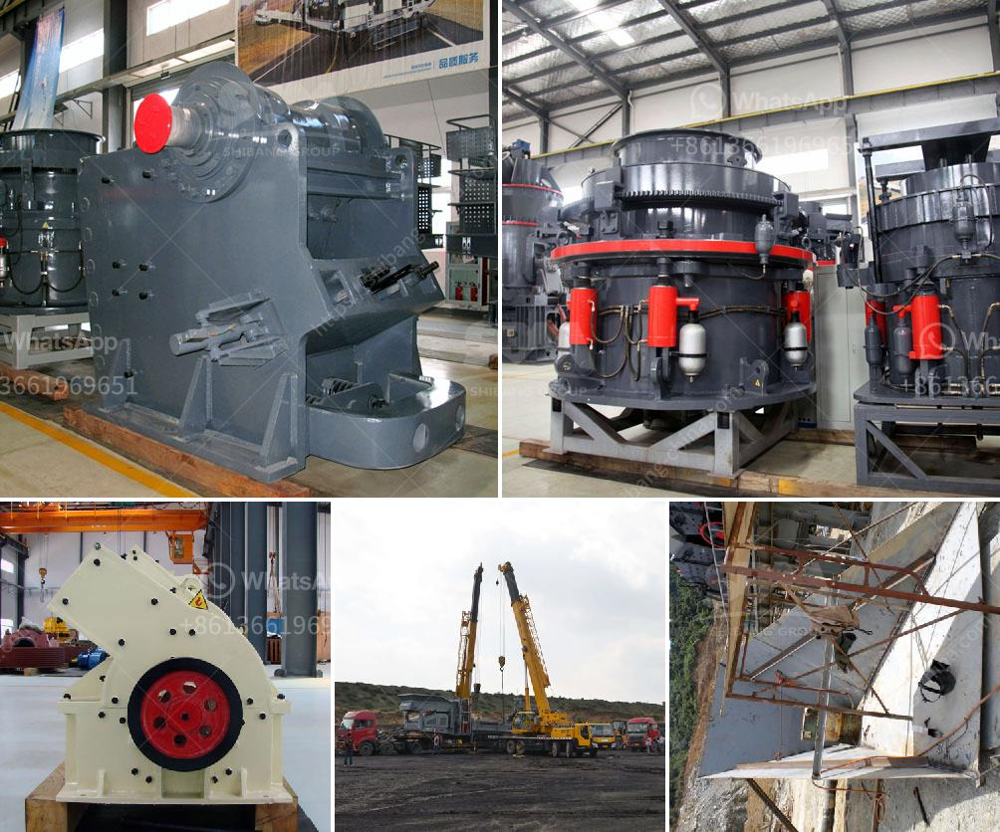

<h3>cost of crushing and screening</h3>
The cost of crushing and screening can vary widely depending on several factors, such as the type of material being crushed, the amount of material being produced, the location of the project, and the availability of resources. However, it is important to understand that crushing and screening are essential processes in many industries and play a significant role in the overall cost of a project.

One of the main factors affecting the cost of crushing and screening is the type of material being crushed. Different materials have different properties, such as hardness, abrasiveness, and moisture content. These properties can affect the equipment and methods used for crushing and screening, ultimately impacting the overall cost. For example, harder materials may require more powerful and durable crushing equipment, leading to higher costs.

The amount of material being produced also plays a crucial role in determining the cost of crushing and screening. Larger quantities of material generally require more resources, such as additional equipment, manpower, and time, which can drive up the overall cost. It is essential to accurately estimate the production volume to ensure adequate resources are allocated.

The location of the project is another factor that affects the cost of crushing and screening. Transportation costs can be a significant factor, especially if the project site is located in a remote area. Additionally, local regulations and permits may need to be obtained, which can increase the overall cost. Hiring local contractors or suppliers can help mitigate some of these additional expenses.

Lastly, the availability of resources can impact the cost of crushing and screening. The availability of suitable equipment, experienced operators, and necessary materials can vary depending on the project location. If certain resources are scarce or require significant transportation costs, it can drive up the overall cost of the project.

In conclusion, understanding the cost of crushing and screening requires consideration of various factors such as the type of material, production volume, project location, and resource availability. It is essential to plan and estimate these costs accurately to ensure the project's success while managing budget constraints effectively. Working with experienced professionals and conducting thorough research can help optimize the process and minimize unnecessary expenses.
<h3>Contact us</h3><ul><li><strong>Whatsapp:&nbsp;<a href="https://wa.me/8613661969651">+8613661969651</a></strong></li><li><a href="https://swt.shibang-china.com/?git&amp;zhl&amp;cost of crushing and screening"><strong>Online Service(chat now)</strong></a></li></ul><h3>Related</h3><ul><li><a href='ultra fine grinding mill for limestone.md'>ultra fine grinding mill for limestone</a></li><li><a href='jaw impact crusher poland.md'>jaw impact crusher poland</a></li><li><a href='gold recovery equipment for small mining companies.md'>gold recovery equipment for small mining companies</a></li><li><a href='silica sand crusher machine.md'>silica sand crusher machine</a></li><li><a href='stone crusher in malaysia.md'>stone crusher in malaysia</a></li></ul>