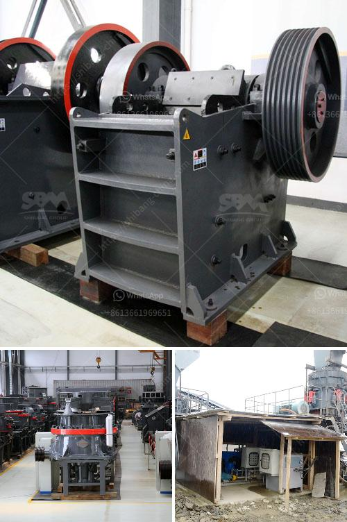

<h3>cost of limestone grinding machine</h3>
The cost of limestone grinding machine is a concern for many people in the construction industry. Because limestone is a popular material used in construction, it is widely available and versatile. However, it comes with a steep price tag. Limestone grinding machines are priced around thousands of dollars, making it a significant investment for any project.

The cost of a limestone grinding machine depends on the size, capacity, and manufacturer. Larger machines tend to be more expensive, but they can also handle larger quantities of limestone. Smaller machines, on the other hand, are more affordable but may not be suitable for large-scale projects. Additionally, the brand and quality of the machine can affect its price. Established and renowned manufacturers may charge higher prices due to their reputation and expertise.

In addition to the cost of the machine, other factors should also be considered when calculating the total cost of owning a limestone grinding machine. These include maintenance and operational costs. Regular maintenance is crucial to keep the machine in optimal condition and avoid breakdowns. Operational costs, such as energy consumption and labor, should also be accounted for. These costs may vary depending on the machine's efficiency and the specific requirements of each project.

Despite the initial high cost, owning a limestone grinding machine can be a wise investment in the long run. By grinding limestone on-site, construction companies can save on transportation costs and reduce the need for bulky limestone slabs or tiles. Moreover, having a grinding machine readily available allows for more flexibility and control over the production process.

To make an informed decision, it is essential to carefully evaluate the specific needs of the project and compare different options. Researching different brands and models, obtaining multiple quotes, and consulting with experts in the field can help ensure that the chosen limestone grinding machine meets both budgetary and operational requirements.

In conclusion, while a limestone grinding machine may come with a high price tag, it offers significant benefits for construction projects. By carefully considering the cost, maintenance, and operational requirements, construction companies can make an informed decision and choose the most suitable machine for their needs.
<h3>Contact us</h3><ul><li><strong>Whatsapp:&nbsp;<a href="https://wa.me/8613661969651">+8613661969651</a></strong></li><li><a href="https://swt.shibang-china.com/?git&amp;zhl&amp;cost of limestone grinding machine"><strong>Online Service(chat now)</strong></a></li></ul><h3>Related</h3><ul><li><a href='open cast mining china clay process.md'>open cast mining china clay process</a></li><li><a href='stone crusher dijual.md'>stone crusher dijual</a></li><li><a href='impact crusher specification limestone.md'>impact crusher specification limestone</a></li><li><a href='crusher conica crusher ethiopia.md'>crusher conica crusher ethiopia</a></li><li><a href='grinding machine for white clay in india.md'>grinding machine for white clay in india</a></li></ul>