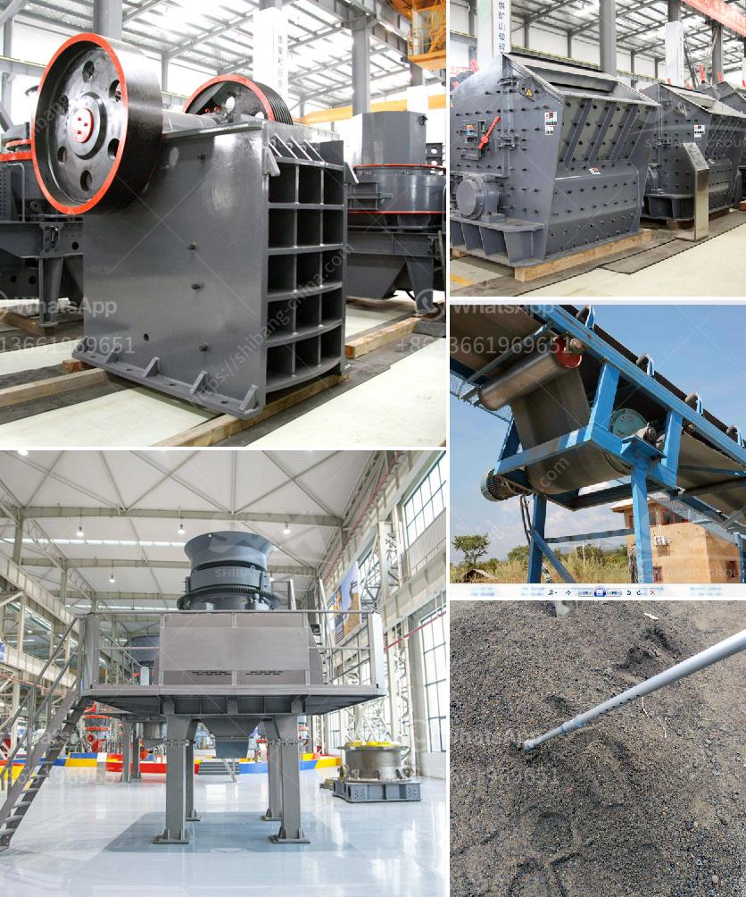

<h3>cost of limestone powder crushing machine</h3>
The cost of limestone powder crushing machine is influenced by many factors, including the production capacity, the efficiency of the equipment, the quality of the finished product, the input cost of the material, labor costs, and other direct or indirect costs. In this article, we will analyze the main cost factors of the limestone powder crushing machine in detail.

Firstly, the production capacity of the limestone powder crushing machine. Different types of crushing machines have different output capacities. The production capacity of a limestone powder crushing machine can range from 20t/h to 1000t/h. The user can choose the appropriate crushing equipment according to their own production needs. Generally speaking, the higher the production capacity of the machine, the higher the price. However, it should be noted that a higher production capacity means a higher efficiency, which can bring higher economic benefits in the long run.

Secondly, the efficiency of the limestone powder crushing machine. The efficiency of the crushing machine is determined by the effectiveness of the crushing process. It includes the crushing ratio, the finished product size, the yield, the power consumption, and other related indicators. A machine with higher efficiency can complete more work in a unit of time, reduce the waste of materials, and save the production cost. Therefore, the efficient limestone powder crushing machine generally has a higher price.

Thirdly, the quality of the finished product. The limestone powder crushing machine should provide high-quality finished products. The quality of the finished product not only affects the user experience but also has a decisive influence on the application scope and market value of the product. A machine that can produce high-quality finished products usually has higher technical content and higher manufacturing costs, resulting in a higher price.

Fourthly, the input cost of the material. The cost of raw materials is also an important factor affecting the price of the limestone powder crushing machine. The price of raw materials such as limestone may vary in different regions and different periods. Therefore, the cost of raw materials should be included in the calculation of the production cost of the machine.

Lastly, the labor costs and other indirect costs. The operation and maintenance of the limestone powder crushing machine require a certain amount of labor costs. The complexity of the machine and the degree of automation will affect the labor costs. In addition, there may be other indirect costs, such as transportation costs, energy consumption costs, and management costs. All these costs should be considered comprehensively when evaluating the cost of the machine.

In conclusion, the cost of the limestone powder crushing machine is affected by various factors, including the production capacity, efficiency, quality of the finished product, input cost of the material, labor costs, and other indirect costs. By considering these factors comprehensively, users can select suitable crushing equipment with reasonable prices and high performance to achieve the best economic benefits.
<h3>Contact us</h3><ul><li><strong>Whatsapp:&nbsp;<a href="https://wa.me/8613661969651">+8613661969651</a></strong></li><li><a href="https://swt.shibang-china.com/?git&amp;zhl&amp;cost of limestone powder crushing machine"><strong>Online Service(chat now)</strong></a></li></ul><h3>Related</h3><ul><li><a href='mobile crushers for sale ghana.md'>mobile crushers for sale ghana</a></li><li><a href='raymond mills mexico.md'>raymond mills mexico</a></li><li><a href='ball mill drive system.md'>ball mill drive system</a></li><li><a href='crusher price in philippines.md'>crusher price in philippines</a></li><li><a href='gypsum board making machine supplier.md'>gypsum board making machine supplier</a></li></ul>