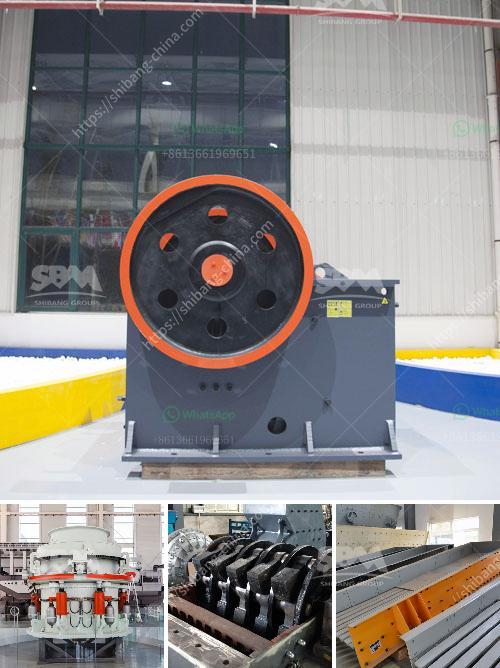

<h3>cost of mining process of calcium carbonate</h3>
Calcium carbonate is a mineral compound found in rocks, minerals, and the shells of marine organisms. It is widely used in various industries such as construction, agriculture, and pharmaceuticals due to its versatile properties. However, the mining process of calcium carbonate can be costly and environmentally damaging.

The extraction of calcium carbonate begins with drilling and blasting of limestone rocks. This process releases large amounts of dust into the air, which can cause respiratory problems in workers and contribute to air pollution. Additionally, the noise generated from the drilling and blasting activities can disturb local communities.

After the rocks are extracted, they are crushed into smaller pieces using heavy machinery. This crushing process requires a significant amount of energy and can result in high operational costs for mining companies. Furthermore, the transportation of the crushed rocks to processing plants can be expensive, especially if the mines are located far from the industrial sites.

Once the crushed rocks reach the processing plant, they undergo further grinding and refining processes to extract calcium carbonate. These processes involve the use of large machines and chemicals, which also add to the overall cost of mining. The equipment used in the refining process needs regular maintenance and replacement, further increasing operational expenses.

Another significant cost associated with the mining process of calcium carbonate is the remediation of environmental damage. Mining activities can lead to deforestation and destruction of habitats, causing long-term ecological harm. Rehabilitating mined areas and restoring the natural environment can be a costly endeavor for mining companies.

In addition to the financial costs, the mining process of calcium carbonate also has environmental implications. The extraction and processing of calcium carbonate release large amounts of carbon dioxide (CO2) into the atmosphere. CO2 is a greenhouse gas that contributes to climate change and global warming. To mitigate these environmental impacts, mining companies need to invest in carbon capture and storage technologies, adding to their production costs.

To address these challenges and reduce the cost of mining calcium carbonate, mining companies have been exploring alternative methods. One such method is the use of more sustainable and energy-efficient technologies. For instance, some companies are investing in renewable energy sources, such as solar or wind power, to power their mining operations. This not only reduces operational costs but also reduces the environmental footprint of the mining process.

Another approach is to use recycled or waste materials as a source of calcium carbonate instead of extracting it from natural resources. This not only reduces the overall cost of mining but also minimizes the environmental impact by reducing the need for new extraction activities.

In conclusion, the mining process of calcium carbonate can be costly due to various factors such as energy consumption, transportation, and environmental remediation. However, by adopting more sustainable practices and exploring alternative methods, mining companies can mitigate these costs and reduce their environmental footprint. Given the increasing demand for calcium carbonate in various industries, it is crucial for mining companies to prioritize cost-efficient and eco-friendly mining practices to ensure long-term sustainability.
<h3>Contact us</h3><ul><li><strong>Whatsapp:&nbsp;<a href="https://wa.me/8613661969651">+8613661969651</a></strong></li><li><a href="https://swt.shibang-china.com/?git&amp;zhl&amp;cost of mining process of calcium carbonate"><strong>Online Service(chat now)</strong></a></li></ul><h3>Related</h3><ul><li><a href='jaw crushing plant cost.md'>jaw crushing plant cost</a></li><li><a href='rock crusher uganda.md'>rock crusher uganda</a></li><li><a href='aggregate crushing machine.md'>aggregate crushing machine</a></li><li><a href='list of gold refineries companies in uae.md'>list of gold refineries companies in uae</a></li><li><a href='stone dust making machine.md'>stone dust making machine</a></li></ul>