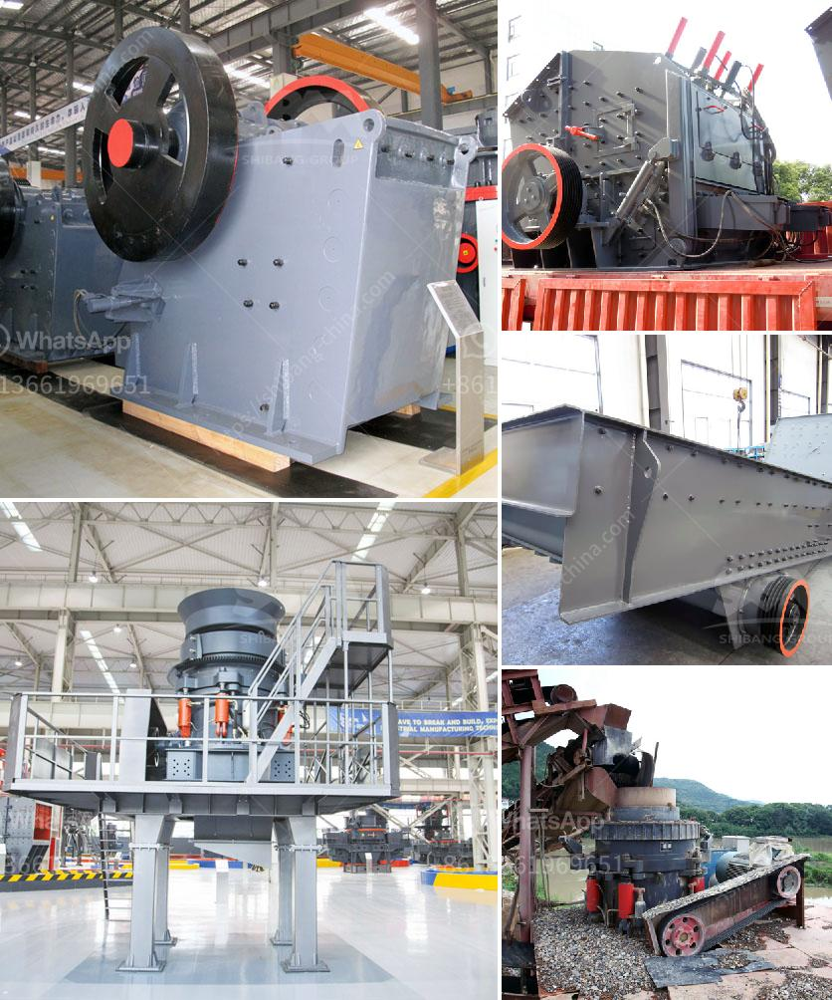

<h3>cost of tons per hour crusher plant in india</h3>
The mining industry is one of the key sectors driving the growth of the Indian economy. In recent years, the demand for crushed stone has been increasing due to the ever-growing construction projects across the country. To meet this demand, there has been a surge in the installation of crusher plants. These plants are used to crush stones into smaller sized materials, which are then used for a variety of purposes such as building roads, foundations, and concrete production.

One of the key factors in determining the cost of a crusher plant is the tonnage produced per hour. This cost varies widely depending on various factors, including the hardness of the stone, the size of the plant, the capacity of the crusher, and the labor required for operations.

Firstly, the hardness of the stone being crushed plays a crucial role in determining the overall cost. Harder stones require more energy to break down into smaller pieces, which means higher energy consumption and ultimately higher operational costs. The hardness of stones is typically measured using the Mohs scale, which ranges from 1 (talc) to 10 (diamond). For example, granite is typically rated around 6-7 on the Mohs scale, while limestone ranges from 3-4. Therefore, crushing granite would require more energy compared to crushing limestone, resulting in higher operational costs.

Secondly, the size of the plant and the capacity of the crusher also affect the cost per ton. A larger plant with a higher capacity crusher will be able to produce more tons per hour, leading to economies of scale. However, larger plants require higher initial investments, as they need more space and additional machinery. Therefore, finding the right balance between the size of the plant and the required production capacity is crucial in optimizing costs.

Lastly, labor costs also play a significant role in determining the total operational expenses. Crusher plants require a skilled workforce to operate and maintain the machinery. Furthermore, regular maintenance and repairs also add to the overall cost. The availability of skilled labor and their wages vary across different regions in India, which may impact the cost of tonnage produced.

In conclusion, the cost of a crusher plant in India in terms of tonnage produced per hour depends on various factors such as the hardness of the stone, the size and capacity of the plant, and the labor required for operations. It is essential for companies in the mining industry to analyze these factors carefully and strike a balance between productivity and cost efficiency. This will enable them to meet the increasing demand for crushed stone in a sustainable and profitable manner. As the construction industry continues to grow, investing in efficient and cost-effective crusher plants will be vital for the overall economic development of India.
<h3>Contact us</h3><ul><li><strong>Whatsapp:&nbsp;<a href="https://wa.me/8613661969651">+8613661969651</a></strong></li><li><a href="https://swt.shibang-china.com/?git&amp;zhl&amp;cost of tons per hour crusher plant in india"><strong>Online Service(chat now)</strong></a></li></ul><h3>Related</h3><ul><li><a href='rock crusher mine price peru.md'>rock crusher mine price peru</a></li><li><a href='dealers of hammer mill in nigeria.md'>dealers of hammer mill in nigeria</a></li><li><a href='tph mobile crushing plant.md'>tph mobile crushing plant</a></li><li><a href='marble grinding factory in dubai.md'>marble grinding factory in dubai</a></li><li><a href='market analysis of stone crusher.md'>market analysis of stone crusher</a></li></ul>