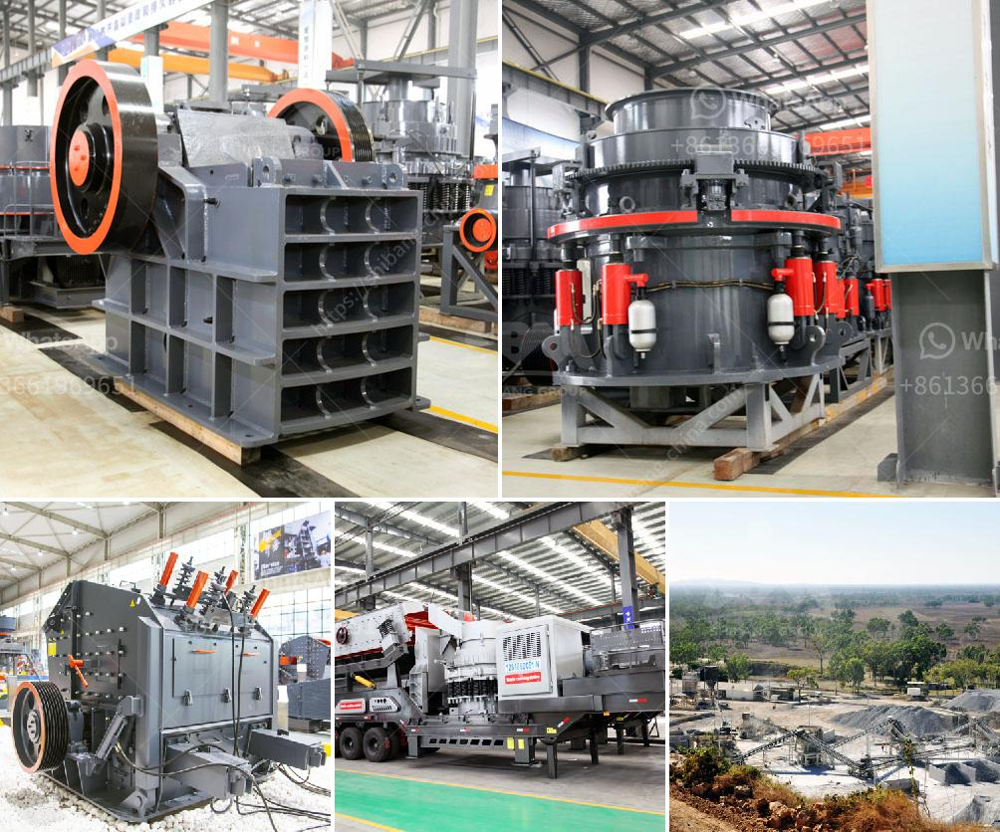

<h3>cost per hour mobile crusher</h3>
Construction and demolition activities have witnessed a significant increase in complexities and requirements over the years. To cope with these challenges, the use of high-performance mobile crushers has become a game-changer in the industry. Mobile crushers offer the convenience of on-site crushing, reducing transportation costs, increasing efficiency, and flexibility. However, before investing in a mobile crusher, it is crucial to evaluate its cost per hour to ensure maximum returns on investment.

Determining the cost per hour of a mobile crusher involves several factors that contribute to its overall profitability. These factors include fuel consumption, maintenance and repair costs, labor expenses, equipment utilization rate, and material capacity.

1. Fuel Consumption: Mobile crushers are powered by diesel engines, which typically consume a specific amount of fuel per hour of operation. Fuel consumption can vary depending on factors such as the crusher type, application, and operational conditions. Understanding the fuel consumption rate helps estimate the overall costs associated with running the machine.

2. Maintenance and Repair Costs: Like any other machinery, mobile crushers require regular maintenance and occasional repairs. Factoring in the cost of spare parts, labor charges, and routine servicing contributes to the cost per hour. Efficient preventive maintenance practices can help minimize downtime and lower long-term costs.

3. Labor Expenses: Mobile crushers require skilled operators to handle and oversee their operations effectively. Labor costs can be estimated based on the number of hours worked per day and labor rates prevalent in the region. Streamlining operations and optimizing resource allocation can promote cost-effectiveness.

4. Equipment Utilization Rate: Maximizing the utilization rate of the mobile crusher is crucial to lowering the cost per hour. Continuously monitoring equipment uptime, minimizing idle time, and optimizing the crusher's capacity ensure efficient usage, resulting in reduced costs and increased productivity.

5. Material Capacity: The productivity and efficiency of a mobile crusher greatly depend on its material capacity. Higher capacity allows for faster processing times and increased output, reducing the overall cost per hour. Careful consideration should be given to selecting a crusher model that meets the project requirements without compromising cost-effectiveness.

1. Regular Inspection and Maintenance: Implementing a robust preventive maintenance program can significantly reduce repair and unplanned downtime costs.

2. Operator Training: Proper training ensures efficient machine operation, minimizing human errors, and improving overall productivity.

3. Fuel Efficiency Measures: Choosing fuel-efficient mobile crushers or adopting additional technologies like hybrid systems can curtail fuel consumption expenses.

4. Strategic Equipment Allocation: Analyzing work schedules and project demands allows for effective allocation of mobile crushers, thus optimizing machine utilization rates.

Evaluating cost per hour is essential when considering mobile crushers for construction and demolition work. While the initial investment may seem significant, understanding the cost dynamics involved can help make an informed decision. By estimating factors such as fuel consumption, maintenance expenses, labor costs, equipment utilization rates, and material capacity, stakeholders can optimize their overall investment returns. Providing on-site crushing capabilities, mobile crushers prove to be beneficial in reducing transportation costs, enhancing operational efficiency, and adapting to the evolving needs of the construction and demolition industry.
<h3>Contact us</h3><ul><li><strong>Whatsapp:&nbsp;<a href="https://wa.me/8613661969651">+8613661969651</a></strong></li><li><a href="https://swt.shibang-china.com/?git&amp;zhl&amp;cost per hour mobile crusher"><strong>Online Service(chat now)</strong></a></li></ul><h3>Related</h3><ul><li><a href='by products of limestone processing.md'>by products of limestone processing</a></li><li><a href='alluvial gold plants for sale south africa.md'>alluvial gold plants for sale south africa</a></li><li><a href='design of stone crushing machine.md'>design of stone crushing machine</a></li><li><a href='gravel making crusher.md'>gravel making crusher</a></li><li><a href='price of aggregate crusher machine in ethiopia.md'>price of aggregate crusher machine in ethiopia</a></li></ul>