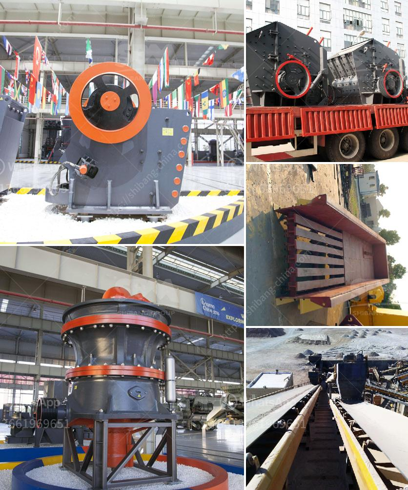

<h3>cost to set up mini cement plant in india</h3>
Setting up a mini cement plant in India has become a prominent investment opportunity in recent years. With the government's focus on infrastructure development, the demand for cement is increasing, making it an attractive market for investors.

The cost of setting up a mini cement plant in India varies depending on the location, size, and capacity of the plant. As the cost of land and construction material is different in different parts of the country, the overall cost can range from around $4 million to $10 million.

One of the main factors contributing to the cost is the price of machinery and equipment required for the plant. This includes crushers, conveyors, cement silos, packing machines, and other equipment necessary for the production process. The cost of machinery can vary from $500,000 to $2 million, depending on the capacity and quality of the equipment.

Another significant cost is the cost of acquiring land for setting up the plant. The location of the plant plays a crucial role in determining its success and profitability. The cost of land can vary depending on the proximity to raw materials, transportation facilities, and market demand. It is essential to select a location that provides easy access to limestone, clay, and other raw materials required for cement production.

Construction cost is another major expense in setting up a mini cement plant. This includes the cost of civil works, erection and commissioning of machinery, and electrical installations. The overall construction cost can range from $1 million to $3 million, depending on the size and complexity of the plant.

In addition to the cost of machinery, equipment, land, and construction, there are other expenses that need to be considered. These include obtaining various licenses and permits, hiring skilled labor, transportation of raw materials and finished products, and marketing and advertising costs.

However, despite the initial investment, setting up a mini cement plant in India can be a profitable venture in the long run. The demand for cement is expected to remain robust due to ongoing infrastructure projects, affordable housing initiatives, and increasing urbanization.

Furthermore, India is the second-largest cement producer in the world, indicating a strong market potential. With the government's focus on improving the ease of doing business and providing incentives for investment, the cement industry in India is poised for growth.

Additionally, a mini cement plant can offer various advantages over large-scale cement plants. Mini plants have lower capital requirements, shorter construction time, and reduced operational costs due to their smaller capacity and streamlined processes. This can result in quicker return on investment and higher profitability.

In conclusion, the cost of setting up a mini cement plant in India can vary depending on various factors. However, with the growing demand for cement and the government's support for infrastructure development, investing in a mini cement plant can be a lucrative opportunity for investors. It is vital to conduct a thorough feasibility study and financial analysis before making any investment decisions to ensure the project's success.
<h3>Contact us</h3><ul><li><strong>Whatsapp:&nbsp;<a href="https://wa.me/8613661969651">+8613661969651</a></strong></li><li><a href="https://swt.shibang-china.com/?git&amp;zhl&amp;cost to set up mini cement plant in india"><strong>Online Service(chat now)</strong></a></li></ul><h3>Related</h3><ul><li><a href='quarry equipment china.md'>quarry equipment china</a></li><li><a href='jaw crusher project report pdf.md'>jaw crusher project report pdf</a></li><li><a href='business plan on manganese ore mining.md'>business plan on manganese ore mining</a></li><li><a href='limestone mobile crusher supplier in malaysia.md'>limestone mobile crusher supplier in malaysia</a></li><li><a href='concrete aggregate crushing plant.md'>concrete aggregate crushing plant</a></li></ul>