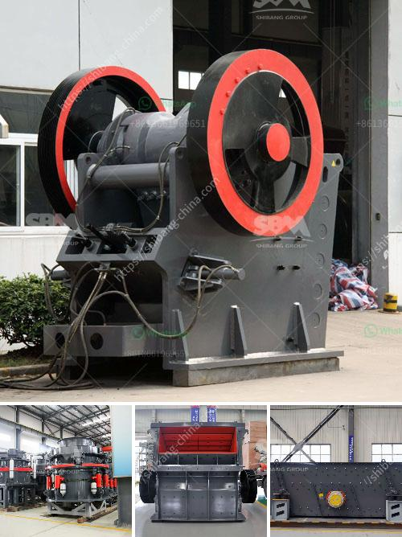

<h3>costs of a grinding mill</h3>
The grinding mill is an essential piece of equipment in many industries, including mining, cement, and pharmaceuticals. It is used to crush, grind, and disperse a variety of materials to achieve the desired particle size distribution. The cost of a grinding mill can vary greatly depending on the specifications and size of the mill, as well as the production capacity and material properties.

One of the main factors that determine the cost of a grinding mill is the size of the mill. Smaller mills with lower production capacities may have lower upfront costs but may also have higher operating costs due to their lower efficiency. On the other hand, larger mills with higher production capacities may have higher upfront costs but can be more efficient in terms of energy consumption and maintenance costs over the long term.

Another factor that affects the cost of a grinding mill is the material of construction. Grinding mills are typically made from metals such as stainless steel or cast iron, which can impact the price. Stainless steel mills are usually more expensive due to their corrosion resistance and durability. However, cast iron mills may be more suitable for certain applications and can be more cost-effective in those cases.

The type of grinding mechanism used in the mill can also impact the cost. There are various types of grinding mechanisms available, including ball mills, rod mills, and impact mills. Each type has its own advantages and disadvantages in terms of performance, durability, and cost. For example, ball mills are generally more efficient than rod mills but can be more expensive to purchase and maintain.

The power source of the grinding mill can also affect the cost. Grinding mills can be powered by electricity, diesel, or natural gas. Electric mills may have lower upfront costs and can be more environmentally friendly, but they can be more expensive to operate due to electricity costs. Diesel or natural gas-powered mills may have higher upfront costs but can be cheaper to operate if the fuel costs are lower.

Maintenance and operational costs are also important factors to consider when evaluating the cost of a grinding mill. Regular maintenance and inspection are necessary to ensure optimal performance and longevity of the mill. Additional costs may arise from the need to replace worn-out parts or to repair any damages. It is crucial to consider the ongoing maintenance and operational costs to determine the overall cost-effectiveness of a grinding mill.

In conclusion, the cost of a grinding mill can vary depending on several factors, including the size of the mill, the material of construction, the type of grinding mechanism, the power source, and the maintenance and operational costs. It is important to carefully evaluate these factors and consider the specific requirements of the application to choose a grinding mill that offers the best balance between performance and cost-effectiveness.
<h3>Contact us</h3><ul><li><strong>Whatsapp:&nbsp;<a href="https://wa.me/8613661969651">+8613661969651</a></strong></li><li><a href="https://swt.shibang-china.com/?git&amp;zhl&amp;costs of a grinding mill"><strong>Online Service(chat now)</strong></a></li></ul><h3>Related</h3><ul><li><a href='crushing machine price.md'>crushing machine price</a></li><li><a href='how much cost silicon quartz stone.md'>how much cost silicon quartz stone</a></li><li><a href='vertical mill of a cement company.md'>vertical mill of a cement company</a></li><li><a href='gravel conveyor belt.md'>gravel conveyor belt</a></li><li><a href='gravel crusher prices philippines.md'>gravel crusher prices philippines</a></li></ul>