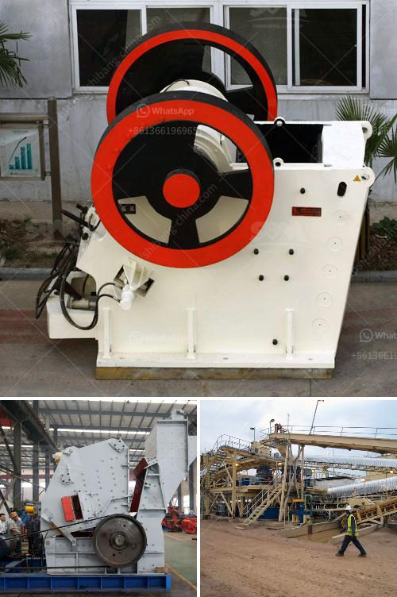

<h3>course in maintenance of stone crushers</h3>
Stone crushers are vital pieces of equipment that aid in breaking down large rocks into smaller chunks for various applications such as road building, construction, and landscaping. Over time, these machines may experience wear and tear, necessitating regular maintenance to ensure optimal performance and extend their lifespan. To address this need, a course in the maintenance of stone crushers has been developed to equip professionals with the necessary skills and knowledge.

This course aims to provide participants with a comprehensive understanding of stone crusher maintenance, covering both theoretical and practical aspects. It is designed for technicians, engineers, and maintenance personnel who are involved in the operation and maintenance of stone crushers in various industries.

The course content includes an introduction to stone crushers, their types, and applications. Participants will learn about the working principles of different types of stone crushers, the common problems encountered during operation, and the maintenance procedures required to address these issues. Proper maintenance techniques, including inspection, lubrication, and adjustment, will be emphasized to enhance crusher performance and prevent breakdowns.

The course will also cover safety precautions and best practices, as stone crushers can be hazardous when not properly maintained. Participants will learn about the potential risks associated with crusher operation and how to mitigate them. This includes understanding safety guidelines, using personal protective equipment, and conducting routine safety inspections.

Furthermore, participants will have hands-on training opportunities to develop practical skills in maintaining stone crushers. This may involve examining different crusher components, such as jaw plates, impact bars, and bearings, and understanding their roles in the crushing process. The course will teach participants how to perform regular inspections, identify signs of wear and damage, and carry out appropriate repairs or replacements.

Apart from routine maintenance, the course will also cover troubleshooting techniques for diagnosing and resolving common issues that can affect crusher performance. Participants will be equipped with the knowledge to identify the root cause of problems and implement effective solutions. This includes troubleshooting mechanical and electrical components, addressing issues with material feed, and optimizing crusher settings for improved efficiency.

By completing this course, participants will be able to effectively maintain stone crushers, ensuring their smooth operation and maximizing their productivity. They will possess the skills to identify potential problems, take preventive measures, and troubleshoot any issues that arise. This will not only help prolong the lifespan of stone crushers but also reduce downtime, operational costs, and the risk of accidents.

The course in maintenance of stone crushers will be delivered through a combination of lectures, demonstrations, and practical exercises. It may be conducted over a few days or conducted as individual modules to accommodate different schedules. Participants will receive learning materials, reference guides, and a certificate upon successful completion of the course.

In conclusion, the maintenance of stone crushers is crucial to their efficiency and longevity. This specialized course offers professionals in various industries the opportunity to acquire the necessary knowledge and skills to effectively maintain these machines, ensuring optimal performance and safe operation. By investing in proper maintenance, organizations can enhance productivity, reduce costs, and prolong the lifespan of their stone crushers.
<h3>Contact us</h3><ul><li><strong>Whatsapp:&nbsp;<a href="https://wa.me/8613661969651">+8613661969651</a></strong></li><li><a href="https://swt.shibang-china.com/?git&amp;zhl&amp;course in maintenance of stone crushers"><strong>Online Service(chat now)</strong></a></li></ul><h3>Related</h3><ul><li><a href='how to measure output of a crusher plant.md'>how to measure output of a crusher plant</a></li><li><a href='china clay washing equipment for sale.md'>china clay washing equipment for sale</a></li><li><a href='quote for jaw crusher.md'>quote for jaw crusher</a></li><li><a href='complete gold refinery for sale in south africa.md'>complete gold refinery for sale in south africa</a></li><li><a href='ore crushing machine.md'>ore crushing machine</a></li></ul>