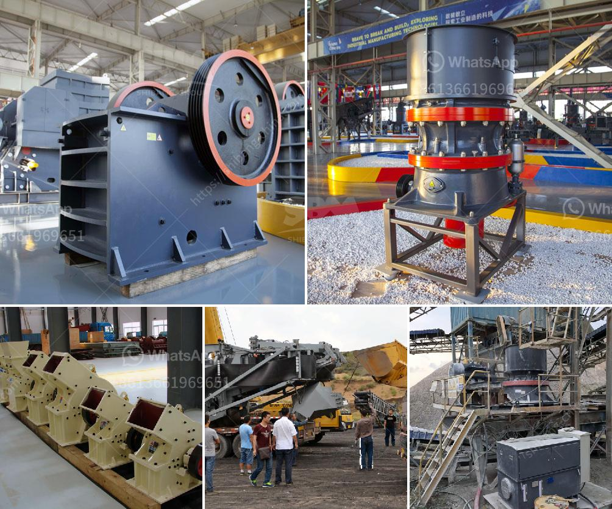

<h3>crushed plant mobile coquimbo</h3>
In recent years, there has been a growing concern about the proper management of waste materials and the impact they have on our environment. Governments and organizations worldwide are actively seeking innovative solutions to tackle this pervasive problem. One such solution is the crushed plant mobile in Coquimbo, a groundbreaking initiative that is revolutionizing waste management practices in the region.

Coquimbo, a coastal city in Chile, is known for its picturesque landscapes and vibrant flora. However, the exponential growth in population has led to an increase in waste production, posing a significant challenge. To combat this issue, the crushed plant mobile was introduced, offering an efficient and sustainable method of waste disposal.

This mobile unit is specifically designed to process different types of waste, including organic and non-organic materials. The system works by crushing the waste into smaller particles, which are then mixed with soil and converted into compost. This compost is subsequently used for various purposes like fertilizing agricultural lands and parks, promoting eco-friendly practices in the community.

The crushed plant mobile has garnered immense popularity due to its numerous benefits. Firstly, it reduces the volume of waste, efficiently maximizing the use of limited landfill space. Secondly, by converting waste into compost, it creates a valuable resource that positively impacts the environment and reduces the need for chemical fertilizers. Additionally, this waste-to-compost process significantly reduces greenhouse gas emissions, combating climate change.

Moreover, the crushed plant mobile is versatile and can be easily transported to different locations, targeting areas with higher waste production. This flexibility allows for better waste management practices even in remote or underserved regions.

Local authorities in Coquimbo have embraced this technology, realizing its potential to transform waste management systems. Not only does it improve the city's environmental footprint, but it also fosters community engagement, as residents actively participate in waste segregation and compost usage.

The success of the crushed plant mobile in Coquimbo has inspired other regions to adopt similar waste management solutions. Its innovative approach and sustainable practices have become a model for cities worldwide, demonstrating that achieving environmental sustainability is achievable with the right tools and commitment.

In conclusion, the crushed plant mobile in Coquimbo is revolutionizing waste management practices, addressing the urgent need for sustainable solutions. Its efficient system not only reduces waste volume but also converts it into compost, benefiting the environment and promoting eco-friendly practices. With the success of this initiative, it is hoped that other cities will follow suit, creating a cleaner, greener future for generations to come.
<h3>Contact us</h3><ul><li><strong>Whatsapp:&nbsp;<a href="https://wa.me/8613661969651">+8613661969651</a></strong></li><li><a href="https://swt.shibang-china.com/?git&amp;zhl&amp;crushed plant mobile coquimbo"><strong>Online Service(chat now)</strong></a></li></ul><h3>Related</h3><ul><li><a href='iron processing equipment in mexico.md'>iron processing equipment in mexico</a></li><li><a href='crusher 40 ton per jam.md'>crusher 40 ton per jam</a></li><li><a href='lime morter grinding machine price list.md'>lime morter grinding machine price list</a></li><li><a href='equipments in gypsum powder production line.md'>equipments in gypsum powder production line</a></li><li><a href='ballast crushing plant.md'>ballast crushing plant</a></li></ul>