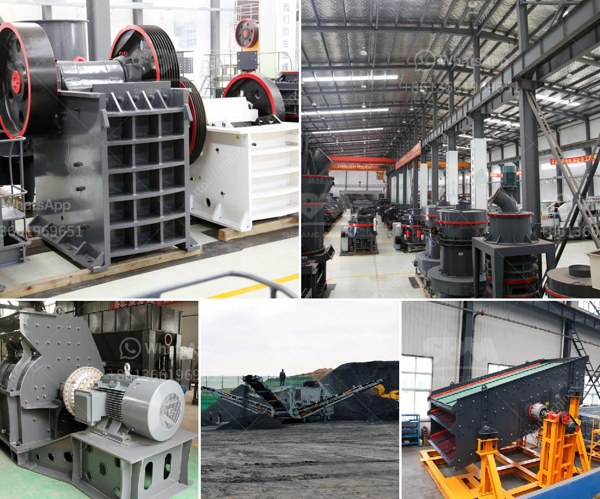

<h3>crushed stone prices per ton</h3>
When it comes to crushed stone, there are various sizes of stone available in the market. Some of the popular ones include 1/4 inch, 3/8 inch, 1/2 inch, and 3/4 inch. These stones are used for various purposes like landscaping projects, pathways, driveways, and drainage systems. The cost of crushed stone per ton depends on the type and size of the stone as well as the location of the project.

The price of crushed stone per ton varies depending on the location. The cost of crushed stone in some urban areas can be higher due to the transportation costs. This is especially true for larger metropolitan areas where crushed stone is not readily available nearby. In rural areas, the cost of crushed stone per ton may be lower as there are usually local quarries that produce and supply the stone.

Another factor that affects the price of crushed stone per ton is the type of stone. Some stones are more expensive than others. For example, a rare and exotic stone may cost more compared to a common type of stone. The quality of the stone also plays a role in determining its price. Higher quality stones may have a higher price per ton.

The size of the crushed stone is another factor that affects its price per ton. Smaller stones are typically less expensive compared to larger stones. This is because smaller stones require less processing and are easier to handle and transport. However, larger stones may be required for certain projects, such as creating a durable and stable base for a driveway or road. In such cases, the higher cost of larger stones may be justified.

It is important to note that the price of crushed stone per ton also includes the costs of production and processing. The stone needs to be extracted from the quarry, crushed, and sorted into various sizes. This requires heavy machinery, labor, and energy. Additionally, there may be additional costs associated with transportation and delivery of the stone to the project site.

When considering the cost of crushed stone per ton, it is also necessary to factor in any additional expenses. This may include the cost of hiring professionals for installation or the purchase of additional materials needed for the project. It is recommended to obtain multiple quotes from different suppliers to compare prices and get the best deal.

In conclusion, the price of crushed stone per ton can vary depending on factors such as the location, type, size, and quality of the stone. It is important to consider all these factors when planning a project that requires crushed stone. By obtaining multiple quotes and considering all the expenses, one can make an informed decision and ensure the project stays within budget.
<h3>Contact us</h3><ul><li><strong>Whatsapp:&nbsp;<a href="https://wa.me/8613661969651">+8613661969651</a></strong></li><li><a href="https://swt.shibang-china.com/?git&amp;zhl&amp;crushed stone prices per ton"><strong>Online Service(chat now)</strong></a></li></ul><h3>Related</h3><ul><li><a href='cone crusher in the philippines.md'>cone crusher in the philippines</a></li><li><a href='concrete crusher for sale in nigeria.md'>concrete crusher for sale in nigeria</a></li><li><a href='conveyor belts supplier malaysia.md'>conveyor belts supplier malaysia</a></li><li><a href='stone crusher second hand south africa.md'>stone crusher second hand south africa</a></li><li><a href='best prices for portable impact crushers.md'>best prices for portable impact crushers</a></li></ul>