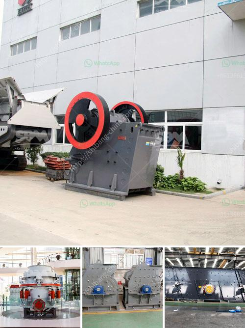

<h3>crushed stones aggregate in uganda</h3>
Crushed stone aggregate is a crucial material used in construction projects of all types in Uganda. Whether it's for road construction, building foundations, or landscaping, the importance of crushed stone cannot be underestimated. In Uganda, it is sourced from hard rock deposits, quarries, and hand-crushed rocks. 

One of the key uses of crushed stone aggregate is for road construction. Uganda, like many other countries in Africa, has an extensive road network that requires constant maintenance and expansion. Crushed stone aggregate is used as a base material in the construction of roads, providing stability and strength to the surface. This helps in reducing potholes and making roads safer for vehicles and pedestrians.

In building construction, crushed stone aggregate plays a vital role in creating a strong foundation. It is commonly used in the construction of concrete structures, providing stability and durability. Crushed stone aggregate is also used in the production of asphalt, which is widely used for roofing, flooring, and road surfacing.

Apart from its practical applications, crushed stone aggregate is also used in landscaping projects. It can be used to create attractive pathways, driveways, or decorative borders. The various sizes and colors of crushed stone allow for creativity and customization in landscape design, enhancing the overall aesthetic appeal of outdoor spaces.

Moreover, crushed stone aggregate is a cost-effective material, readily available in Uganda. Its use helps in reducing construction costs as it can be locally sourced, eliminating the need for expensive imports. This makes it accessible to both large-scale construction companies and individual homeowners, contributing to the overall development of the country's infrastructure.

In conclusion, crushed stone aggregate serves as a fundamental building material in Uganda. Its uses range from road construction to building foundations and landscaping projects. With its durability, affordability, and versatile applications, crushed stone aggregate continues to play a vital role in the country's construction industry, contributing to Uganda's overall development and growth.
<h3>Contact us</h3><ul><li><strong>Whatsapp:&nbsp;<a href="https://wa.me/8613661969651">+8613661969651</a></strong></li><li><a href="https://swt.shibang-china.com/?git&amp;zhl&amp;crushed stones aggregate in uganda"><strong>Online Service(chat now)</strong></a></li></ul><h3>Related</h3><ul><li><a href='granite crusher for sale.md'>granite crusher for sale</a></li><li><a href='hydro classifier silica sand.md'>hydro classifier silica sand</a></li><li><a href='coal crusher 6mm.md'>coal crusher 6mm</a></li><li><a href='mineral powder machine.md'>mineral powder machine</a></li><li><a href='stone crushing equipment for hire in harare.md'>stone crushing equipment for hire in harare</a></li></ul>