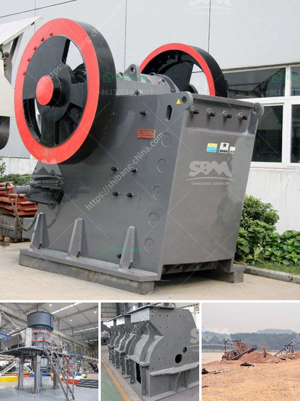

<h3>crusher 40 ton per jam</h3>
Crushing is an essential process in construction and mining industry that facilitates the breaking down of large rocks into small stones or sand. While it is a vital operation, it can also be challenging, especially when dealing with a large volume of material. This is where a crusher comes into play. One such crusher that is designed to handle substantial loads efficiently is a crusher 40 ton per jam.

A crusher 40 ton per jam is a piece of equipment that uses mechanical force to break down materials such as rocks into smaller, more manageable pieces. This particular crusher is capable of producing 40 tons of material per hour, making it suitable for medium-sized construction projects or mining operations.

One of the key features of a crusher 40 ton per jam is its high productivity. With its powerful motor and robust construction, it can handle heavy-duty operations without any hassle. This means that it can crush a large quantity of material quickly, reducing downtime and improving overall efficiency. Additionally, its adjustable setting allows users to produce different sizes of crushed material, based on their specific requirements.

Another significant advantage of a crusher 40 ton per jam is its versatility. It can handle a wide range of materials, including rocks, concrete, asphalt, and even some metals. This flexibility makes it highly adaptable to various applications, from road construction to building foundations or even recycling projects. With the right attachments and proper maintenance, this crusher can be a valuable asset for any construction or mining company.

In terms of safety, a crusher 40 ton per jam is equipped with various features to protect its operators. It includes safety guards and emergency stop buttons, which ensure that the machine can be quickly shut down in case of any accidents or malfunctions. Additionally, it meets all the necessary safety regulations set by the industry, providing peace of mind to its users.

When it comes to maintaining a crusher 40 ton per jam, regular servicing and inspections are crucial. This not only extends the lifespan of the machine but also ensures its optimal performance. It is recommended to follow the manufacturer's guidelines and schedule routine maintenance such as oil changes, filter replacements, and lubrication. By doing so, users can maximize the efficiency and reliability of this powerful crushing equipment.

In conclusion, a crusher 40 ton per jam is a reliable and efficient solution for large-scale crushing operations. Its high productivity, versatility, and safety features make it an ideal choice for construction and mining projects. With proper maintenance and care, this crusher can provide consistent performance, helping businesses meet their material processing needs effectively. Whether it's a construction site or a mine, investing in a crusher 40 ton per jam is a wise decision for any company looking to enhance their productivity and reduce operational costs.
<h3>Contact us</h3><ul><li><strong>Whatsapp:&nbsp;<a href="https://wa.me/8613661969651">+8613661969651</a></strong></li><li><a href="https://swt.shibang-china.com/?git&amp;zhl&amp;crusher 40 ton per jam"><strong>Online Service(chat now)</strong></a></li></ul><h3>Related</h3><ul><li><a href='silica sand washing and grinding.md'>silica sand washing and grinding</a></li><li><a href='ball mill capacity 26 x 41.md'>ball mill capacity 26 x 41</a></li><li><a href='selling crusher grinding mill indonesia.md'>selling crusher grinding mill indonesia</a></li><li><a href='vibrating screen in egypt.md'>vibrating screen in egypt</a></li><li><a href='coal crushing plant for sale in south africa.md'>coal crushing plant for sale in south africa</a></li></ul>