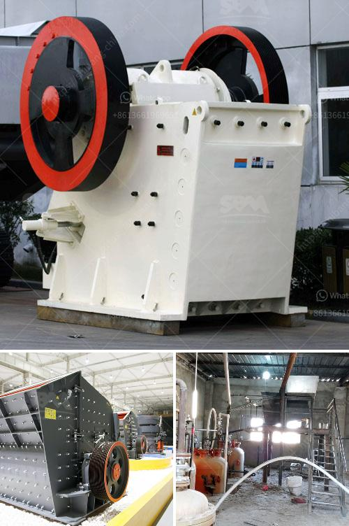

<h3>crusher and producton per hour</h3>
In the world of industrial manufacturing, efficiency and output play a crucial role in determining the success and profitability of a business. One industry that heavily relies on these factors is the mining and construction sector, where crushers are used to break down large rocks into smaller, more manageable pieces. The ability to produce a high volume of crushed material per hour is a key indicator of operational effectiveness.

A crusher's production per hour refers to the amount of material that can be crushed within 60 minutes. This metric is directly linked to the machine's capacity and power usage. A higher production per hour signifies efficient crushing processes, while a lower figure might indicate operational limitations. 

Several factors influence a crusher's production per hour. The type of material being crushed, its hardness, moisture content, and size all play a significant role. Additionally, the design and specifications of the crusher itself, including the size and type of its crushing chamber, its motor power, and the setting of the crusher's eccentric speed, contribute to the productivity level.

To achieve optimal production per hour, it's essential to select the right crusher for the job and ensure it is operating at its peak performance. Regular maintenance and inspections are necessary to identify and address any issues that might hinder efficiency. Properly adjusting the crusher's feed size and keeping the crushing chamber clear of any blockages are other critical steps for maximizing productivity.

When it comes to crushers, different models can have varying production capacities. For example, a jaw crusher may have a production rate ranging from 100 to 300 tons per hour, depending on its specifications. On the other hand, a cone crusher might produce between 200 and 500 tons per hour. These figures serve as reference points, and actual production rates may vary based on the aforementioned factors.

In conclusion, maximizing crusher and production per hour is crucial for any business in the mining and construction industry. By carefully selecting the right crusher, conducting regular maintenance, and optimizing operational processes, companies can ensure they are operating efficiently and achieving high volumes of output to meet market demands. By doing so, they can boost profitability and stay competitive in a demanding industry.
<h3>Contact us</h3><ul><li><strong>Whatsapp:&nbsp;<a href="https://wa.me/8613661969651">+8613661969651</a></strong></li><li><a href="https://swt.shibang-china.com/?git&amp;zhl&amp;crusher and producton per hour"><strong>Online Service(chat now)</strong></a></li></ul><h3>Related</h3><ul><li><a href='crusher plant in rajasthan.md'>crusher plant in rajasthan</a></li><li><a href='defination of machine aggregate crusher.md'>defination of machine aggregate crusher</a></li><li><a href='potassium ore production equipment.md'>potassium ore production equipment</a></li><li><a href='gold hammer mills in harare zimbabwe.md'>gold hammer mills in harare zimbabwe</a></li><li><a href='crushers of crushers.md'>crushers of crushers</a></li></ul>