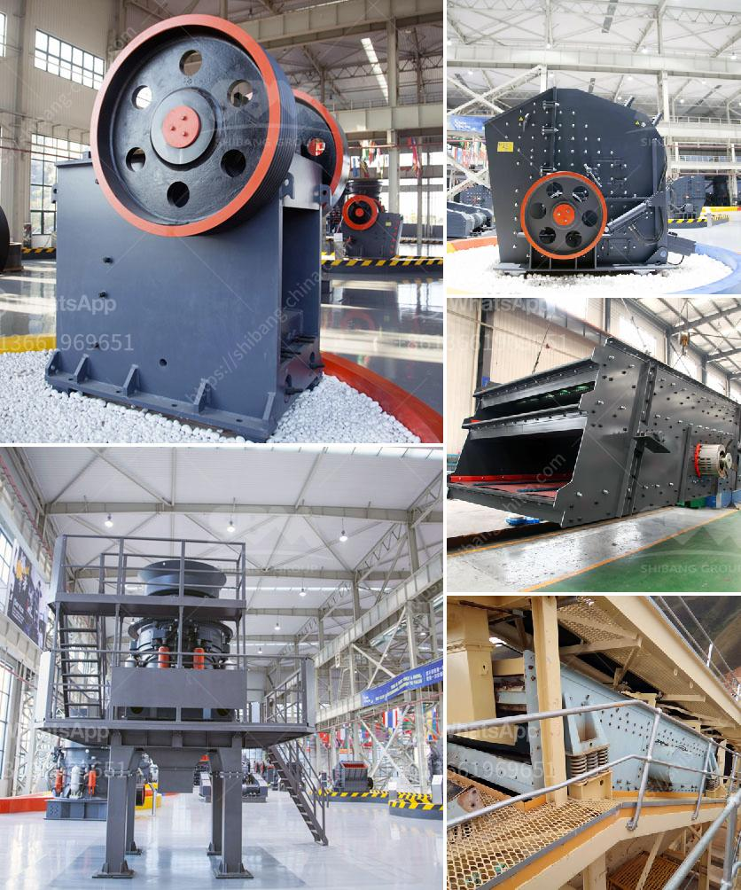

<h3>crusher and screening plant price south africa</h3>
The demand for crushing and screening plants in South Africa has been growing steadily as the construction industry continues to boom. With the rapid development of infrastructure projects in the country, the demand for crushing and screening plants has soared exponentially.

As a result, the prices of crushing and screening plants in South Africa have increased significantly. However, despite the rising prices, these plants remain in high demand due to their crucial role in various construction projects. The market for these plants is characterized by intense competition among manufacturers, as each company strives to offer the best price and quality to attract customers.

The price of a crusher and screening plant in South Africa can vary significantly depending on the manufacturer, the size and capacity of the plant, and the specific requirements of the customer. Additionally, transportation and installation costs also play a significant role in determining the final price of the plant.

One of the major factors affecting the price of crushing and screening plants is the cost of raw materials. The prices of steel, cement, and other essential construction materials have skyrocketed in recent years, impacting the overall manufacturing cost of these plants. Manufacturers have no choice but to pass on these increased costs to customers, resulting in higher plant prices.

Another factor that influences the price is the level of technological advancements incorporated into the plant. Modern crushing and screening plants come with advanced features like automation, remote control systems, and improved efficiency. These technological advancements significantly impact the price of the plant, making it more expensive compared to older, less advanced models.

Despite the rising prices, South Africa still offers significant advantages when it comes to purchasing crusher and screening plants. The country has a competitive manufacturing industry that produces high-quality plants at relatively affordable prices. South African manufacturers are known for their expertise and experience in manufacturing crushing and screening plants, making them a reliable choice for customers in search of cost-effective options.

Furthermore, the availability of raw materials in South Africa benefits both domestic manufacturers and customers. The country is rich in mineral resources, including iron ore and coal, which are major components used in the manufacturing of these plants. This availability reduces the reliance on imports and contributes to keeping the prices of crushing and screening plants relatively stable despite the increasing demand.

In conclusion, the prices of crusher and screening plants in South Africa have seen a significant rise due to increasing demand, rising manufacturing costs, and advanced technological features. However, South Africa remains a competitive market for these plants, with local manufacturers offering high-quality products at relatively affordable prices. The country's abundance of raw materials also plays a key role in keeping prices stable. Despite the higher costs, investing in a crusher and screening plant remains a wise choice for construction companies looking to meet the growing demand and stay competitive in South Africa's booming construction industry.
<h3>Contact us</h3><ul><li><strong>Whatsapp:&nbsp;<a href="https://wa.me/8613661969651">+8613661969651</a></strong></li><li><a href="https://swt.shibang-china.com/?git&amp;zhl&amp;crusher and screening plant price south africa"><strong>Online Service(chat now)</strong></a></li></ul><h3>Related</h3><ul><li><a href='qustion about ball milling process.md'>qustion about ball milling process</a></li><li><a href='hammer crusher machine in malaysia.md'>hammer crusher machine in malaysia</a></li><li><a href='quartz silica old plant sale at telgana.md'>quartz silica old plant sale at telgana</a></li><li><a href='crushing companies in the usa.md'>crushing companies in the usa</a></li><li><a href='prices of aggregate crusher plants.md'>prices of aggregate crusher plants</a></li></ul>