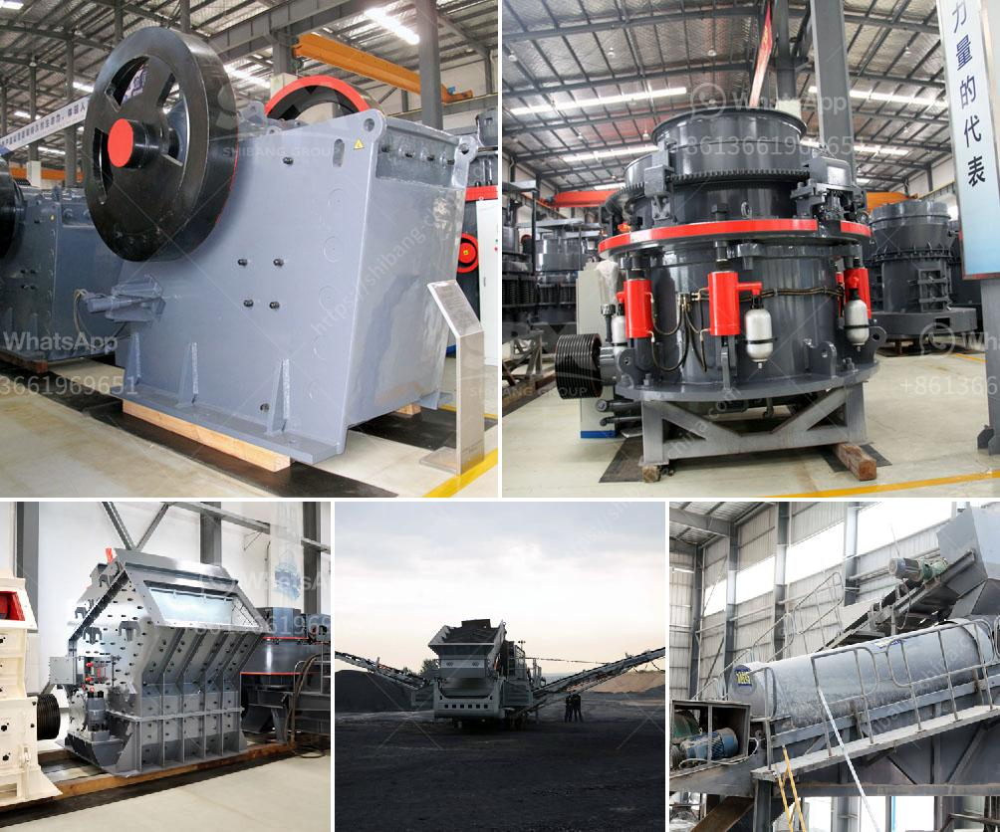

<h3>crusher conica crusher ethiopia</h3>
Crusher conica, also known as a conical crusher, is a versatile and efficient crushing machine widely used in mining and construction industries. One country that greatly benefits from this equipment is Ethiopia. With its expanding infrastructure and growing economy, Ethiopia is in need of reliable and durable crushers to handle various materials and aggregate for construction projects.

The crusher conica is designed with a conical-shaped head that ensures even and consistent crushing of the feed material. This unique shape helps to improve the efficiency and performance of the crusher, resulting in higher production rates and reduced operating costs.

One key advantage of the crusher conica is its ability to adjust the size of the product. This is achieved by adjusting the distance between the mantle and the concave, allowing for precise control over the final product size. This feature is particularly beneficial in Ethiopia, where different construction projects require different sizes of aggregate. It ensures that the crusher can produce the required material and meets the specifications of each project.

Furthermore, the crusher conica is equipped with advanced technologies to enhance its performance. For instance, it may include an automated control system that regulates the crusher's operation, ensuring optimal performance and preventing any potential damage due to overloading. Some models also incorporate a hydraulic setting adjustment system, providing easy and quick adjustments to the crusher settings.

In terms of capacity, the crusher conica offers a range of options suitable for various crushing requirements. Ethiopia, with its growing construction industry, can benefit from crushers with a capacity of 300-500 tons per hour. These crushers can efficiently handle large quantities of materials, ensuring continuous and uninterrupted production.

Ethiopia's natural resources, including stone, sand, and gravel, provide ample opportunities for crushers like the conical crusher. With its robust design and durable construction, these crushers can withstand the harsh conditions often found in mining and construction sites. Additionally, the conical shape of the crusher head helps to reduce wear and tear, increasing the lifespan of the equipment.

Moreover, the crusher conica is known for its energy efficiency. By utilizing the conical shape, it effectively compresses the material, reducing the overall energy requirement for the crushing process. This not only helps to reduce operating costs but also makes the crusher more environmentally friendly, benefiting Ethiopia's sustainability goals.

In conclusion, the crusher conica is a reliable and efficient crushing machine that can benefit Ethiopia's construction and mining industries. With its ability to produce different sizes of aggregates and handle a wide range of materials, this equipment is well-suited for Ethiopia's growing infrastructure needs. The crusher conica's advanced technologies, capacity options, durability, and energy efficiency make it an ideal choice for the country's demanding construction projects. Investing in crusher conica in Ethiopia can contribute to the nation's development and economic growth while also ensuring sustainable and responsible mining practices.
<h3>Contact us</h3><ul><li><strong>Whatsapp:&nbsp;<a href="https://wa.me/8613661969651">+8613661969651</a></strong></li><li><a href="https://swt.shibang-china.com/?git&amp;zhl&amp;crusher conica crusher ethiopia"><strong>Online Service(chat now)</strong></a></li></ul><h3>Related</h3><ul><li><a href='course in maintenance of stone crushers.md'>course in maintenance of stone crushers</a></li><li><a href='mobile jaw crusher for sale.md'>mobile jaw crusher for sale</a></li><li><a href='crushing plant zenith.md'>crushing plant zenith</a></li><li><a href='dry ball milling process.md'>dry ball milling process</a></li><li><a href='high energy ball mill price.md'>high energy ball mill price</a></li></ul>