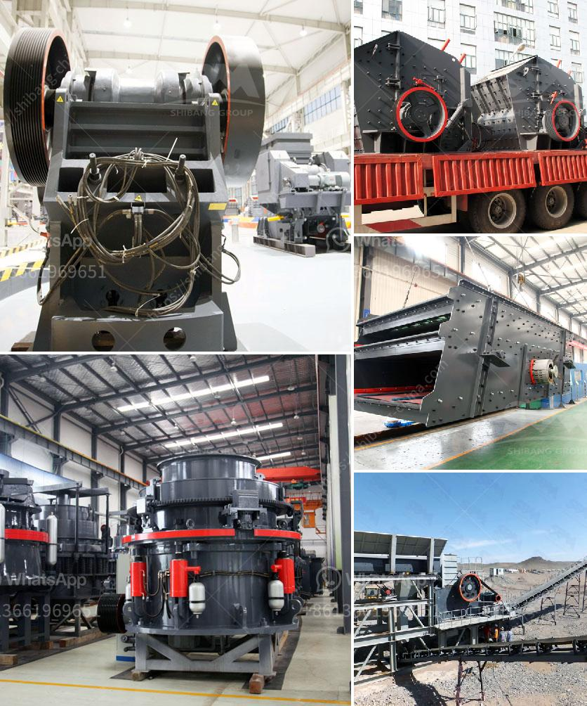

<h3>crusher dust washing machines</h3>
Crusher dust, also known as blue metal dust or quarry dust, is an abrasive and hard material that is commonly used as a base or sub-base material for construction projects. Crusher dust is made by crushing rocks and grinding them to a specific size and texture.

While crusher dust is an important material in construction and building projects, it can pose certain challenges when it comes to cleanliness and washing. Due to its fine nature and tendency to stick to surfaces, crusher dust can be difficult to remove with traditional washing methods.

Fortunately, there are crusher dust washing machines available in the market that offer a solution to this issue. These machines are specifically designed to wash away the crusher dust and leave behind clean, usable material.

Crusher dust washing machines utilize water and gravity separation to remove impurities such as dust, clay, and other unwanted particles from the crusher dust. By using this method, the dust and impurities are effectively washed away, resulting in cleaner, higher-quality material.

The crusher dust washing machines are available in different sizes and capacities, offering a wide range of options for small to large-scale operations. These machines ensure efficient washing of the crusher dust, ultimately producing clean, sand-like material.

In addition to improving the cleanliness of the crusher dust, washing machines can also eliminate the need for stockpiling, which can be costly and time-consuming. By washing the crusher dust on-site, construction companies can save money on transportation and ensure that only clean, usable material is used for their projects.

Furthermore, using crusher dust washing machines reduces the environmental impact associated with the extraction of raw materials and the disposal of waste. By reusing and recycling crusher dust, companies can minimize their carbon footprint and promote sustainability.

In conclusion, crusher dust washing machines are essential equipment in the construction industry for efficiently cleaning and washing crusher dust, ensuring high-quality material. With their ability to remove impurities and produce clean, usable material, these machines offer numerous benefits for construction projects. By using crusher dust washing machines, construction companies can improve their efficiency, reduce costs, and contribute to a more sustainable future.
<h3>Contact us</h3><ul><li><strong>Whatsapp:&nbsp;<a href="https://wa.me/8613661969651">+8613661969651</a></strong></li><li><a href="https://swt.shibang-china.com/?git&amp;zhl&amp;crusher dust washing machines"><strong>Online Service(chat now)</strong></a></li></ul><h3>Related</h3><ul><li><a href='raymond grinding mill machine.md'>raymond grinding mill machine</a></li><li><a href='open cast mining china clay process.md'>open cast mining china clay process</a></li><li><a href='price of copper smelting plant.md'>price of copper smelting plant</a></li><li><a href='cone crusher 100tph prices in india.md'>cone crusher 100tph prices in india</a></li><li><a href='coal screening crushing machines.md'>coal screening crushing machines</a></li></ul>