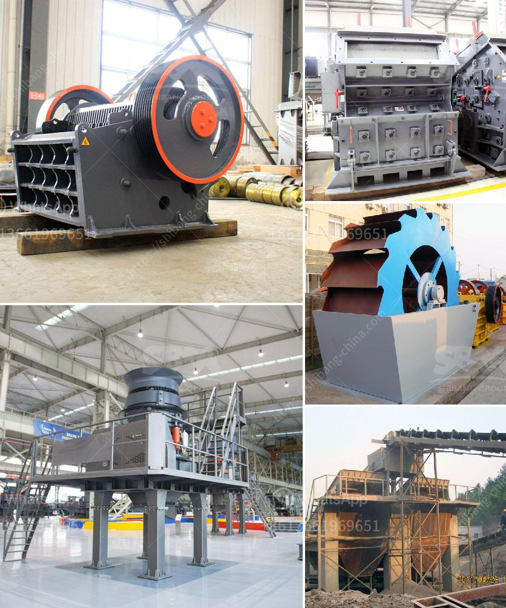

<h3>crusher in antioquia stone crusher</h3>
In the region of Antioquia, Colombia, stands a unique stone crusher known locally as "la trituradora." This impressive machine plays a pivotal role in the mining and construction industry, crushing large stones into smaller pieces for further processing. With its immense power and efficiency, the crusher in Antioquia has revolutionized the way raw materials are extracted from quarries, transforming them into usable aggregates for various applications.

The crusher in Antioquia is a mechanical device that utilizes a powerful force to break down large rocks into smaller, more manageable sizes. It consists of two main components: a fixed jaw and a movable jaw. As the crushing process begins, the raw material is fed into the crusher through a vibrating feeder. The rotating motion of the eccentric shaft causes the movable jaw to move back and forth, crushing the stone against the fixed jaw.

One of the key advantages of the crusher in Antioquia is its high production capacity. With its robust construction and powerful motor, it can process large quantities of stone in a short amount of time. This makes it highly efficient and cost-effective for mining and construction companies alike, as it reduces the time and labor required to extract and process raw materials.

Another remarkable feature of the crusher in Antioquia is its versatility. It can crush various types of stones, including granite, limestone, shale, and even concrete debris. This adaptability allows for a wide range of applications, from road construction and building projects to landscaping and agriculture. The crushed stone can be used as a base or sub-base material for roads, as aggregate for concrete production, or as a decorative element in landscaping.

Moreover, the crusher in Antioquia offers significant environmental benefits. By transforming large stones into smaller, more manageable sizes, it reduces the need for blasting and excavation, thus minimizing the disruption to the natural landscape. Additionally, the use of crushed stone as a construction material reduces the demand for virgin aggregates, contributing to the conservation of natural resources.

However, it is essential to operate the crusher in Antioquia responsibly. Mining and construction companies must comply with all safety regulations and environmental standards to ensure the well-being of their workers and the surrounding communities. Regular maintenance and inspections of the machine are crucial to prevent accidents and ensure its optimal performance.

In conclusion, the crusher in Antioquia is a remarkable stone crushing machine that has revolutionized the mining and construction industry in the region. Its immense power and efficiency allow for the quick and cost-effective processing of raw materials, saving time and labor. With its versatility and environmental benefits, it has become an indispensable tool for companies in need of crushed stone for various applications. However, it is significant to use this machine responsibly and adhere to all safety and environmental regulations to ensure a sustainable future.
<h3>Contact us</h3><ul><li><strong>Whatsapp:&nbsp;<a href="https://wa.me/8613661969651">+8613661969651</a></strong></li><li><a href="https://swt.shibang-china.com/?git&amp;zhl&amp;crusher in antioquia stone crusher"><strong>Online Service(chat now)</strong></a></li></ul><h3>Related</h3><ul><li><a href='gypsum board making machine.md'>gypsum board making machine</a></li><li><a href='grinding ball mill machine.md'>grinding ball mill machine</a></li><li><a href='double toggle jaw crushers.md'>double toggle jaw crushers</a></li><li><a href='crusher stone for sale gauteng.md'>crusher stone for sale gauteng</a></li><li><a href='concrete crushing testing equipment.md'>concrete crushing testing equipment</a></li></ul>