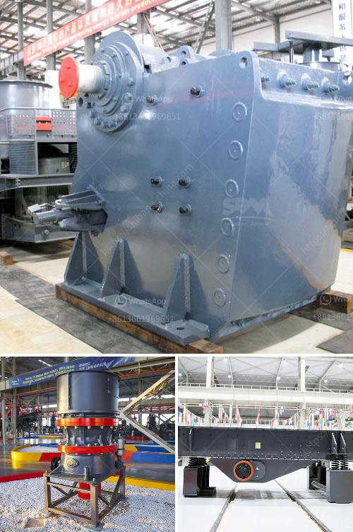

<h3>crusher in the philippines</h3>
In recent years, the Philippines has witnessed a steady growth in the construction industry. This growth brings new challenges for the sector and, especially, for the stone quarrying industry. With the expansion of infrastructure projects in the country, the demand for construction materials such as stones and aggregates is increasing.

One of the essential components in the stone crushing line is the crusher. The crusher crushes the raw material into fine pieces or chips, revolutionizing the way stones are processed. The crusher has become an indispensable piece of equipment on construction sites, helping reduce the maintenance cost and improve the overall efficiency of projects.

The market for crushers in the Philippines is growing, as the construction industry continues to thrive. Based on data from the Department of Trade and Industry (DTI), the industry registered a growth of 7.5% in 2019. This growth can be attributed to the increasing number of infrastructure projects being developed across the country.

There are several types of crushers available in the market that aims to meet the specific needs of different industries. Jaw crushers are the most commonly used crushers in the primary crushing stage. They are suitable for processing various materials, ranging from soft limestone to hard granite. Cone crushers are commonly used in the secondary or tertiary crushing stage for hard materials such as granite, basalt, and iron ore. Impact crushers are ideal for producing intermediate grades of aggregates, as they can produce high-quality cubic-shaped particles.

The Philippines is rich in mineral resources, and the mining industry plays a significant role in the country's economic development. According to the Mines and Geosciences Bureau (MGB), the Philippines has an estimated $840 billion worth of untapped mineral wealth. The crusher industry is expected to play an essential role in unlocking this potential by providing the necessary equipment for efficient and sustainable mining operations.

Apart from the mining sector, crushers are also used in the recycling industry to process and reduce the size of waste materials. The crusher helps in reducing the volume of waste materials, making it easier to transport and dispose of. This contributes to the promotion of sustainable practices and the protection of the environment.

It is worth mentioning that the crusher industry faces several challenges in the Philippines. One of the primary challenges is the lack of necessary infrastructure to support the efficient transportation of quarry materials. The government and private sector stakeholders need to collaborate to address this issue and ensure the smooth flow of materials.

In conclusion, the crusher plays a crucial role in the Philippines' construction industry and the mining sector. With its ability to crush and process various materials efficiently, the crusher helps improve the overall productivity and competitiveness of the industry. As the demand for construction materials continues to grow, the crusher industry will continue to flourish and contribute to the country's economic development.
<h3>Contact us</h3><ul><li><strong>Whatsapp:&nbsp;<a href="https://wa.me/8613661969651">+8613661969651</a></strong></li><li><a href="https://swt.shibang-china.com/?git&amp;zhl&amp;crusher in the philippines"><strong>Online Service(chat now)</strong></a></li></ul><h3>Related</h3><ul><li><a href='1 tonne gypsum processing machine.md'>1 tonne gypsum processing machine</a></li><li><a href='price of rollers for conveyor belts.md'>price of rollers for conveyor belts</a></li><li><a href='safety of belt conveyors in hindi.md'>safety of belt conveyors in hindi</a></li><li><a href='stone crusher portable.md'>stone crusher portable</a></li><li><a href='cement boll mill grinding media charging formula.md'>cement boll mill grinding media charging formula</a></li></ul>