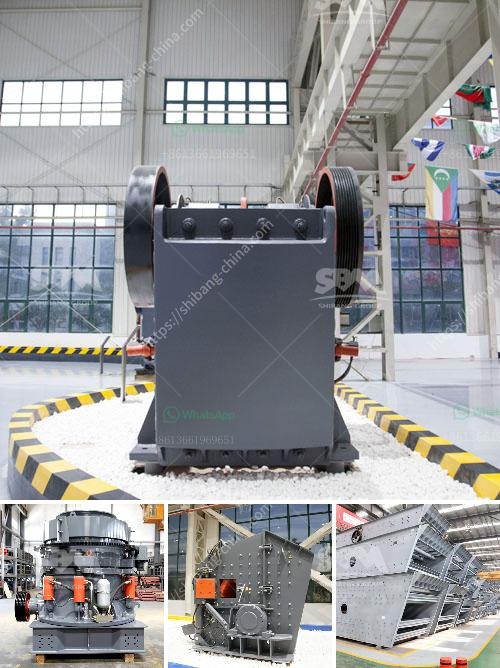

<h3>crusher machine for sale tanzania</h3>
Tanzania is rich in mineral resources. There are numerous types of high-quality crusher machines for sale in Tanzania. These machines are able to process a wide variety of raw materials, such as ores, rocks, granite, limestone, and more, reducing them to smaller sizes, which can be further used in construction, road building, and other industries.

One of the most popular crushing machines in Tanzania is the jaw crusher. This machine utilizes a powerful force to break down stones into smaller pieces. The jaw crusher uses a stationary jaw plate and a moving jaw plate to create a unique “V” shape. As materials pass through the machine, the jaws press and squeeze the stones against the stationary plate, gradually reducing their size.

Another commonly used crusher machine in Tanzania is the cone crusher. This machine works by breaking down materials using an eccentrically rotating cone, which is covered by a hard, wear-resistant mantle. As the cone rotates, it crushes the materials against the mantle, effectively reducing them to the desired size.

In addition to jaw and cone crushers, there are also impact crushers available for sale in Tanzania. These machines use a high-speed rotor with blow bars that impact the materials and break them apart. This type of crusher is ideal for producing a uniform cubical shape of the final product.

When considering purchasing a crusher machine in Tanzania, several factors need to be taken into account. Firstly, it is crucial to determine the hardness and size of the raw materials to be processed, as this will help determine the type of crusher machine required. Secondly, it is essential to consider the desired output size, as different machines have different capabilities in terms of reducing materials to the desired size.

Furthermore, it is vital to choose a crusher machine from a reputable manufacturer or supplier that offers high-quality machines and excellent after-sales service. This ensures that the purchased machine will run efficiently and have a longer lifespan, reducing maintenance and downtime costs.

In summary, crusher machines for sale in Tanzania offer a wide range of options for crushing various raw materials. Whether it is jaw crushers, cone crushers, or impact crushers, each type can bring specific benefits and meet different requirements. Selecting the right crusher machine and working with a reliable supplier will ensure a successful crushing operation in Tanzania.
<h3>Contact us</h3><ul><li><strong>Whatsapp:&nbsp;<a href="https://wa.me/8613661969651">+8613661969651</a></strong></li><li><a href="https://swt.shibang-china.com/?git&amp;zhl&amp;crusher machine for sale tanzania"><strong>Online Service(chat now)</strong></a></li></ul><h3>Related</h3><ul><li><a href='crushers and wash plant processes.md'>crushers and wash plant processes</a></li><li><a href='gold ore 300 550tph cs cone crusher for sale.md'>gold ore 300 550tph cs cone crusher for sale</a></li><li><a href='hydraulic concrete crusher.md'>hydraulic concrete crusher</a></li><li><a href='small scale gold refinery plant equipments.md'>small scale gold refinery plant equipments</a></li><li><a href='sand making crusher plant india.md'>sand making crusher plant india</a></li></ul>