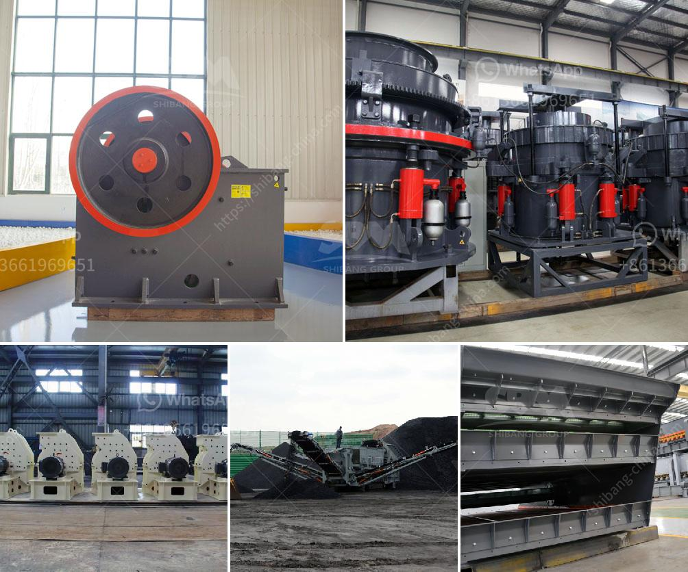

<h3>crusher machine in bhutan</h3>
In the small but beautiful country of Bhutan, located in the eastern Himalayas, a modern and efficient crusher machine is becoming an essential tool for different construction and building projects. This machine is helping to reduce large rocks into smaller rocks, gravel, or rock dust, enabling the construction industry to complete projects efficiently and promptly.

The crusher machine in Bhutan is mainly used for construction purposes such as producing aggregate, which can be used for road construction, railway construction, building construction, and bridge construction. The machine is capable of crushing rocks of various hardness levels, ranging from limestone to granite. This versatility makes it an ideal choice for construction companies as it can handle different types of materials.

Furthermore, the crusher machine in Bhutan is designed to be environmentally friendly. It minimizes dust and noise pollution, ensuring that nearby communities are not disturbed during the crushing process. This is a crucial factor in a country like Bhutan, which places a strong emphasis on environmental conservation and sustainability.

The crusher machine is also equipped with advanced technology, such as hydraulic systems and durable wear parts, which improve its efficiency and longevity. This reduces maintenance costs and ensures that the machine operates at optimal levels for extended periods. Additionally, the machine is user-friendly, making it accessible to operators of varying skill levels.

The introduction of the crusher machine in Bhutan has greatly enhanced the construction industry's capabilities. It has increased productivity, reduced manual labor, and improved the quality of construction materials. With the growing demand for infrastructure development in Bhutan, the crusher machine is playing a crucial role in meeting these needs efficiently and effectively.

As Bhutan continues to progress, the crusher machine will continue to be an important asset in the construction industry. Its reliability, efficiency, and environmentally friendly features make it an indispensable tool for any construction project.
<h3>Contact us</h3><ul><li><strong>Whatsapp:&nbsp;<a href="https://wa.me/8613661969651">+8613661969651</a></strong></li><li><a href="https://swt.shibang-china.com/?git&amp;zhl&amp;crusher machine in bhutan"><strong>Online Service(chat now)</strong></a></li></ul><h3>Related</h3><ul><li><a href='stone crusher dijual.md'>stone crusher dijual</a></li><li><a href='gypsum powder production process pdf.md'>gypsum powder production process pdf</a></li><li><a href='cement plant machinery list.md'>cement plant machinery list</a></li><li><a href='mobile crusher namibia.md'>mobile crusher namibia</a></li><li><a href='rock crusher design.md'>rock crusher design</a></li></ul>