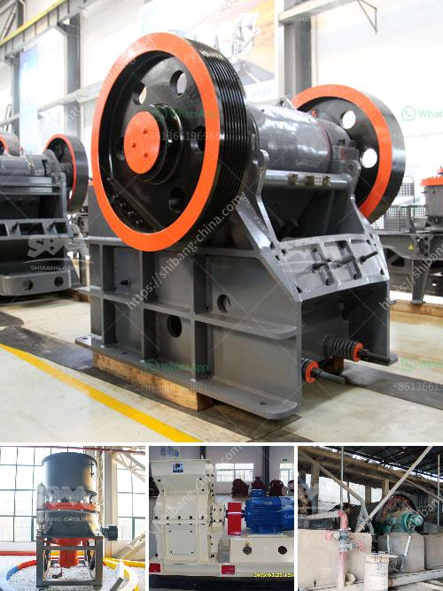

<h3>crusher machine in uae</h3>
The United Arab Emirates has been witnessing a steady growth in the construction industry for the past decades. Due to the flourishing tourism industry, rapid urbanization, and increasing infrastructure projects, the country has witnessed an increased demand for construction materials such as cement, steel, and aggregate. However, with such extensive construction happening, it generates a lot of waste material as well. To address this issue, the UAE government has introduced various policies and initiatives to reduce waste and promote recycling.

One of the key initiatives is the reduction of waste through the use of crusher machines. These machines are designed to crush all kinds of construction waste materials to reduce waste volume and increase recycling efficiency. With the rapid development of the construction industry in the UAE, there is increasing demand for quarried materials such as sand, gravel, and crushed stone. As the demand for aggregates rises, so does the need for crushers, making it a lucrative business opportunity for those in the construction industry.

In the UAE, many quarries make use of crusher machines to produce stones of smaller sizes for various construction requirements. Some can be used as landscaping materials, while others can be used to manufacture concrete or asphalt. The crushers provide great convenience nowadays for various industries as they can process different materials such as ores, marbles, granites, and so on.

In the UAE, there are many quarries that produce various construction materials. Many of these quarries also have the crushers available to process the materials upon extraction. This process may involve the use of a primary crusher, secondary crushers, and different screening techniques to segregate the crushed materials into different particle sizes. Bulk quantities of sand, gravel, and crushed aggregates are then poured into large holding tanks before being further processed for additional applications.

With the increase in construction projects in the UAE, there is a growing need for these machines. Advancements in technology have allowed manufacturers to design and build crushers that are more energy-efficient and have a smaller carbon footprint. Additionally, the crushers have become more specialized, providing options for different applications such as recycling, concrete production, and mining.

The crusher machines used in the UAE are designed to handle a wide range of crushing applications such as secondary, tertiary, and quaternary crushing of various materials. Many of these machines handle the toughest materials that would otherwise need to be processed by more conventional crushing equipment. The result is a uniform-sized and shaped material that can be reused in various construction applications like road construction, concrete production, and others.

Another important driver for the UAE's construction industry is sustainability. With the UAE government's focus on sustainability, crusher machines are increasingly indispensable in reducing waste and recycling building materials. Advancements in crushers enable the recycling of building materials such as concrete, brick, and asphalt, yielding reusable aggregates.

The presence of crusher machines in the UAE has encouraged companies to incorporate recycled materials in their projects. Moreover, governments in the UAE have recognized the importance of recycling and reducing waste, aiming to achieve a greener future and minimize landfill sites. Crusher machines facilitate this task by reducing large rocks into smaller particles suitable for use as aggregates in construction projects.

The extensive use of crusher machines in the Middle East has contributed to the environmental pollution. In view of this, construction companies are now keen on making sure that their crushers are in line with stringent environmental regulations. To meet these requirements, manufacturers focus on energy efficiency and dust management during the crushing processes.

In conclusion, crusher machines are very useful for dealing with materials for construction purposes. The modern crusher machines are highly beneficial for builders due to their efficiency and versatility. With the UAE's sustainability drive and increasing demand for aggregates, the use of crushers is set to rise in the coming years. Various governments and other construction companies in the UAE are implementing sustainable strategies in their operations to face future challenges and reduce the carbon footprint. By embracing crusher machines, these organizations can turn waste into valuable resources, contributing to a more sustainable future.
<h3>Contact us</h3><ul><li><strong>Whatsapp:&nbsp;<a href="https://wa.me/8613661969651">+8613661969651</a></strong></li><li><a href="https://swt.shibang-china.com/?git&amp;zhl&amp;crusher machine in uae"><strong>Online Service(chat now)</strong></a></li></ul><h3>Related</h3><ul><li><a href='hammer pulverizer machine.md'>hammer pulverizer machine</a></li><li><a href='crusher price in philippines.md'>crusher price in philippines</a></li><li><a href='jaw crusher usa pakistan.md'>jaw crusher usa pakistan</a></li><li><a href='vertical ball mills of india.md'>vertical ball mills of india</a></li><li><a href='robo sand making equipment rates in india.md'>robo sand making equipment rates in india</a></li></ul>