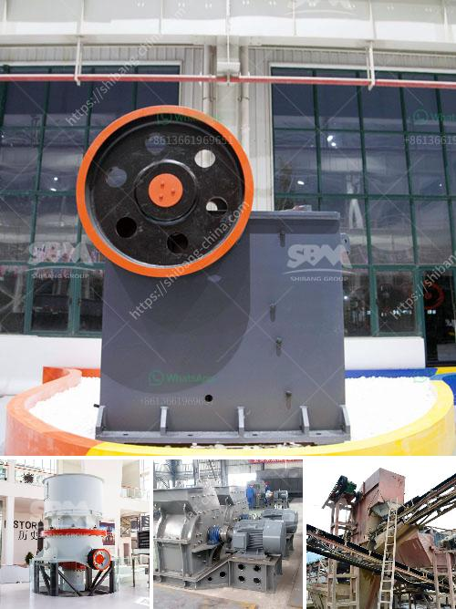

<h3>crusher machine manufacturer in coimbatore</h3>
Coimbatore is a leading industrial hub in South India, known for its textile and manufacturing industries. Located in the state of Tamil Nadu, it is also known as the "Manchester of South India" for its bustling textile industry. However, in recent years, Coimbatore has emerged as a prominent center for the manufacturing of crusher machines.

Crusher machines are used for crushing stones, rocks, or any other hard substance into smaller pieces or even into powder for various purposes. These machines give better results with lesser effort and time, delivering a high-quality product, which also ensures customer satisfaction. In Coimbatore, many crusher machine manufacturers are renowned for manufacturing top-quality crusher machines and their spare parts.

Based on the customer requirements, the manufacturers in Coimbatore offer diverse kinds of crusher machines, which include jaw crushers, impact crushers, cone crushers, stone crushers, and various other types. These crusher machines are widely used in industries such as mining, construction, metallurgy, chemical, and other industries.

One of the leading crusher machine manufacturers in Coimbatore is Propel Industries. They specialize in the manufacture of sand washing machines, crushers, feeders, conveyors, and other customized machinery. They have been serving the industry for more than a decade and have a dedicated team of professionals who work efficiently to deliver high-quality products.

Another reputed crusher machine manufacturer in Coimbatore is Nesans Mining and Automation Pvt Ltd. Their machines are widely used in various industries, such as construction, mining, highways, mineral processing, and metallurgy. They focus on providing cutting-edge technology to their customers and ensure their machines deliver optimal performance and reliability.

Furthermore, Deepa Machinery Manufacturers Pvt Ltd is another renowned crusher machine manufacturer in Coimbatore. Their stone crusher machines are highly reliable and environment-friendly, and their designs have been appreciated by leading architects and engineers all over the world. They specialize in recycling, crushing, and screening and have a wide range of products such as sand making machines, jaw crushers, vibrating screens, and more.

One of the notable crusher machine manufacturers in Coimbatore is Propel Industries. They specialize in the manufacture of sand washing machines, crushers, feeders, conveyors, and other customized machinery. They have been serving the industry for more than a decade and have a dedicated team of professionals who work efficiently to deliver high-quality products.

Overall, the crusher machine manufacturing industry in Coimbatore is growing at a rapid pace and is expected to flourish even more in the coming years. With the increasing demand for crusher machines, it is evident that there will be a significant opportunity for manufacturers to innovate and improve their product offerings. The crusher machine manufacturers in Coimbatore strive to provide products that are energy-efficient and environment-friendly. These manufacturers also focus on incorporating the latest technology and automation to improve the overall efficiency and quality of their machines.

In conclusion, Coimbatore has emerged as a prominent hub for crusher machine manufacturing, with several leading manufacturers who cater to diverse industry needs. These manufacturers strive to provide high-quality machines that are durable, efficient, and tailor-made according to customer requirements. With their commitment to innovation and customer satisfaction, these crusher machine manufacturers in Coimbatore are poised for considerable growth in the years to come.
<h3>Contact us</h3><ul><li><strong>Whatsapp:&nbsp;<a href="https://wa.me/8613661969651">+8613661969651</a></strong></li><li><a href="https://swt.shibang-china.com/?git&amp;zhl&amp;crusher machine manufacturer in coimbatore"><strong>Online Service(chat now)</strong></a></li></ul><h3>Related</h3><ul><li><a href='jaw crusher usa pakistan.md'>jaw crusher usa pakistan</a></li><li><a href='stone crushers in uttarakhand.md'>stone crushers in uttarakhand</a></li><li><a href='how to grind sand into powder.md'>how to grind sand into powder</a></li><li><a href='ultrafine powder mill.md'>ultrafine powder mill</a></li><li><a href='crusher 40 ton per jam.md'>crusher 40 ton per jam</a></li></ul>