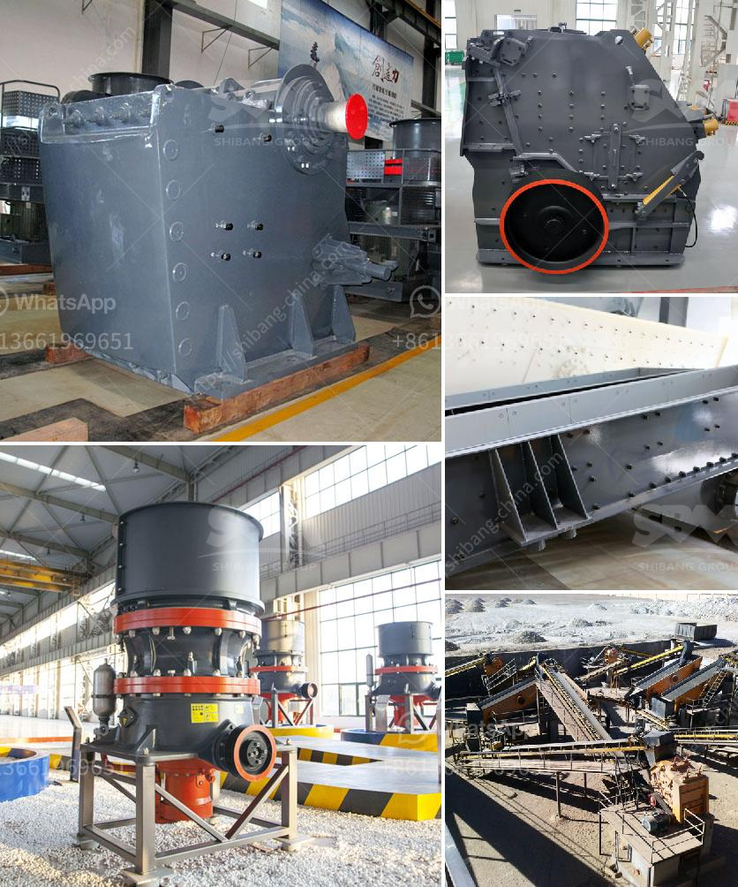

<h3>crusher machine saudi arabia</h3>
Saudi Arabia, officially known as the Kingdom of Saudi Arabia, is located in the Middle East region. Saudi Arabia is known as the largest country in the Middle East and the 13th largest in the world. The country is rich in various minerals and has abundant natural resources. One of the key sectors which contribute to the Saudi Arabian economy is the mining industry.

The mining industry in Saudi Arabia is prospering at an unprecedented rate. As such, it is crucial for market investors to keep abreast of all the latest developments in this sector. The Kingdom of Saudi Arabia has built a strong foundation in the mining and quarrying industry over several decades. Currently, Saudi Arabia enjoys a strong economy and it ranks as the third economy in the Middle East and North Africa region.

In the mining industry, Saudi Arabia is considered as one of the key players. With its vast resources, it plays a crucial role in the economic development of the country. The Saudi Arabian mining industry is dominated by massive investment in mining infrastructure projects such as the development of seaports, railways, and highways.

In order to process various minerals, there is a need for efficient crusher machines. Crusher machines are widely used for crushing stones or rocks into smaller pieces. Crushers are able to break down large-sized materials into smaller, more manageable pieces. Crushers are also used to change the form of waste materials to make them easy to dispose of or recycle.

One of the key crushers used in mining is the Jaw Crusher. This machine is often used in multiple production lines for all kinds of stones or ores. Different types of crushers are also used in the mining industry as well, such as Impact Crushers, Cone Crushers, and Hammer Crushers. Jaw Crusher Machine is one of the most popular of crushing machine, With two jaw plates, forming the jaw crushing chamber, jaw crushing machine can simulate the two jaws movement of animals and complete materials crushing operations.

Crusher machines are used in various industries, ranging from mining to construction and even food manufacturing. Many companies invest in crusher machines in order to enhance productivity, increase the efficiency of the manufacturing process, and to reduce operating costs.

In Saudi Arabia, there are numerous crusher machines suppliers who provide different types of crushing machines for sale. These crusher machines are widely used in quarrying, mining, construction, and recycling operations. Crushers can be used to crush various ore and stones, such as iron ore, copper ore, gold ore, limestone, marble, granite, calcite, and other materials. Jaw crushers can be used in mining, metallurgical industry, construction, road and railway building, water conservancy, chemistry, etc.

Saudi Arabia is abundant with oil and the output is 526 million tons. Besides oil, natural gas is also very rich and it is in the fourth in the world. There are other ore mineral resources in this country, such as gold ore, copper ore, iron ore, chrome ore, etc. Various metal ores and non-metallic ore materials need to be processed by a large number of mining machines.

Crusher machines can be used for processing all kinds of raw materials, such as rocks, abrasives, refractories, cement clinker, quartz stone, iron ore, concrete aggregate, etc. It is especially suitable for crushing limestone and medium hardness stones with compression strength less than 200MPa.

Saudi Arabia possesses large deposits of various minerals, including bauxite, copper, gold, iron, lead, silver, tin and non-metallic minerals. Mining crushing plant has wide applications there. The introduction of modern mining and extraction methods has once again made the mine a major producer of precious metals.

In conclusion, Saudi Arabia is one of the most rapidly growing countries in the Middle East and as such, is a key player in the mining industry. Crusher machines have a crucial role to play in this country, as the mineral industry continues to grow. Saudi Arabia has a diverse range of mining deposits, including bauxite, copper, gold, iron, lead, silver, tin and non-metallic minerals. Mining crushing plant has wide applications there.
<h3>Contact us</h3><ul><li><strong>Whatsapp:&nbsp;<a href="https://wa.me/8613661969651">+8613661969651</a></strong></li><li><a href="https://swt.shibang-china.com/?git&amp;zhl&amp;crusher machine saudi arabia"><strong>Online Service(chat now)</strong></a></li></ul><h3>Related</h3><ul><li><a href='gold mining equipment stamp mill.md'>gold mining equipment stamp mill</a></li><li><a href='crusher sand washing machines for crusher nepal.md'>crusher sand washing machines for crusher nepal</a></li><li><a href='alluvial gold plants for sale south africa.md'>alluvial gold plants for sale south africa</a></li><li><a href='river stone crusher plant for sale in india.md'>river stone crusher plant for sale in india</a></li><li><a href='clay making process nigeria.md'>clay making process nigeria</a></li></ul>