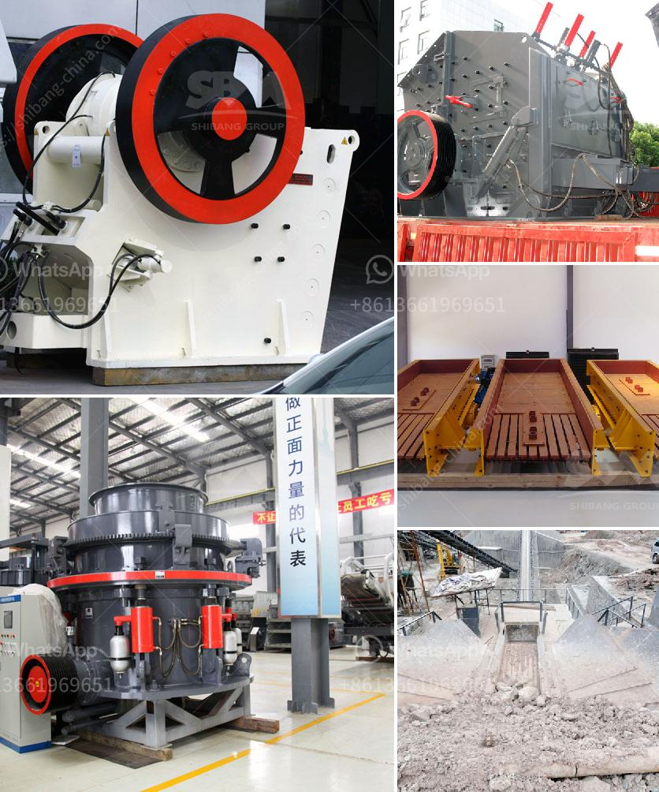

<h3>crusher mandrel crusher price</h3>
The crusher mandrel is an indispensable tool used in various industries for crushing different types of materials. It consists of a cylindrical shaft with multiple crushing heads attached to it. The crusher mandrel's primary purpose is to apply pressure and force to break down large pieces of rock, ore, or other materials into smaller, more manageable sizes.

The price of a crusher mandrel varies depending on several factors. Firstly, the quality and durability of the mandrel play a significant role in its price. A high-quality mandrel, made of robust materials such as hardened steel, will be more expensive than a lower-quality alternative. Investing in a durable mandrel ensures its longevity and reduces the need for frequent replacements, which can lead to significant cost savings in the long run.

Secondly, the size and specifications of the crusher mandrel can impact its price. Mandrels are available in various sizes and configurations, designed to cater to different crushing applications. Mandrels with larger diameters and more crushing heads typically come at a higher price point due to the increased material and manufacturing costs involved in their production.

Furthermore, the brand and reputation of the manufacturer can influence the price of a crusher mandrel. Established and reputable manufacturers often charge a premium for their products due to their proven track record of producing reliable and high-performing equipment. While opting for a renowned brand may result in a higher upfront cost, it can provide peace of mind in terms of product quality and after-sales support.

Lastly, market demand and competition also play a role in determining the price of a crusher mandrel. In regions with a high demand for crushers and limited competition, the prices are generally higher. On the other hand, in regions with a saturated market and intense competition among manufacturers, prices tend to be more competitive. Buyers should consider these market dynamics and conduct thorough research to ensure they are getting a fair price for the crusher mandrel they need.

While the price of a crusher mandrel is an important consideration, buyers should not solely focus on cost. It is essential to evaluate the overall value and long-term benefits the mandrel offers. A reliable and efficient mandrel can increase productivity, reduce downtime, and enhance operational efficiency, resulting in higher returns on investment.

In conclusion, the price of a crusher mandrel can vary depending on the quality, size, specifications, manufacturer, and market dynamics. Buyers should carefully assess their crushing requirements and budget to make an informed decision. Investing in a high-quality and durable mandrel may come at a higher upfront cost but can provide significant long-term benefits in terms of performance, reliability, and cost savings.
<h3>Contact us</h3><ul><li><strong>Whatsapp:&nbsp;<a href="https://wa.me/8613661969651">+8613661969651</a></strong></li><li><a href="https://swt.shibang-china.com/?git&amp;zhl&amp;crusher mandrel crusher price"><strong>Online Service(chat now)</strong></a></li></ul><h3>Related</h3><ul><li><a href='raymond grinding mill for sale in thailand.md'>raymond grinding mill for sale in thailand</a></li><li><a href='rock crushing machine speed limit.md'>rock crushing machine speed limit</a></li><li><a href='laborte crusing plant.md'>laborte crusing plant</a></li><li><a href='slag crushing machine manufacture in india.md'>slag crushing machine manufacture in india</a></li><li><a href='300 tph jaw crusher.md'>300 tph jaw crusher</a></li></ul>